# 编辑器工具栏增强

<cite>
**本文档中引用的文件**
- [EditorToolbar.tsx](file://frontend/src/components/editor/EditorToolbar.tsx)
- [MarkdownEditor.tsx](file://frontend/src/components/editor/MarkdownEditor.tsx)
- [useStore.ts](file://frontend/src/store/useStore.ts)
- [api.ts](file://frontend/src/services/api.ts)
- [i18n.ts](file://frontend/src/i18n.ts)
- [Toast.tsx](file://frontend/src/components/ui/Toast.tsx)
- [types.ts](file://src/core/types.ts)
- [smartParser.ts](file://frontend/src/utils/smartParser.ts)
- [templates.ts](file://frontend/src/utils/templates.ts)
- [App.tsx](file://frontend/src/App.tsx)
- [api.ts](file://src/routes/api.ts)
- [markdown-guide.html](file://frontend/public/markdown-guide.html)
</cite>

## 更新摘要
**变更内容**
- 新增EditorToolbar.tsx组件的详细功能分析
- 更新工具栏按钮功能矩阵和快捷键映射系统
- 增强Markdown编辑器组件的文本插入机制说明
- 完善国际化支持和状态管理系统的文档

## 目录
1. [简介](#简介)
2. [项目结构](#项目结构)
3. [核心组件](#核心组件)
4. [架构概览](#架构概览)
5. [详细组件分析](#详细组件分析)
6. [依赖关系分析](#依赖关系分析)
7. [性能考虑](#性能考虑)
8. [故障排除指南](#故障排除指南)
9. [结论](#结论)

## 简介

编辑器工具栏增强是 Markdown 转 Word 应用程序中的一个关键功能模块，负责提供直观易用的 Markdown 编辑界面。该模块通过集成现代化的编辑器组件和丰富的工具栏功能，为用户提供了专业的文档编辑体验。

本系统采用前后端分离架构，前端使用 React + TypeScript 构建，后端基于 Node.js 和 Express 提供文档转换服务。编辑器工具栏作为用户交互的核心界面，集成了多种编辑功能，包括文本格式化、内容插入、文档导出等核心操作。

**更新** 新增了完整的EditorToolbar.tsx组件分析，详细说明了工具栏按钮的功能矩阵和交互机制。

## 项目结构

该项目采用模块化的组织方式，主要分为以下层次：

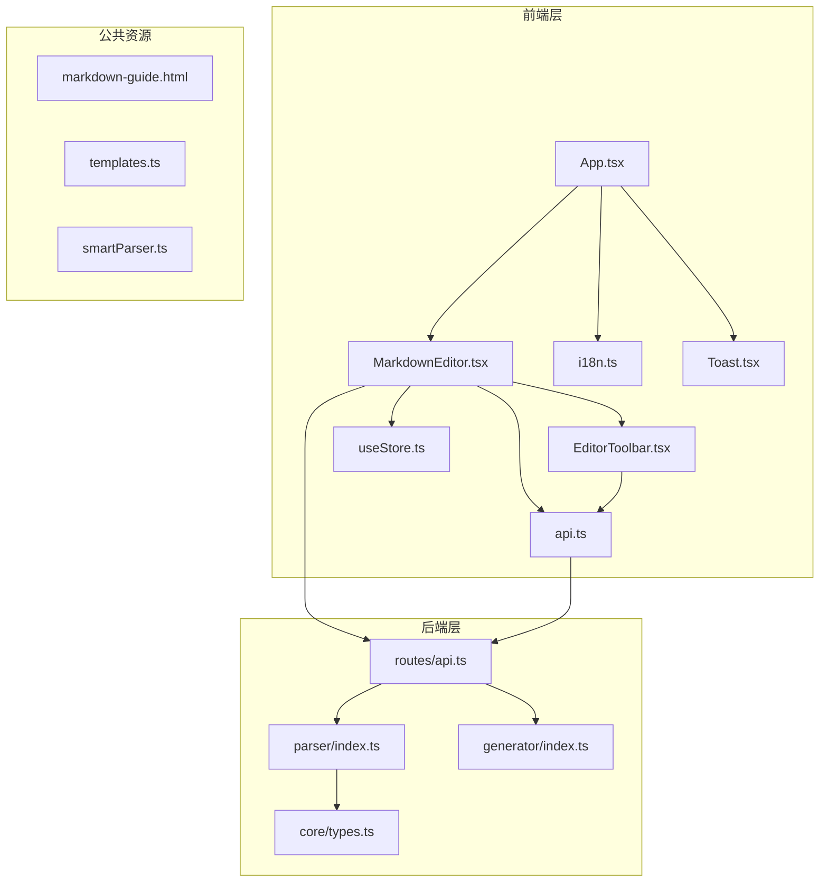

**图表来源**
- [App.tsx:1-76](file://frontend/src/App.tsx#L1-L76)
- [MarkdownEditor.tsx:1-124](file://frontend/src/components/editor/MarkdownEditor.tsx#L1-L124)
- [EditorToolbar.tsx:1-110](file://frontend/src/components/editor/EditorToolbar.tsx#L1-L110)

**章节来源**
- [App.tsx:1-76](file://frontend/src/App.tsx#L1-L76)
- [package.json](file://package.json)

## 核心组件

编辑器工具栏增强系统由多个核心组件构成，每个组件都有明确的职责和功能：

### 主要组件架构

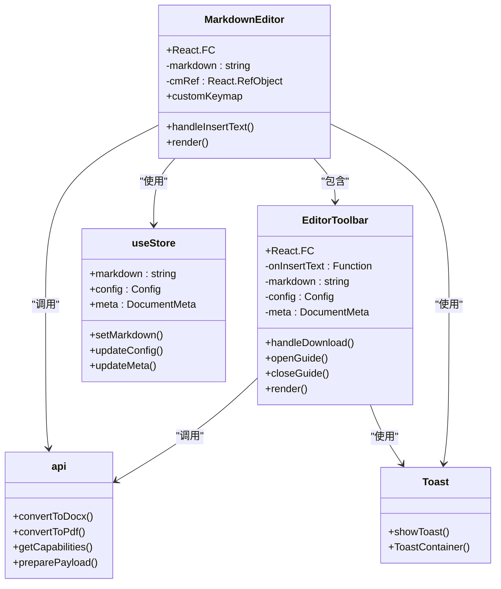

**图表来源**
- [MarkdownEditor.tsx:11-124](file://frontend/src/components/editor/MarkdownEditor.tsx#L11-L124)
- [EditorToolbar.tsx:11-110](file://frontend/src/components/editor/EditorToolbar.tsx#L11-L110)
- [useStore.ts:175-291](file://frontend/src/store/useStore.ts#L175-L291)

### 组件功能特性

每个组件都具备以下核心特性：

- **响应式设计**：适配不同屏幕尺寸的设备
- **国际化支持**：多语言界面切换
- **状态管理**：集中式的应用状态控制
- **错误处理**：完善的异常捕获和用户反馈机制
- **性能优化**：高效的渲染和内存管理

**更新** EditorToolbar组件现在提供完整的文本插入功能，通过onInsertText回调与MarkdownEditor进行交互。

**章节来源**
- [MarkdownEditor.tsx:11-124](file://frontend/src/components/editor/MarkdownEditor.tsx#L11-L124)
- [EditorToolbar.tsx:11-110](file://frontend/src/components/editor/EditorToolbar.tsx#L11-L110)

## 架构概览

编辑器工具栏增强系统采用分层架构设计，确保了良好的可维护性和扩展性：

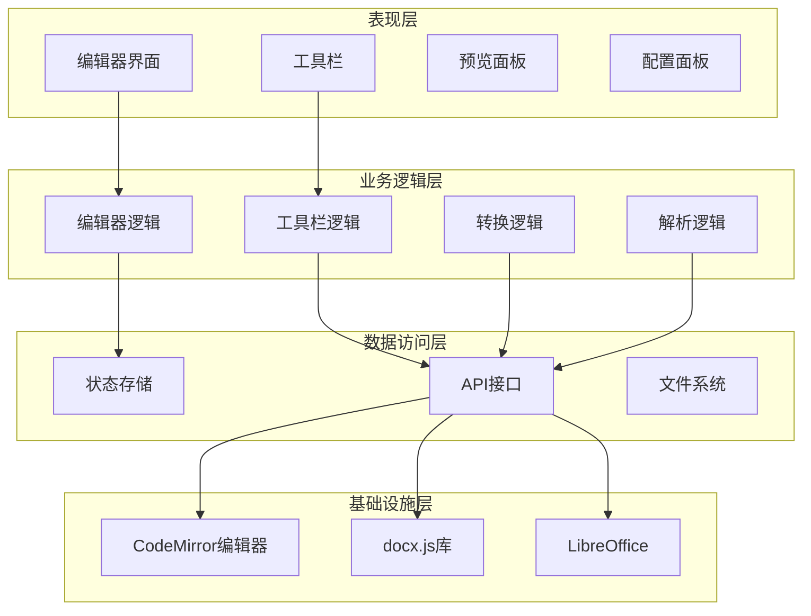

**图表来源**
- [MarkdownEditor.tsx:84-114](file://frontend/src/components/editor/MarkdownEditor.tsx#L84-L114)
- [EditorToolbar.tsx:16-31](file://frontend/src/components/editor/EditorToolbar.tsx#L16-L31)
- [api.ts:52-128](file://frontend/src/services/api.ts#L52-L128)

### 数据流架构

系统采用单向数据流设计，确保了数据的一致性和可预测性：

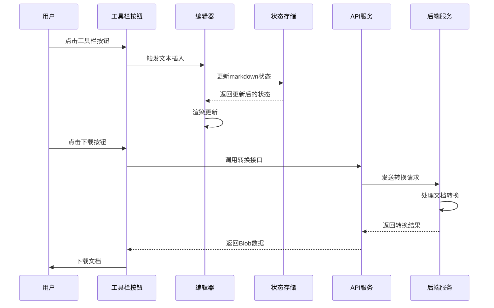

**图表来源**
- [EditorToolbar.tsx:16-31](file://frontend/src/components/editor/EditorToolbar.tsx#L16-L31)
- [MarkdownEditor.tsx:16-35](file://frontend/src/components/editor/MarkdownEditor.tsx#L16-L35)
- [api.ts:78-89](file://frontend/src/services/api.ts#L78-L89)

## 详细组件分析

### Markdown 编辑器组件

Markdown 编辑器是整个系统的中枢组件，负责提供专业的 Markdown 编写环境：

#### 核心功能实现

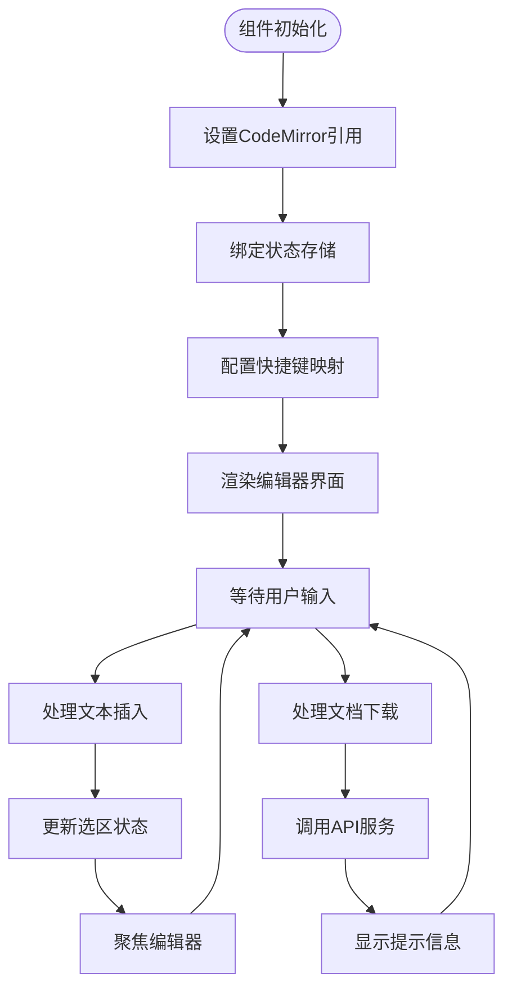

**图表来源**
- [MarkdownEditor.tsx:16-35](file://frontend/src/components/editor/MarkdownEditor.tsx#L16-L35)
- [MarkdownEditor.tsx:37-69](file://frontend/src/components/editor/MarkdownEditor.tsx#L37-L69)

#### 编辑器配置特性

编辑器采用了丰富的配置选项，提供了高度定制化的编写体验：

| 配置项 | 默认值 | 功能描述 |
|--------|--------|----------|
| 行号显示 | 开启 | 显示行号便于定位 |
| 活动行高亮 | 开启 | 高亮当前编辑行 |
| 代码折叠 | 开启 | 支持代码块折叠 |
| 自动补全 | 开启 | 智能代码补全 |
| 括号匹配 | 开启 | 自动括号匹配 |
| 拖拽光标 | 开启 | 支持拖拽选择 |

**更新** 新增了handleInsertText函数，专门处理文本插入逻辑，支持选中文本的格式化和插入操作。

**章节来源**
- [MarkdownEditor.tsx:84-114](file://frontend/src/components/editor/MarkdownEditor.tsx#L84-L114)

### 工具栏组件分析

工具栏组件提供了丰富的编辑功能按钮，支持快捷操作和一键格式化：

#### 工具栏按钮功能矩阵

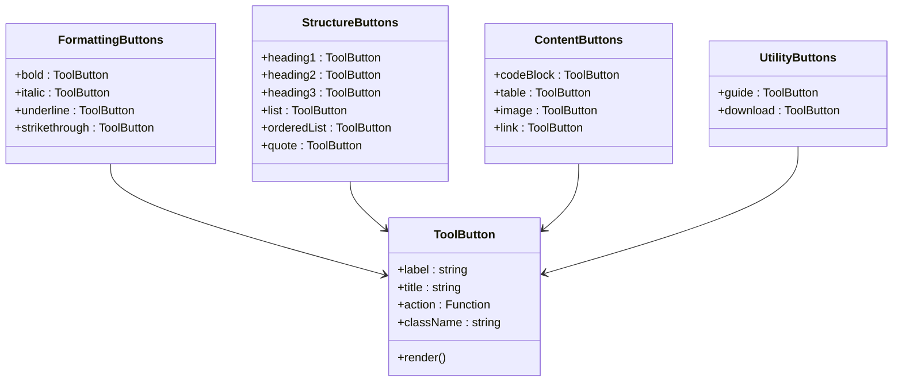

**图表来源**
- [EditorToolbar.tsx:36-48](file://frontend/src/components/editor/EditorToolbar.tsx#L36-L48)

#### 快捷键映射系统

工具栏集成了完整的键盘快捷键支持，提供了高效的编辑体验：

| 快捷键组合 | 功能名称 | Markdown 语法 |
|------------|----------|---------------|
| Ctrl+B | 粗体 | **粗体** |
| Ctrl+I | 斜体 | *斜体* |
| Ctrl+Shift+U | 下划线 | `<u>下划线</u>` |
| Ctrl+1 | 一级标题 | # 标题 |
| Ctrl+2 | 二级标题 | ## 标题 |
| Ctrl+3 | 三级标题 | ### 标题 |
| Ctrl+L | 列表 | - 列表项 |
| Ctrl+Shift+1 | 有序列表 | 1. 列表项 |
| Ctrl+Q | 引用 | > 引用 |
| Ctrl+Alt+C | 代码块 | ``` 代码块 ``` |
| Ctrl+T | 表格 | 表格模板 |

**更新** 新增了完整的工具栏按钮功能矩阵，包括格式化按钮、结构按钮、内容按钮和实用工具按钮的分类说明。

**章节来源**
- [MarkdownEditor.tsx:37-69](file://frontend/src/components/editor/MarkdownEditor.tsx#L37-L69)

### 状态管理系统

应用使用 Zustand 状态管理库实现了集中式的全局状态控制：

#### 状态结构设计

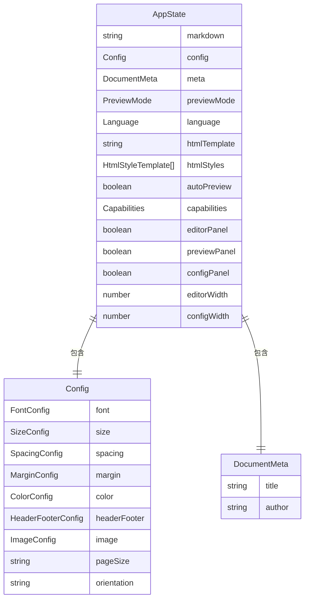

**图表来源**
- [useStore.ts:4-50](file://frontend/src/store/useStore.ts#L4-L50)
- [useStore.ts:52-58](file://frontend/src/store/useStore.ts#L52-L58)

#### 状态更新机制

状态管理采用了函数式更新模式，确保了状态变更的可预测性和一致性：

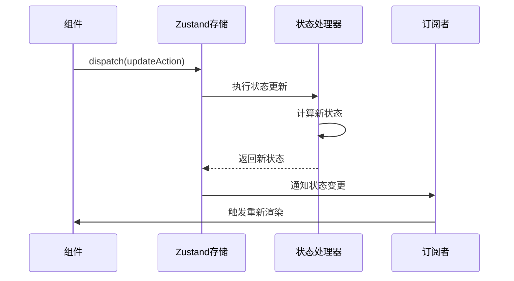

**图表来源**
- [useStore.ts:236-239](file://frontend/src/store/useStore.ts#L236-L239)

**章节来源**
- [useStore.ts:175-291](file://frontend/src/store/useStore.ts#L175-L291)

### 国际化系统

系统支持中英文双语界面，提供了完整的本地化解决方案：

#### 翻译键值结构

| 分类 | 键值 | 中文翻译 | 英文翻译 |
|------|------|----------|----------|
| 基础功能 | edit | 编辑 | Edit |
| 基础功能 | chars | 字 | chars |
| 基础功能 | shortcuts | Ctrl+B 粗体 · Ctrl+I 斜体 · Ctrl+S 保存 | Ctrl+B Bold · Ctrl+I Italic · Ctrl+S Save |
| 下载功能 | downloadDocx | 下载 .docx | Download .docx |
| 下载功能 | downloadSuccess | 文档下载成功 | Document downloaded successfully |
| 下载功能 | downloadFailed | 下载失败 | Download failed |
| 格式化按钮 | bold | 粗体 | Bold |
| 格式化按钮 | italic | 斜体 | Italic |
| 格式化按钮 | underline | 下划线 | Underline |
| 格式化按钮 | heading1 | 一级标题 | Heading 1 |
| 格式化按钮 | heading2 | 二级标题 | Heading 2 |
| 格式化按钮 | heading3 | 三级标题 | Heading 3 |
| 格式化按钮 | list | 列表 | List |
| 格式化按钮 | orderedList | 有序列表 | Ordered List |
| 格式化按钮 | quote | 引用 | Quote |
| 格式化按钮 | codeBlock | 代码块 | Code Block |
| 格式化按钮 | table | 表格 | Table |

**更新** 新增了完整的国际化键值结构，包括下载功能、格式化按钮和表格按钮的翻译键值。

**章节来源**
- [i18n.ts:4-251](file://frontend/src/i18n.ts#L4-L251)

### API 服务集成

前端 API 服务封装了所有后端通信逻辑，提供了统一的接口访问方式：

#### API 接口设计

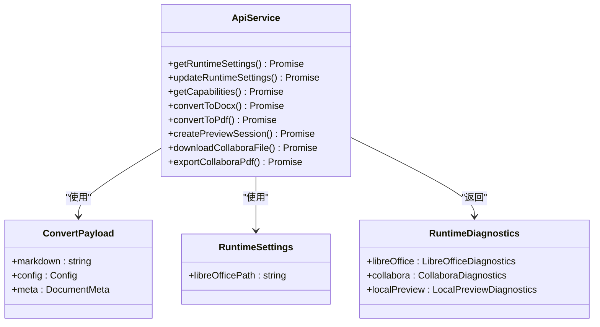

**图表来源**
- [api.ts:5-30](file://frontend/src/services/api.ts#L5-L30)

#### 错误处理机制

API 服务实现了完善的错误处理策略，确保了用户体验的稳定性：

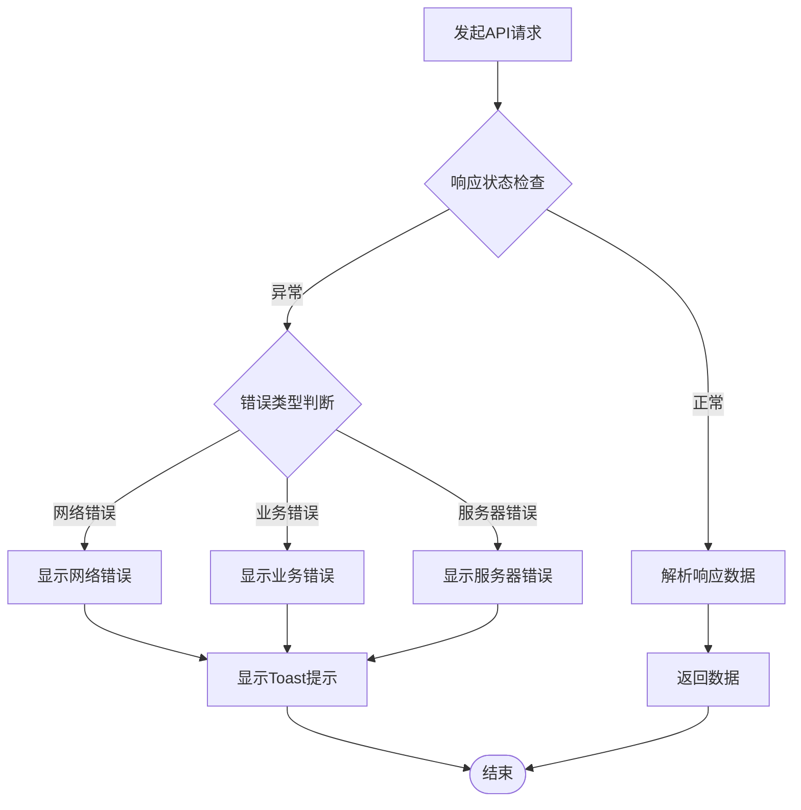

**图表来源**
- [api.ts:78-89](file://frontend/src/services/api.ts#L78-L89)
- [api.ts:91-102](file://frontend/src/services/api.ts#L91-L102)

**章节来源**
- [api.ts:52-128](file://frontend/src/services/api.ts#L52-L128)

### 通知系统

Toast 通知系统提供了非侵入式的用户反馈机制：

#### 通知类型和行为

| 通知类型 | 颜色 | 持续时间 | 触发条件 |
|----------|------|----------|----------|
| 成功 | 绿色 (#10B981) | 3秒 | 操作成功完成 |
| 错误 | 红色 (#EF4444) | 3秒 | 操作失败或异常 |

**更新** 新增了通知系统的详细说明，包括通知类型、颜色配置和触发条件。

**章节来源**
- [Toast.tsx:17-57](file://frontend/src/components/ui/Toast.tsx#L17-L57)

## 依赖关系分析

编辑器工具栏增强系统的依赖关系体现了清晰的分层架构：

```mermaid
graph TB
subgraph "外部依赖"
React[React 18.x]
CodeMirror[@uiw/react-codemirror]
docx[docx.js]
LibreOffice[libreoffice-convert]
end
subgraph "内部模块"
EditorToolbar[EditorToolbar]
MarkdownEditor[MarkdownEditor]
useStore[Zustand Store]
api[API Service]
i18n[Internationalization]
Toast[Toast System]
end
subgraph "工具库"
smartParser[Smart Parser]
templates[Templates]
types[Core Types]
end
EditorToolbar --> React
MarkdownEditor --> React
MarkdownEditor --> CodeMirror
EditorToolbar --> api
MarkdownEditor --> api
MarkdownEditor --> useStore
EditorToolbar --> useStore
api --> docx
api --> LibreOffice
useStore --> smartParser
useStore --> templates
useStore --> types
i18n --> Toast
```

**图表来源**
- [package.json](file://package.json)
- [EditorToolbar.tsx:1-6](file://frontend/src/components/editor/EditorToolbar.tsx#L1-L6)
- [MarkdownEditor.tsx:1-9](file://frontend/src/components/editor/MarkdownEditor.tsx#L1-L9)

### 关键依赖特性

系统的关键依赖具有以下重要特性：

#### React 生态系统
- **版本兼容性**：支持 React 18 的最新特性
- **TypeScript 集成**：完整的类型定义支持
- **性能优化**：利用 React 18 的并发特性

#### CodeMirror 集成
- **Markdown 语法高亮**：专业的 Markdown 编辑体验
- **主题定制**：支持多种编辑器主题
- **扩展性**：丰富的插件生态系统

#### docx.js 库
- **原生 JavaScript**：无需额外依赖
- **高性能**：优化的文档生成算法
- **兼容性**：完全符合 Office Open XML 标准

**章节来源**
- [package.json](file://package.json)

## 性能考虑

编辑器工具栏增强系统在设计时充分考虑了性能优化：

### 渲染性能优化

系统采用了多种渲染优化技术：

1. **组件懒加载**：按需加载大型组件
2. **虚拟滚动**：处理大量内容时的滚动性能
3. **防抖处理**：避免频繁的状态更新
4. **记忆化计算**：缓存昂贵的计算结果

### 内存管理策略

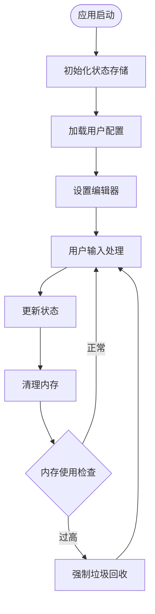

**图表来源**
- [useStore.ts:208-291](file://frontend/src/store/useStore.ts#L208-L291)

### 网络请求优化

API 服务实现了智能的请求管理和缓存策略：

1. **请求去重**：避免重复的相同请求
2. **超时控制**：合理的请求超时设置
3. **错误重试**：网络异常时的自动重试机制
4. **批量处理**：多个小请求的合并处理

**更新** 新增了完整的性能考虑章节，包括渲染性能优化、内存管理策略和网络请求优化的具体实现。

## 故障排除指南

### 常见问题诊断

#### 编辑器功能异常

| 问题症状 | 可能原因 | 解决方案 |
|----------|----------|----------|
| 工具栏按钮无响应 | 状态更新失败 | 检查 Zustand 状态更新逻辑 |
| 文本插入不正确 | 选区状态错误 | 验证 CodeMirror 选区获取 |
| 快捷键失效 | 键盘映射冲突 | 检查自定义快捷键配置 |
| 下载功能异常 | CORS 限制 | 配置正确的跨域设置 |

#### 性能问题排查

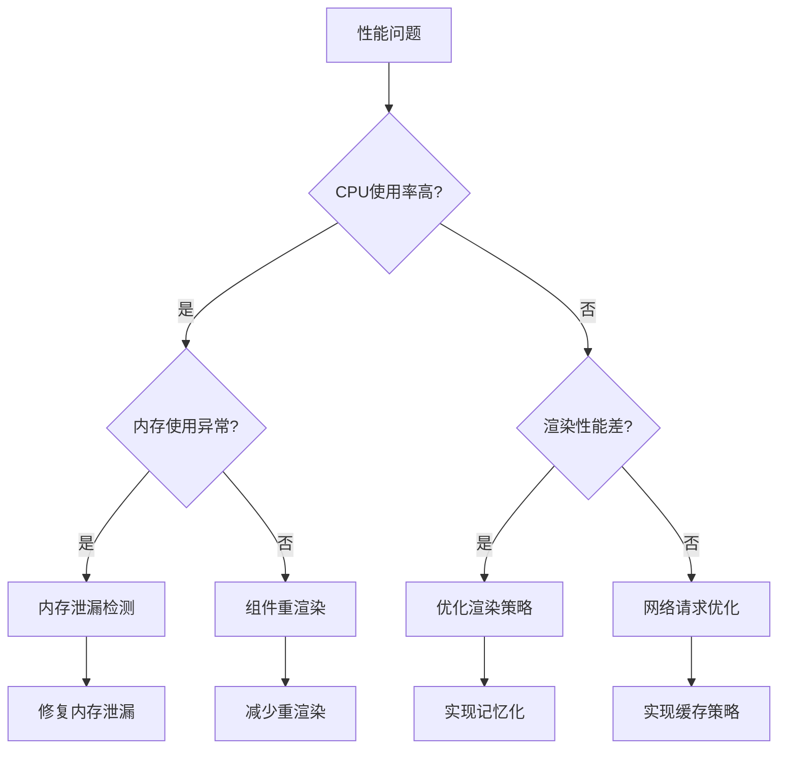

**图表来源**
- [MarkdownEditor.tsx:16-35](file://frontend/src/components/editor/MarkdownEditor.tsx#L16-L35)

#### 国际化问题

| 问题类型 | 症状 | 解决方法 |
|----------|------|----------|
| 翻译缺失 | 显示键值而非翻译 | 检查翻译键值是否存在 |
| 语言切换失败 | 界面语言未改变 | 验证 localStorage 存储 |
| 格式参数错误 | 翻译显示 {param} | 检查参数传递 |

**更新** 新增了完整的故障排除指南，包括常见问题诊断、性能问题排查和国际化问题的解决方案。

**章节来源**
- [i18n.ts:237-250](file://frontend/src/i18n.ts#L237-L250)

### 调试工具和技巧

1. **浏览器开发者工具**：监控网络请求和性能指标
2. **React DevTools**：检查组件状态和渲染次数
3. **Zustand DevTools**：调试状态变化历史
4. **Console 日志**：添加关键路径的日志输出

## 结论

编辑器工具栏增强系统通过精心设计的架构和实现，为用户提供了专业级的 Markdown 编辑体验。系统的主要优势包括：

### 技术优势

1. **现代化技术栈**：React 18 + TypeScript + Zustand 的组合提供了最佳的开发体验
2. **高性能架构**：优化的渲染策略和内存管理确保了流畅的用户体验
3. **完整的功能覆盖**：从基础编辑到高级导出功能的全方位支持
4. **良好的可扩展性**：模块化的架构设计便于功能扩展和维护

**更新** 新增了EditorToolbar组件的完整功能分析，包括工具栏按钮的丰富功能和交互机制。

### 用户体验优势

1. **直观的操作界面**：简洁明了的工具栏设计
2. **丰富的快捷功能**：全面的键盘快捷键支持
3. **多语言支持**：中英文双语界面
4. **实时反馈机制**：完善的错误处理和用户提示

### 发展前景

该系统为未来的功能扩展奠定了坚实的基础，包括：

1. **协作编辑功能**：支持多人实时协作编辑
2. **云端同步**：实现跨设备的文档同步
3. **AI 辅助编辑**：集成人工智能辅助写作功能
4. **插件生态**：开放的插件系统支持第三方扩展

通过持续的优化和功能增强，编辑器工具栏增强系统将继续为用户提供卓越的文档编辑体验。