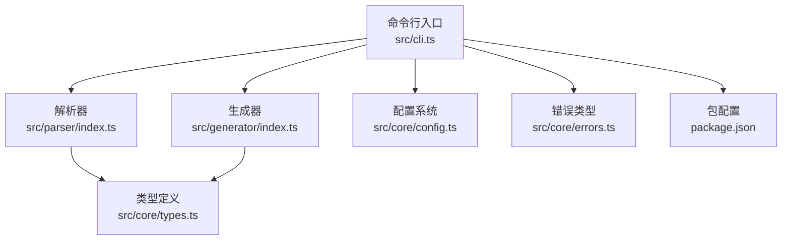
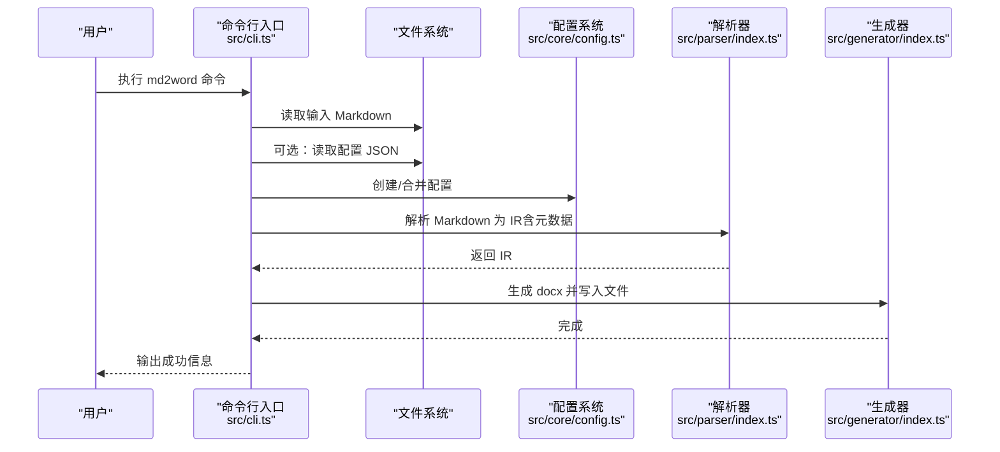
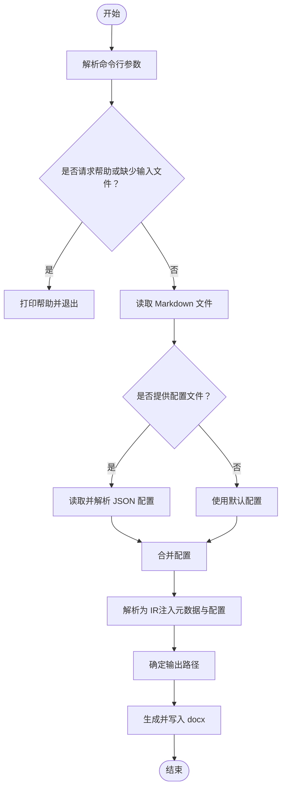
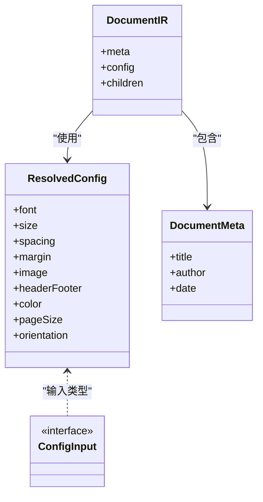
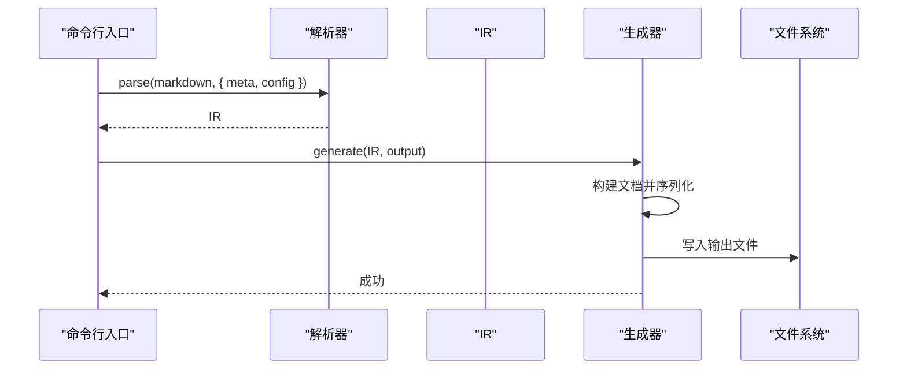
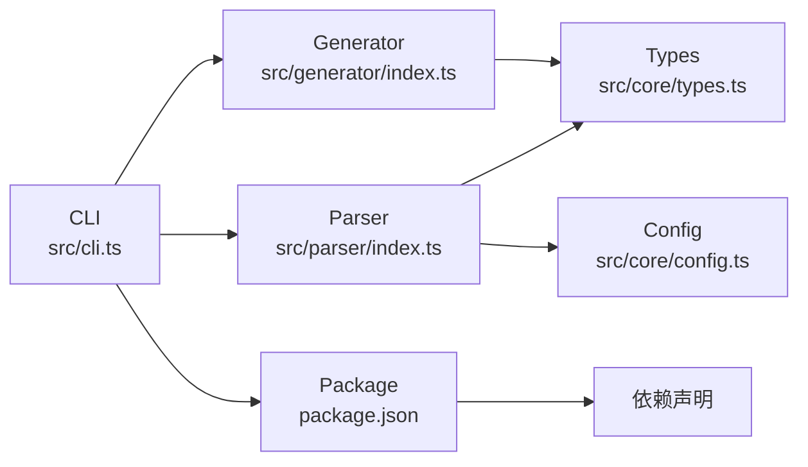

# 命令行工具使用

<cite>
**本文引用的文件**
- [src/cli.ts](file://src/cli.ts)
- [src/parser/index.ts](file://src/parser/index.ts)
- [src/generator/index.ts](file://src/generator/index.ts)
- [src/core/config.ts](file://src/core/config.ts)
- [src/core/types.ts](file://src/core/types.ts)
- [src/core/errors.ts](file://src/core/errors.ts)
- [package.json](file://package.json)
- [tests/e2e/full-pipeline.test.ts](file://tests/e2e/full-pipeline.test.ts)
- [tests/fixtures/markdown/sample.md](file://tests/fixtures/markdown/sample.md)
</cite>

## 目录
1. [简介](#简介)
2. [项目结构](#项目结构)
3. [核心组件](#核心组件)
4. [架构总览](#架构总览)
5. [详细组件分析](#详细组件分析)
6. [依赖分析](#依赖分析)
7. [性能考虑](#性能考虑)
8. [故障排除指南](#故障排除指南)
9. [结论](#结论)
10. [附录](#附录)

## 简介
本指南面向使用 Markdown to Word 转换器命令行工具（md2word）的用户与运维人员，系统讲解命令行语法、参数选项、配置文件加载、元数据设置、错误处理与常见问题排查，并提供最佳实践与性能优化建议。通过本文，您将能够：
- 正确使用 md2word 完成从 Markdown 到 Word 文档的转换
- 理解输入输出路径、配置文件与元数据参数的作用与组合方式
- 在复杂场景中进行批量处理与模板化配置
- 快速定位并解决常见的运行时错误

## 项目结构
该仓库采用模块化组织，命令行入口位于 src/cli.ts，核心解析与生成逻辑分别在 src/parser 与 src/generator 中，配置与类型定义位于 src/core。

图表来源
- [src/cli.ts:1-113](file://src/cli.ts#L1-L113)
- [src/parser/index.ts:1-24](file://src/parser/index.ts#L1-L24)
- [src/generator/index.ts:1-21](file://src/generator/index.ts#L1-L21)
- [src/core/config.ts:1-91](file://src/core/config.ts#L1-L91)
- [src/core/types.ts:1-198](file://src/core/types.ts#L1-L198)
- [src/core/errors.ts:1-28](file://src/core/errors.ts#L1-L28)
- [package.json:1-47](file://package.json#L1-L47)

章节来源
- [src/cli.ts:1-113](file://src/cli.ts#L1-L113)
- [package.json:1-47](file://package.json#L1-L47)

## 核心组件
- 命令行入口：负责解析参数、读取输入、加载配置、调用解析与生成流程，并输出结果或错误信息。
- 解析器：将 Markdown 文本转换为内部 IR（中间表示），并注入元数据与配置。
- 生成器：基于 IR 构建 docx 文档并写入文件。
- 配置系统：提供默认配置与校验，支持从 JSON 文件合并覆盖。
- 类型系统：统一描述文档元数据、节点类型与配置结构。
- 错误体系：对解析失败、生成失败、图片处理异常与配置校验失败进行分类处理。

章节来源
- [src/cli.ts:69-113](file://src/cli.ts#L69-L113)
- [src/parser/index.ts:11-21](file://src/parser/index.ts#L11-L21)
- [src/generator/index.ts:7-18](file://src/generator/index.ts#L7-L18)
- [src/core/config.ts:68-91](file://src/core/config.ts#L68-L91)
- [src/core/types.ts:1-198](file://src/core/types.ts#L1-L198)
- [src/core/errors.ts:1-28](file://src/core/errors.ts#L1-L28)

## 架构总览
下面以序列图展示一次典型转换流程：命令行参数解析 → 读取 Markdown → 加载配置 → 解析为 IR → 生成 docx → 写入文件。

图表来源
- [src/cli.ts:77-105](file://src/cli.ts#L77-L105)
- [src/core/config.ts:68-81](file://src/core/config.ts#L68-L81)
- [src/parser/index.ts:11-21](file://src/parser/index.ts#L11-L21)
- [src/generator/index.ts:7-18](file://src/generator/index.ts#L7-L18)

## 详细组件分析

### 命令行语法与参数详解
- 基本语法
  - md2word 输入文件 [选项...]
- 参数说明
  - -o, --output <路径>
    - 指定输出 Word 文档的保存路径；若省略，则以输入文件名为基础，扩展名为 .docx。
  - -c, --config <路径>
    - 指定 JSON 配置文件路径；程序会读取并解析为配置对象，用于覆盖默认样式与布局。
  - --title <标题>
    - 设置文档元数据中的标题字段；可被解析阶段注入到 IR 的 meta 中。
  - --author <作者>
    - 设置文档元数据中的作者字段；同样注入到 IR 的 meta。
  - -h, --help
    - 显示帮助信息并退出。
- 示例
  - 基本转换：md2word document.md
  - 指定输出：md2word document.md -o report.docx
  - 使用配置文件与标题：md2word document.md -c template.json --title "我的报告"

章节来源
- [src/cli.ts:9-25](file://src/cli.ts#L9-L25)
- [src/cli.ts:27-67](file://src/cli.ts#L27-L67)
- [src/cli.ts:100](file://src/cli.ts#L100)

### 参数解析与控制流
- 输入文件必须显式提供；否则显示帮助并以非零状态退出。
- 支持短横线与长横线形式的参数；部分参数需要紧随其后提供值。
- 输出路径优先使用 -o/--output；若未提供则根据输入文件名推导默认 .docx 路径。
- 配置文件为可选；当提供时，读取并解析为 JSON，随后与默认配置合并。

图表来源
- [src/cli.ts:69-113](file://src/cli.ts#L69-L113)

章节来源
- [src/cli.ts:69-113](file://src/cli.ts#L69-L113)

### 配置系统与元数据注入
- 配置来源与合并
  - 默认配置由配置系统提供；可通过 JSON 文件覆盖。
  - 合并策略为浅合并：新配置对象与现有配置对象键值叠加，后者覆盖前者同名键。
- 元数据注入
  - 解析阶段将命令行传入的标题与作者注入到 IR 的 meta 字段，供后续渲染使用。
- 配置项范围
  - 字体族、字号、行距、页边距、图片最大宽度与对齐、页眉页脚、颜色、纸张尺寸与方向等。

图表来源
- [src/core/config.ts:68-91](file://src/core/config.ts#L68-L91)
- [src/core/types.ts:136-198](file://src/core/types.ts#L136-L198)
- [src/parser/index.ts:11-21](file://src/parser/index.ts#L11-L21)

章节来源
- [src/core/config.ts:68-91](file://src/core/config.ts#L68-L91)
- [src/core/types.ts:1-198](file://src/core/types.ts#L1-L198)
- [src/parser/index.ts:11-21](file://src/parser/index.ts#L11-L21)

### 解析与生成流程
- 解析
  - 将 Markdown 文本分词并转为 IR，同时应用默认配置与传入的元数据。
- 生成
  - 基于 IR 构建 docx 文档对象，序列化为二进制缓冲区并写入目标路径。
- 错误处理
  - 生成阶段捕获底层异常并包装为特定错误类型，便于上层统一处理。

图表来源
- [src/parser/index.ts:11-21](file://src/parser/index.ts#L11-L21)
- [src/generator/index.ts:7-18](file://src/generator/index.ts#L7-L18)

章节来源
- [src/parser/index.ts:11-21](file://src/parser/index.ts#L11-L21)
- [src/generator/index.ts:7-18](file://src/generator/index.ts#L7-L18)

### 命令行示例与使用场景
- 基本使用
  - 单文件转换：md2word document.md
  - 指定输出：md2word document.md -o report.docx
- 高级配置
  - 使用配置文件：md2word document.md -c template.json
  - 指定标题与作者：md2word document.md --title "报告标题" --author "张三"
- 批量处理建议
  - 结合 shell 脚本循环遍历多个 .md 文件，逐个执行转换。
  - 对于多语言或特殊字体需求，建议准备专用配置文件并通过 -c 统一应用。

章节来源
- [src/cli.ts:20-24](file://src/cli.ts#L20-L24)

## 依赖分析
- CLI 依赖解析器与生成器完成端到端转换；解析器依赖配置系统与类型定义；生成器依赖 docx 序列化能力。
- package.json 中声明了 docx、markdown-it、sharp、zod 等关键依赖，确保解析、渲染与图像处理能力。

图表来源
- [src/cli.ts:1-113](file://src/cli.ts#L1-L113)
- [src/parser/index.ts:1-24](file://src/parser/index.ts#L1-L24)
- [src/generator/index.ts:1-21](file://src/generator/index.ts#L1-L21)
- [src/core/config.ts:1-91](file://src/core/config.ts#L1-L91)
- [src/core/types.ts:1-198](file://src/core/types.ts#L1-L198)
- [package.json:1-47](file://package.json#L1-L47)

章节来源
- [package.json:27-36](file://package.json#L27-L36)

## 性能考虑
- 大文件处理
  - 避免一次性读取超大 Markdown 文件；如需批量转换，建议拆分文件或分批执行。
- 图像处理
  - 若 Markdown 中包含大量图片，建议预处理图片尺寸与格式，减少生成阶段的图像处理开销。
- 配置复用
  - 将常用样式与布局封装为配置文件，避免重复解析与构建过程中的重复计算。
- I/O 优化
  - 输出路径尽量指向本地磁盘，减少跨盘符或网络路径带来的写入延迟。

## 故障排除指南
- 常见错误类型
  - Markdown 解析错误：当 Markdown 语法不合法时抛出相应错误。
  - DOCX 生成错误：生成阶段异常会被包装为特定错误类型。
  - 图片处理错误：图片读取或转换失败时抛出对应错误。
  - 配置校验错误：JSON 配置不符合模式时触发校验错误。
- 排查步骤
  - 确认输入文件存在且可读。
  - 检查配置文件 JSON 格式是否正确，字段名称与类型是否符合要求。
  - 查看标准输出中的错误提示，定位具体环节（解析/生成/配置）。
  - 尝试最小化示例（仅标题与少量内容）验证工具链是否正常。
- 参考测试
  - 端到端测试展示了从 Markdown 到 docx 缓冲区的完整流程与校验方法，可作为参考实现。

章节来源
- [src/core/errors.ts:1-28](file://src/core/errors.ts#L1-L28)
- [tests/e2e/full-pipeline.test.ts:8-51](file://tests/e2e/full-pipeline.test.ts#L8-L51)

## 结论
md2word 命令行工具提供了简洁而强大的 Markdown 到 Word 转换能力。通过合理使用参数与配置文件，您可以快速实现从基础单文件转换到复杂样式定制与批量处理的多种场景。遇到问题时，结合错误类型与测试样例进行定位，通常能快速恢复服务。

## 附录

### 命令行参数一览表
- -o, --output <路径>
  - 作用：指定输出 Word 文档路径；省略时按输入文件名推导 .docx 路径。
  - 场景：自定义输出位置、重命名输出文件。
- -c, --config <路径>
  - 作用：加载 JSON 配置文件，覆盖默认样式与布局。
  - 场景：模板化样式、团队统一规范。
- --title <标题>
  - 作用：设置文档元数据中的标题字段。
  - 场景：报告、论文、手册等需要标题的文档。
- --author <作者>
  - 作用：设置文档元数据中的作者字段。
  - 场景：协作文档、审计记录等需要作者信息的场景。
- -h, --help
  - 作用：显示帮助信息。
  - 场景：首次使用或忘记语法时。

章节来源
- [src/cli.ts:9-25](file://src/cli.ts#L9-L25)
- [src/cli.ts:27-67](file://src/cli.ts#L27-L67)

### 配置文件字段参考（节选）
- 字体与字号：body、heading、english、code；heading1 至 heading6、code
- 行距与段间距：lineSpacing、paragraphSpacing、headingSpacing
- 页边距：top、bottom、left、right
- 图片：maxWidthPercent、defaultAlign
- 页眉页脚：header、footer、pageNumbers
- 颜色：heading、text、link、codeBackground、blockquoteBorder
- 页面：pageSize（A4、Letter）、orientation（portrait、landscape）

章节来源
- [src/core/config.ts:4-64](file://src/core/config.ts#L4-L64)
- [src/core/types.ts:136-198](file://src/core/types.ts#L136-L198)

### 示例 Markdown（用于测试与演示）
- 可参考测试夹具中的示例 Markdown，包含标题、列表、引用、代码块、表格、分隔线与链接等元素。

章节来源
- [tests/fixtures/markdown/sample.md:1-51](file://tests/fixtures/markdown/sample.md#L1-L51)