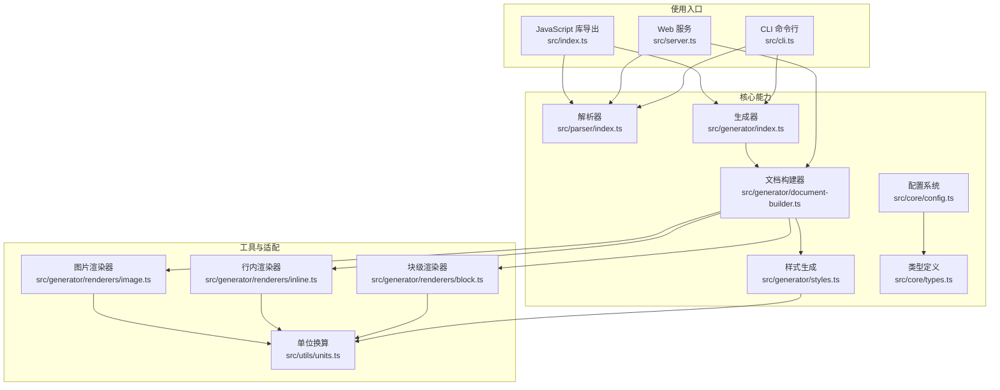
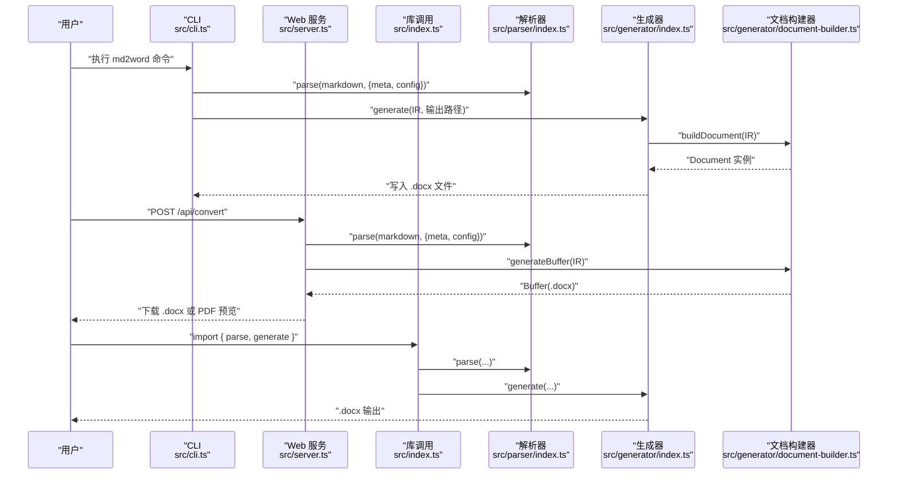
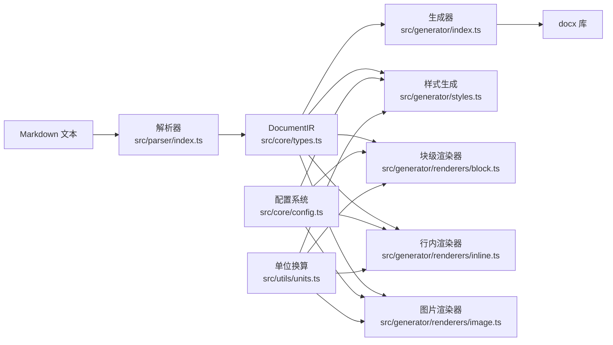

# 用户指南

<cite>
**本文引用的文件**
- [package.json](file://package.json)
- [src/index.ts](file://src/index.ts)
- [src/cli.ts](file://src/cli.ts)
- [src/server.ts](file://src/server.ts)
- [src/core/config.ts](file://src/core/config.ts)
- [src/core/types.ts](file://src/core/types.ts)
- [src/parser/index.ts](file://src/parser/index.ts)
- [src/generator/index.ts](file://src/generator/index.ts)
- [src/generator/styles.ts](file://src/generator/styles.ts)
- [src/generator/document-builder.ts](file://src/generator/document-builder.ts)
- [src/generator/renderers/block.ts](file://src/generator/renderers/block.ts)
- [src/generator/renderers/inline.ts](file://src/generator/renderers/inline.ts)
- [src/generator/renderers/image.ts](file://src/generator/renderers/image.ts)
- [src/utils/units.ts](file://src/utils/units.ts)
- [tests/fixtures/markdown/sample.md](file://tests/fixtures/markdown/sample.md)
</cite>

## 目录
1. [简介](#简介)
2. [项目结构](#项目结构)
3. [核心组件](#核心组件)
4. [架构总览](#架构总览)
5. [详细组件分析](#详细组件分析)
6. [依赖关系分析](#依赖关系分析)
7. [性能考虑](#性能考虑)
8. [故障排查指南](#故障排查指南)
9. [结论](#结论)
10. [附录](#附录)

## 简介
本指南面向不同技术背景的用户，系统讲解 Markdown to Word 转换器的三种使用模式：命令行工具、Web 服务与 JavaScript 库。文档覆盖从安装到运行、从基础配置到高级定制的全流程，并提供多种实际场景的使用范式、最佳实践与性能优化建议。

## 项目结构
该仓库采用模块化分层设计：
- 核心能力层：解析（parser）、生成（generator）、类型与配置（core）
- 使用入口层：CLI（命令行）、Server（Web 服务）、Library（JavaScript 库导出）
- 工具与适配层：单位换算、图片处理、样式生成

图表来源
- [src/cli.ts:1-113](file://src/cli.ts#L1-L113)
- [src/server.ts:1-94](file://src/server.ts#L1-L94)
- [src/index.ts:1-25](file://src/index.ts#L1-L25)
- [src/parser/index.ts:1-24](file://src/parser/index.ts#L1-L24)
- [src/generator/index.ts:1-21](file://src/generator/index.ts#L1-L21)
- [src/generator/document-builder.ts:1-112](file://src/generator/document-builder.ts#L1-L112)
- [src/generator/styles.ts:1-122](file://src/generator/styles.ts#L1-L122)
- [src/generator/renderers/block.ts:1-266](file://src/generator/renderers/block.ts#L1-L266)
- [src/generator/renderers/inline.ts:1-110](file://src/generator/renderers/inline.ts#L1-L110)
- [src/generator/renderers/image.ts:1-61](file://src/generator/renderers/image.ts#L1-L61)
- [src/core/config.ts:1-91](file://src/core/config.ts#L1-L91)
- [src/core/types.ts:1-198](file://src/core/types.ts#L1-L198)
- [src/utils/units.ts:1-45](file://src/utils/units.ts#L1-L45)

章节来源
- [package.json:1-47](file://package.json#L1-L47)
- [src/index.ts:1-25](file://src/index.ts#L1-L25)

## 核心组件
- 解析器：将 Markdown 文本转为内部 IR（文档中间表示），包含元数据与配置。
- 生成器：将 IR 渲染为 docx 文档，支持写入文件或输出 Buffer。
- 配置系统：通过 Zod Schema 定义可验证的配置模型，支持字体、字号、间距、页边距、图像、页眉页脚、颜色、纸张尺寸与方向等。
- 样式系统：基于 docx 的样式 API 生成标题、正文、代码块、引用等样式。
- 渲染器：块级（标题、段落、列表、表格、代码块、图片、分隔线）与行内（文本、加粗、斜体、下划线、行内代码、链接、换行）渲染。
- 单位换算：像素、点、twip、EMU 的统一换算工具，确保页面布局与图像尺寸准确。

章节来源
- [src/parser/index.ts:1-24](file://src/parser/index.ts#L1-L24)
- [src/generator/index.ts:1-21](file://src/generator/index.ts#L1-L21)
- [src/generator/document-builder.ts:1-112](file://src/generator/document-builder.ts#L1-L112)
- [src/generator/styles.ts:1-122](file://src/generator/styles.ts#L1-L122)
- [src/generator/renderers/block.ts:1-266](file://src/generator/renderers/block.ts#L1-L266)
- [src/generator/renderers/inline.ts:1-110](file://src/generator/renderers/inline.ts#L1-L110)
- [src/generator/renderers/image.ts:1-61](file://src/generator/renderers/image.ts#L1-L61)
- [src/core/config.ts:1-91](file://src/core/config.ts#L1-L91)
- [src/core/types.ts:1-198](file://src/core/types.ts#L1-L198)
- [src/utils/units.ts:1-45](file://src/utils/units.ts#L1-L45)

## 架构总览
下图展示从输入到输出的端到端流程，涵盖命令行、Web 服务与库调用三种模式。

图表来源
- [src/cli.ts:69-113](file://src/cli.ts#L69-L113)
- [src/server.ts:23-85](file://src/server.ts#L23-L85)
- [src/index.ts:1-25](file://src/index.ts#L1-L25)
- [src/parser/index.ts:11-21](file://src/parser/index.ts#L11-L21)
- [src/generator/index.ts:7-18](file://src/generator/index.ts#L7-L18)
- [src/generator/document-builder.ts:17-106](file://src/generator/document-builder.ts#L17-L106)

## 详细组件分析

### 命令行工具（CLI）
- 功能：读取 Markdown 文件，加载可选配置，解析为 IR，生成 .docx 文件。
- 支持参数：
  - -o/--output：指定输出文件路径，默认以 .docx 结尾
  - -c/--config：指定 JSON 配置文件路径
  - --title/--author：覆盖文档元数据
  - -h/--help：显示帮助
- 错误处理：捕获并打印错误信息，非正常退出码 1

使用示例（路径参考）
- [src/cli.ts:20-24](file://src/cli.ts#L20-L24)
- [src/cli.ts:79-105](file://src/cli.ts#L79-L105)

章节来源
- [src/cli.ts:1-113](file://src/cli.ts#L1-L113)

### Web 服务（HTTP API）
- 提供两个接口：
  - POST /api/convert：接收 markdown、config、meta，返回 .docx 文件
  - POST /api/preview：生成 .docx 后转换为 PDF 返回（需要 LibreOffice）
  - GET /health：健康检查
- 请求体字段：
  - markdown：必填
  - config：可选，JSON 对象
  - meta：可选，包含 title、author 等
- 响应头：
  - /api/convert 设置 Content-Disposition 下载 .docx
  - /api/preview 设置 Content-Type 为 application/pdf
- 错误处理：
  - 缺少 markdown 返回 400
  - LibreOffice 未安装时返回 503 并提示安装地址

使用示例（路径参考）
- [src/server.ts:23-49](file://src/server.ts#L23-L49)
- [src/server.ts:51-85](file://src/server.ts#L51-L85)
- [src/server.ts:87-89](file://src/server.ts#L87-L89)

章节来源
- [src/server.ts:1-94](file://src/server.ts#L1-L94)

### JavaScript 库（Library）
- 导出 API：
  - parse(markdown, options)：解析为 IR
  - generate(IR, outputPath)：生成 .docx 文件
  - createConfig()/mergeConfig()/defaultConfig：配置管理
  - 类型：DocumentIR、DocumentMeta、BlockNode、InlineNode、ResolvedConfig 等
- 典型流程：parse → generate → 下载/保存

使用示例（路径参考）
- [src/index.ts:1-25](file://src/index.ts#L1-L25)
- [src/generator/index.ts:7-18](file://src/generator/index.ts#L7-L18)

章节来源
- [src/index.ts:1-25](file://src/index.ts#L1-L25)
- [src/generator/index.ts:1-21](file://src/generator/index.ts#L1-L21)

### 配置系统（Config）
- 配置项（均具备默认值）：
  - 字体：正文、标题、英文、代码字体
  - 尺寸：正文、各级标题、代码字号
  - 间距：行距、段前段后、标题间距
  - 页边距：上、下、左、右（twip）
  - 图像：最大宽度百分比、默认对齐
  - 页眉页脚：内容、页码开关
  - 颜色：标题、正文、链接、代码背景、引用边框
  - 页面：A4/Letter，方向：纵向/横向
- 校验与合并：
  - 使用 Zod Schema 校验输入
  - createConfig 合并默认值与用户输入
  - mergeConfig 支持在运行时叠加覆盖

使用示例（路径参考）
- [src/core/config.ts:54-81](file://src/core/config.ts#L54-L81)
- [src/core/config.ts:83-90](file://src/core/config.ts#L83-L90)
- [src/core/types.ts:136-197](file://src/core/types.ts#L136-L197)

章节来源
- [src/core/config.ts:1-91](file://src/core/config.ts#L1-L91)
- [src/core/types.ts:1-198](file://src/core/types.ts#L1-L198)

### 解析与 IR（Parser）
- 输入：Markdown 字符串
- 输出：DocumentIR（type='document'，包含 meta、config、children）
- 步骤：tokenize → transformTokens → 组装 IR

使用示例（路径参考）
- [src/parser/index.ts:11-21](file://src/parser/index.ts#L11-L21)

章节来源
- [src/parser/index.ts:1-24](file://src/parser/index.ts#L1-L24)

### 文档生成（Generator）
- generate(IR, outputPath)：写入本地文件
- buildDocument(IR)：构建 docx 文档对象
- generateBuffer(IR)：直接输出 Buffer
- 错误包装：DocxGenerationError

使用示例（路径参考）
- [src/generator/index.ts:7-18](file://src/generator/index.ts#L7-L18)
- [src/generator/document-builder.ts:17-106](file://src/generator/document-builder.ts#L17-L106)

章节来源
- [src/generator/index.ts:1-21](file://src/generator/index.ts#L1-L21)
- [src/generator/document-builder.ts:1-112](file://src/generator/document-builder.ts#L1-L112)

### 样式系统（Styles）
- 自动生成标题（Heading 1–6）、正文、代码块、引用样式
- 基于 ResolvedConfig 注入字体、字号、颜色、行距、段前段后、大纲级别等
- 代码块使用背景色；引用块使用边框与斜体

使用示例（路径参考）
- [src/generator/styles.ts:5-109](file://src/generator/styles.ts#L5-L109)
- [src/generator/styles.ts:111-122](file://src/generator/styles.ts#L111-L122)

章节来源
- [src/generator/styles.ts:1-122](file://src/generator/styles.ts#L1-L122)

### 渲染器（Renderers）
- 块级渲染器（block.ts）：标题、段落、列表、引用、代码块、表格、图片、分隔线
- 行内渲染器（inline.ts）：文本、加粗、斜体、下划线、行内代码、链接、换行
- 图片渲染器（image.ts）：读取图片、计算缩放尺寸、对齐与间距、异常回退

使用示例（路径参考）
- [src/generator/renderers/block.ts:28-58](file://src/generator/renderers/block.ts#L28-L58)
- [src/generator/renderers/inline.ts:12-109](file://src/generator/renderers/inline.ts#L12-L109)
- [src/generator/renderers/image.ts:6-60](file://src/generator/renderers/image.ts#L6-L60)

章节来源
- [src/generator/renderers/block.ts:1-266](file://src/generator/renderers/block.ts#L1-L266)
- [src/generator/renderers/inline.ts:1-110](file://src/generator/renderers/inline.ts#L1-L110)
- [src/generator/renderers/image.ts:1-61](file://src/generator/renderers/image.ts#L1-L61)

### 单位换算（Units）
- px↔EMU、pt↔半点、pt↔twip、页面宽高 EMU 计算
- 用于图像尺寸与页边距的精确控制

使用示例（路径参考）
- [src/utils/units.ts:6-44](file://src/utils/units.ts#L6-L44)

章节来源
- [src/utils/units.ts:1-45](file://src/utils/units.ts#L1-L45)

## 依赖关系分析
- 外部依赖：docx（生成 .docx）、markdown-it（解析）、libreoffice/libreoffice-convert（PDF 预览）、sharp（图片处理）、cors/express（Web 服务）、zod（配置校验）
- 内部耦合：解析器与生成器通过 IR 解耦；样式与渲染器通过 ResolvedConfig 解耦；CLI/Server/Library 通过统一 API 调用核心模块

图表来源
- [src/parser/index.ts:11-21](file://src/parser/index.ts#L11-L21)
- [src/generator/index.ts:7-18](file://src/generator/index.ts#L7-L18)
- [src/generator/styles.ts:5-109](file://src/generator/styles.ts#L5-L109)
- [src/generator/renderers/block.ts:28-58](file://src/generator/renderers/block.ts#L28-L58)
- [src/generator/renderers/inline.ts:12-109](file://src/generator/renderers/inline.ts#L12-L109)
- [src/generator/renderers/image.ts:6-60](file://src/generator/renderers/image.ts#L6-L60)
- [src/core/config.ts:68-90](file://src/core/config.ts#L68-L90)
- [src/utils/units.ts:6-44](file://src/utils/units.ts#L6-L44)

章节来源
- [package.json:27-36](file://package.json#L27-L36)

## 性能考虑
- 图片处理
  - 使用 sharp 进行缩放与格式转换，建议预压缩大图以减少内存峰值
  - 控制图像最大宽度百分比与页边距，避免过度渲染
- 列表与嵌套结构
  - 深层嵌套会增加渲染层级，建议保持合理嵌套深度
- 样式与段落
  - 批量段落与行内样式渲染时尽量复用配置，减少重复计算
- Web 服务
  - 限制请求体大小（已设 10MB），避免超大文档导致内存压力
  - PDF 预览依赖 LibreOffice，建议在容器中预热或使用轻量化部署

[本节为通用建议，不直接分析具体文件]

## 故障排查指南
- 常见错误类型
  - MarkdownParseError：解析失败（语法问题或扩展不支持）
  - DocxGenerationError：生成失败（权限、磁盘空间、docx 库异常）
  - ImageProcessingError：图片读取/缩放失败（路径、格式、损坏）
  - ConfigValidationError：配置 Schema 校验失败（类型不符、越界）
- CLI
  - 参数缺失或错误：查看帮助输出与错误码
  - 输出路径不可写：确认目录存在且有写权限
- Web 服务
  - /api/preview 报错“找不到 soffice 二进制”：安装 LibreOffice 并确保 PATH 可找到
  - /api/convert 返回 400：检查请求体是否包含 markdown
- 配置
  - 字号/间距越界：使用 Schema 默认范围内的数值
  - 字体名无效：确保系统已安装对应字体

章节来源
- [src/index.ts:19-24](file://src/index.ts#L19-L24)
- [src/server.ts:74-83](file://src/server.ts#L74-L83)

## 结论
本转换器提供了从命令行、Web 服务到 JavaScript 库的完整使用方式，配合完善的配置系统与渲染管线，能够满足从简单文档到复杂排版的多样化需求。建议结合实际场景选择合适的使用模式，并遵循本文的最佳实践与性能建议。

[本节为总结性内容，不直接分析具体文件]

## 附录

### 使用模式与示例

- 命令行模式
  - 基础转换：参考 [src/cli.ts:20-24](file://src/cli.ts#L20-L24)
  - 指定输出与配置：参考 [src/cli.ts:79-105](file://src/cli.ts#L79-L105)
- Web 服务模式
  - 转换接口：POST /api/convert，参考 [src/server.ts:23-49](file://src/server.ts#L23-L49)
  - 预览接口：POST /api/preview，参考 [src/server.ts:51-85](file://src/server.ts#L51-L85)
- JavaScript 库模式
  - 解析与生成：参考 [src/index.ts:1-25](file://src/index.ts#L1-L25)、[src/generator/index.ts:7-18](file://src/generator/index.ts#L7-L18)

### 配置定制要点
- 字体与语言：针对中英混排设置 body/heading/english/code 字体
- 尺寸与间距：按阅读体验调整字号与行距、段前段后
- 页面布局：根据用途选择 A4/Letter 与纵向/横向
- 图像与页边距：控制最大宽度百分比与页边距，避免溢出
- 页眉页脚：启用页码或自定义内容
- 颜色方案：统一标题、正文、链接与代码背景色

章节来源
- [src/core/config.ts:54-81](file://src/core/config.ts#L54-L81)
- [src/generator/styles.ts:5-109](file://src/generator/styles.ts#L5-L109)
- [src/generator/document-builder.ts:30-69](file://src/generator/document-builder.ts#L30-L69)

### 实际示例参考
- 示例 Markdown 文档：[tests/fixtures/markdown/sample.md](file://tests/fixtures/markdown/sample.md)
- 生成的 .docx 文件：可在命令行或 Web 服务中下载验证效果

章节来源
- [tests/fixtures/markdown/sample.md:1-51](file://tests/fixtures/markdown/sample.md#L1-L51)