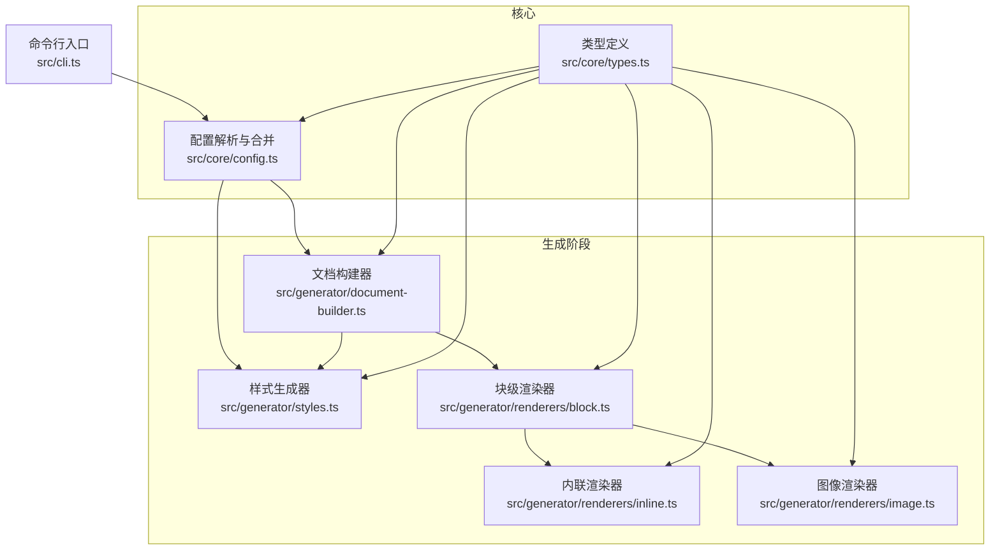
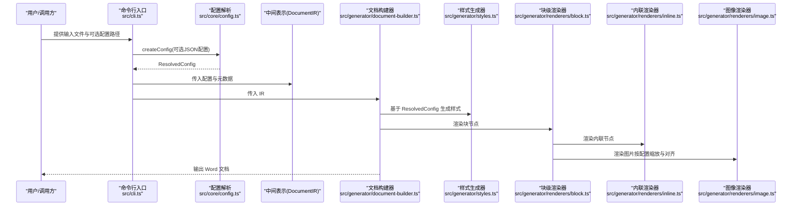
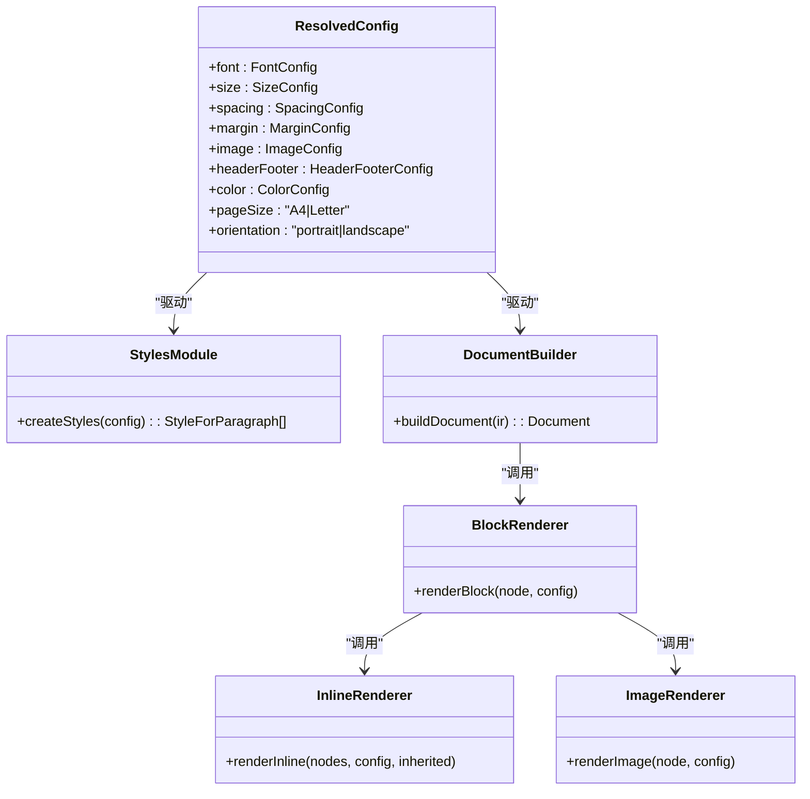

# 配置系统

<cite>
**本文引用的文件**
- [src/core/config.ts](file://src/core/config.ts)
- [src/core/types.ts](file://src/core/types.ts)
- [src/generator/styles.ts](file://src/generator/styles.ts)
- [src/generator/document-builder.ts](file://src/generator/document-builder.ts)
- [src/generator/renderers/block.ts](file://src/generator/renderers/block.ts)
- [src/generator/renderers/inline.ts](file://src/generator/renderers/inline.ts)
- [src/generator/renderers/image.ts](file://src/generator/renderers/image.ts)
- [src/utils/units.ts](file://src/utils/units.ts)
- [src/utils/image.ts](file://src/utils/image.ts)
- [src/cli.ts](file://src/cli.ts)
- [tests/unit/core/config.test.ts](file://tests/unit/core/config.test.ts)
</cite>

## 更新摘要
**所做更改**
- 新增全面的样式配置系统章节，详细介绍字体选择、颜色定制、页面布局设置等高级配置选项
- 扩展配置对象结构说明，包含完整的配置字段分类和作用描述
- 增加配置继承机制和合并策略的详细分析
- 补充配置错误诊断和常见问题解决方案
- 更新配置应用流程图和架构图，反映新的样式配置系统

## 目录
1. [简介](#简介)
2. [项目结构](#项目结构)
3. [核心组件](#核心组件)
4. [架构总览](#架构总览)
5. [详细组件分析](#详细组件分析)
6. [依赖关系分析](#依赖关系分析)
7. [性能考量](#性能考量)
8. [故障排查指南](#故障排查指南)
9. [结论](#结论)
10. [附录](#附录)

## 简介
本指南面向 Markdown to Word 转换器的配置系统，帮助用户与开发者理解配置对象的结构、默认值、校验规则、合并策略与优先级，并提供可直接套用的配置模板与最佳实践。配置系统以类型安全的模式构建，通过 Zod Schema 定义严格的输入校验，确保生成的 Word 文档在样式、页面布局、图像处理与页眉页脚等方面符合预期。

**更新** 新增全面的样式配置系统，包括字体选择、颜色定制、页面布局设置等高级配置选项，提供更精细的排版控制能力。

## 项目结构
配置系统主要由以下模块组成：
- 类型定义：集中于核心类型文件，定义配置接口与运行时解析后的配置类型。
- 配置解析与合并：提供创建默认配置、合并配置与导出默认配置的能力。
- 渲染与应用：样式生成器、文档构建器与各渲染器读取配置，将其映射到最终的 Word 文档结构。

**图表来源**
- [src/core/config.ts:1-91](file://src/core/config.ts#L1-L91)
- [src/core/types.ts:136-198](file://src/core/types.ts#L136-L198)
- [src/generator/styles.ts:1-122](file://src/generator/styles.ts#L1-L122)
- [src/generator/document-builder.ts:17-106](file://src/generator/document-builder.ts#L17-L106)
- [src/generator/renderers/block.ts:28-58](file://src/generator/renderers/block.ts#L28-L58)
- [src/generator/renderers/inline.ts:12-109](file://src/generator/renderers/inline.ts#L12-L109)
- [src/generator/renderers/image.ts:6-61](file://src/generator/renderers/image.ts#L6-L61)
- [src/cli.ts:69-113](file://src/cli.ts#L69-L113)

**章节来源**
- [src/core/config.ts:1-91](file://src/core/config.ts#L1-L91)
- [src/core/types.ts:136-198](file://src/core/types.ts#L136-L198)
- [src/cli.ts:69-113](file://src/cli.ts#L69-L113)

## 核心组件
- 配置 Schema 与默认值
  - 字体配置：正文、标题、英文、代码字体族名称。
  - 尺寸配置：正文、各级标题、代码字号。
  - 间距配置：行距、段前段后间距、标题间距。
  - 边距配置：上、下、左、右边距（Twip）。
  - 图像配置：最大宽度百分比、默认对齐方式。
  - 页眉页脚配置：页眉文本、页脚文本、是否显示页码。
  - 颜色配置：标题、正文、链接、代码背景、引用边框颜色。
  - 页面设置：纸张大小（A4、Letter）、方向（纵向、横向）。
- 配置解析与合并
  - createConfig：基于 Schema 解析输入，自动填充默认值。
  - mergeConfig：浅合并两个配置对象，后者覆盖前者同名字段。
  - defaultConfig：完整的默认配置实例，便于作为基线进行覆盖。

**章节来源**
- [src/core/config.ts:4-64](file://src/core/config.ts#L4-L64)
- [src/core/config.ts:68-91](file://src/core/config.ts#L68-L91)
- [src/core/types.ts:136-198](file://src/core/types.ts#L136-L198)

## 架构总览
配置从输入到渲染的流转如下：

**图表来源**
- [src/cli.ts:69-113](file://src/cli.ts#L69-L113)
- [src/core/config.ts:68-91](file://src/core/config.ts#L68-L91)
- [src/generator/document-builder.ts:17-106](file://src/generator/document-builder.ts#L17-L106)
- [src/generator/styles.ts:5-109](file://src/generator/styles.ts#L5-L109)
- [src/generator/renderers/block.ts:28-58](file://src/generator/renderers/block.ts#L28-L58)
- [src/generator/renderers/inline.ts:12-109](file://src/generator/renderers/inline.ts#L12-L109)
- [src/generator/renderers/image.ts:6-61](file://src/generator/renderers/image.ts#L6-L61)

## 详细组件分析

### 配置对象结构与字段说明
- 字体配置（font）
  - body：正文字体族名称。
  - heading：标题字体族名称。
  - english：英文内容字体族名称。
  - code：代码字体族名称。
- 尺寸配置（size）
  - body：正文字号。
  - heading1..heading6：各级标题字号。
  - code：代码块字号。
- 间距配置（spacing）
  - lineSpacing：行距（倍数）。
  - paragraphSpacing：段前段后间距（pt）。
  - headingSpacing：标题间距（pt）。
- 边距配置（margin）
  - top/bottom/left/right：页面四边边距（Twip）。
- 图像配置（image）
  - maxWidthPercent：图像最大宽度占页面可用宽度的百分比（1–100）。
  - defaultAlign：图像默认对齐方式（left/center/right）。
- 页眉页脚（headerFooter）
  - header：页眉文本（可选）。
  - footer：页脚文本（可选）。
  - pageNumbers：是否在页脚显示页码。
- 颜色配置（color）
  - heading：标题颜色（十六进制字符串）。
  - text：正文颜色。
  - link：链接颜色。
  - codeBackground：代码背景色。
  - blockquoteBorder：引用块左侧边框颜色。
- 页面设置（pageSize、orientation）
  - pageSize：纸张大小（A4/Letter）。
  - orientation：页面方向（portrait/landscape）。

**章节来源**
- [src/core/config.ts:4-64](file://src/core/config.ts#L4-L64)
- [src/core/types.ts:136-198](file://src/core/types.ts#L136-L198)

### 默认值与校验规则
- 默认值
  - 字体：中文（正文/标题）、英文字体、代码字体均有默认值。
  - 尺寸：正文与各级标题、代码字号有默认值。
  - 间距：行距、段间距、标题间距有默认值。
  - 边距：上下左右默认 Twip 值。
  - 图像：最大宽度百分比默认 80，对齐默认居中。
  - 页眉页脚：页码默认关闭；页眉/页脚文本可选。
  - 颜色：标题、正文、链接、代码背景、引用边框颜色有默认值。
  - 页面设置：默认 A4 与纵向。
- 校验规则
  - 字体、尺寸、颜色、边距、图像、页眉页脚、颜色等均通过 Schema 校验。
  - pageSize 仅允许 A4 或 Letter。
  - orientation 仅允许 portrait 或 landscape。
  - image.maxWidthPercent 必须在 1–100 的范围内。
  - headerFooter 中的 header/ footer 为可选字符串，pageNumbers 为布尔值。

**章节来源**
- [src/core/config.ts:4-64](file://src/core/config.ts#L4-L64)
- [tests/unit/core/config.test.ts:14-31](file://tests/unit/core/config.test.ts#L14-L31)

### 配置继承与合并策略
- 继承机制
  - defaultConfig 提供完整默认集，作为"基线"。
- 合并策略
  - mergeConfig 对 base 与 override 进行浅合并，后者覆盖前者同名字段。
  - createConfig 在内部先以空对象填充默认值，再将输入覆盖其上，实现"输入优先"的效果。
- 优先级
  - 输入配置 > 默认配置；mergeConfig 中 override > base。
- 注意事项
  - 部分字段（如颜色、边距）为数值或字符串，直接覆盖；嵌套对象（如 font、size、spacing、margin、image、headerFooter、color）采用浅合并，不会递归合并子属性。

**章节来源**
- [src/core/config.ts:68-91](file://src/core/config.ts#L68-L91)
- [tests/unit/core/config.test.ts:14-31](file://tests/unit/core/config.test.ts#L14-L31)

### 配置在渲染中的应用
- 样式生成（样式表）
  - 标题样式：基于 heading1..6 的字号、字体、颜色与段落间距生成。
  - 正文样式：基于 body 字号、字体、颜色与行距/段间距生成。
  - 代码块样式：基于 code 字号、字体与背景色生成。
  - 引用样式：斜体、浅灰文本与左侧边框。
- 段落与块级元素
  - 标题段落：根据层级映射 HeadingLevel，并应用对应字号与段前段后间距。
  - 列表与引用：应用统一的行距与段间距，并在引用块添加左侧边框。
  - 表格：单元格内段落复用正文样式。
- 内联元素
  - 文本、加粗、斜体、下划线、行内代码、链接、换行分别映射到对应的 TextRun 属性。
- 图像
  - 最大宽度按页面宽度与边距计算，受 maxWidthPercent 控制。
  - 默认对齐方式来自 image.defaultAlign，节点可覆盖。
- 页眉页脚与页面属性
  - 页眉/页脚文本与页码显示由 headerFooter 控制。
  - 页面方向与边距由 orientation 与 margin 控制。

**章节来源**
- [src/generator/styles.ts:5-109](file://src/generator/styles.ts#L5-L109)
- [src/generator/renderers/block.ts:60-197](file://src/generator/renderers/block.ts#L60-L197)
- [src/generator/renderers/inline.ts:12-109](file://src/generator/renderers/inline.ts#L12-L109)
- [src/generator/renderers/image.ts:6-61](file://src/generator/renderers/image.ts#L6-L61)
- [src/generator/document-builder.ts:17-106](file://src/generator/document-builder.ts#L17-L106)

### 配置 JSON 格式与示例
- JSON 结构要点
  - 顶层字段与类型需与 ResolvedConfig 对应，支持部分字段覆盖。
  - 可选字段（如 headerFooter.header/ footer）可省略。
  - 数值字段（如字号、边距）需为数字；枚举字段（如 pageSize、orientation）需为允许值。
- 示例模板
  - 基础模板：仅覆盖必要的字段，其余使用默认值。
  - 中文排版模板：调整字体与字号，适配中文阅读习惯。
  - 报告模板：增大标题间距与段间距，设置页眉页脚与页码。
  - 瘦身模板：减小边距与行距，提高信息密度。
  - 大图展示模板：提升图像最大宽度百分比与字号，突出图文。
- 使用方式
  - 命令行：通过 -c/--config 指定 JSON 文件路径。
  - 编程：导入 createConfig 并传入对象字面量。

**章节来源**
- [src/cli.ts:69-113](file://src/cli.ts#L69-L113)
- [src/core/config.ts:68-91](file://src/core/config.ts#L68-L91)

### 配置错误诊断与常见问题
- 常见错误类型
  - 枚举值非法：如 pageSize 非 A4/Letter，orientation 非 portrait/landscape。
  - 数值范围越界：如 maxWidthPercent 不在 1–100。
  - 类型不匹配：如字号为字符串而非数字。
- 诊断步骤
  - 捕获异常并输出错误消息；检查报错字段与期望值。
  - 使用默认配置作为对比，逐步缩小问题范围。
  - 单独校验 JSON 文件格式与字段命名。
- 解决方案
  - 修正枚举值或数值范围。
  - 确保所有数值字段为合法数字。
  - 使用 mergeConfig 与 defaultConfig 对比差异，确认覆盖顺序。

**章节来源**
- [tests/unit/core/config.test.ts:22-24](file://tests/unit/core/config.test.ts#L22-L24)
- [src/cli.ts:106-109](file://src/cli.ts#L106-L109)

### 全面的样式配置系统
**新增** 配置系统现已支持全面的样式配置，包括以下高级选项：

#### 字体配置系统
- 中文字体支持：正文使用 Microsoft YaHei，标题使用 SimHei
- 英文字体支持：默认 Times New Roman，适合技术文档
- 代码字体：Consolas 提供等宽字体支持
- 字体回退机制：支持 eastAsia 字段确保中文字体正确显示

#### 颜色定制系统
- 标题颜色：默认黑色，支持十六进制颜色值
- 正文颜色：默认黑色，可自定义主题色彩
- 链接颜色：默认蓝色，符合文档阅读习惯
- 代码背景：默认浅灰色，提升代码可读性
- 引用边框：默认浅灰色，清晰区分引用内容

#### 页面布局设置
- 纸张大小：A4 和 Letter 两种标准规格
- 页面方向：纵向和横向自由切换
- 边距控制：精确到 Twip 的四边边距设置
- 页面尺寸计算：基于 EMU 单位的精确页面测量

#### 高级排版选项
- 标题层级：H1-H6 独立的字号和样式配置
- 行距控制：支持多种行距比例设置
- 段落间距：独立控制段前段后间距
- 图像处理：最大宽度百分比和对齐方式

**章节来源**
- [src/core/config.ts:4-64](file://src/core/config.ts#L4-L64)
- [src/generator/styles.ts:5-109](file://src/generator/styles.ts#L5-L109)
- [src/generator/document-builder.ts:72-95](file://src/generator/document-builder.ts#L72-L95)

## 依赖关系分析
- 类型耦合
  - ResolvedConfig 与各渲染器共享，确保样式与布局一致性。
- 解析与渲染的耦合
  - createConfig 与 mergeConfig 为纯函数，不引入副作用，便于测试与复用。
- 外部依赖
  - 样式生成依赖 docx 库的样式与段落 API。
  - 图像渲染依赖图像读取与单位转换工具。

**图表来源**
- [src/core/types.ts:187-198](file://src/core/types.ts#L187-L198)
- [src/generator/styles.ts:5-109](file://src/generator/styles.ts#L5-L109)
- [src/generator/document-builder.ts:17-106](file://src/generator/document-builder.ts#L17-L106)
- [src/generator/renderers/block.ts:28-58](file://src/generator/renderers/block.ts#L28-L58)
- [src/generator/renderers/inline.ts:12-109](file://src/generator/renderers/inline.ts#L12-L109)
- [src/generator/renderers/image.ts:6-61](file://src/generator/renderers/image.ts#L6-L61)

## 性能考量
- 样式生成
  - createStyles 会为每个标题级别生成独立样式，避免重复计算；保持配置稳定可减少样式数量。
- 渲染流程
  - renderBlock/renderInline 为纯函数，避免全局状态；合理拆分段落与表格可降低内存峰值。
- 图像处理
  - 图像最大宽度按页面宽度与边距动态计算，避免过大图像导致内存压力；必要时在上游压缩图像。
- 合并策略
  - mergeConfig 为浅合并，避免深度遍历带来的开销；尽量只覆盖必要字段。

## 故障排查指南
- 配置校验失败
  - 现象：抛出校验异常，提示字段非法或类型不符。
  - 排查：对照默认值与枚举列表，修正字段值。
- 样式不符合预期
  - 现象：标题字号、颜色或段间距异常。
  - 排查：确认 size、color、spacing 是否被正确覆盖；检查 mergeConfig 的覆盖顺序。
- 图像显示异常
  - 现象：图像过大、对齐不生效或空白。
  - 排查：检查 image.maxWidthPercent 与 margin；确认节点对齐是否覆盖；查看回退逻辑。
- 页眉页脚与页面布局
  - 现象：页码未显示或边距不正确。
  - 排查：确认 headerFooter.pageNumbers 与 margin 设置；检查 orientation 与 pageSize。

**章节来源**
- [src/generator/renderers/image.ts:47-60](file://src/generator/renderers/image.ts#L47-L60)
- [src/generator/document-builder.ts:30-69](file://src/generator/document-builder.ts#L30-L69)

## 结论
该配置系统以类型安全与 Schema 校验为核心，结合默认配置与浅合并策略，提供了灵活且可控的排版能力。通过将配置贯穿至样式生成与渲染阶段，实现了从输入到输出的一致性与可预测性。新增的全面样式配置系统进一步增强了文档的视觉表现力，支持字体选择、颜色定制、页面布局等高级配置选项。遵循本文提供的模板与最佳实践，可在不同场景下快速获得高质量的 Word 文档输出。

## 附录
- 命令行使用
  - 支持通过 -c/--config 指定 JSON 配置文件；支持通过 --title 与 --author 注入文档元数据。
- 测试参考
  - 单元测试覆盖了默认配置、字段覆盖与非法值校验，可作为编写自定义配置的参考。
- 配置最佳实践
  - 建议为不同文档类型创建专门的配置模板
  - 保持字体和颜色配置的一致性，建立品牌色彩规范
  - 合理设置行距和段间距，确保文档可读性
  - 使用适当的边距和页面设置，适应不同的打印需求

**章节来源**
- [src/cli.ts:69-113](file://src/cli.ts#L69-L113)
- [tests/unit/core/config.test.ts:4-31](file://tests/unit/core/config.test.ts#L4-L31)