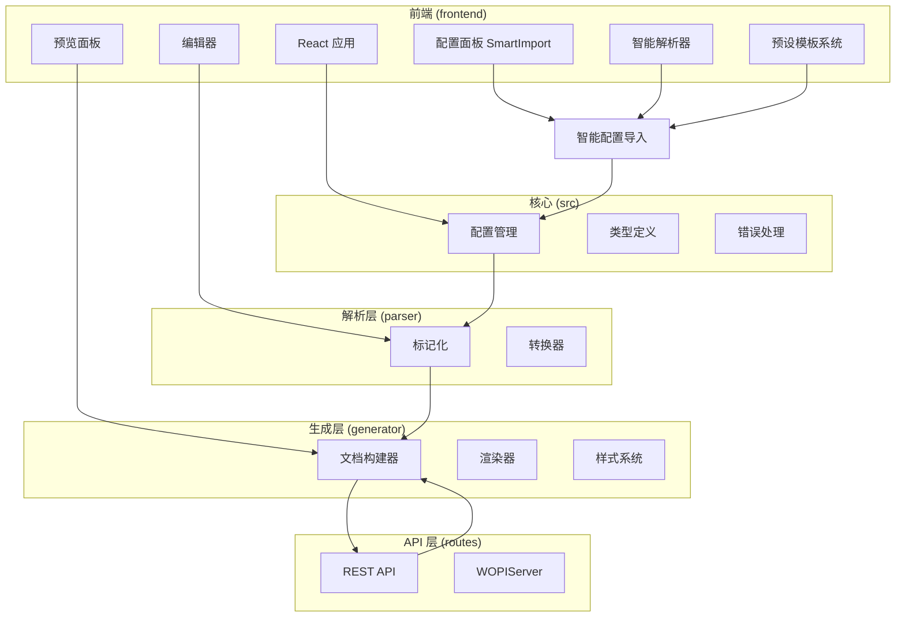
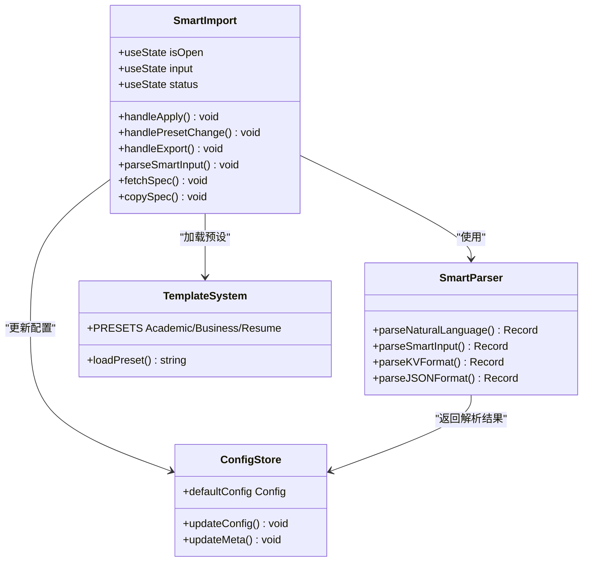
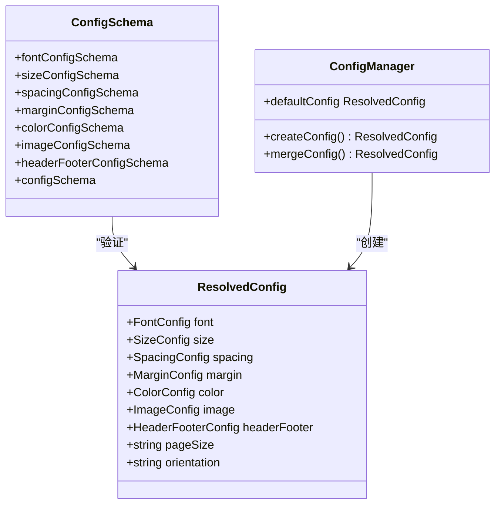
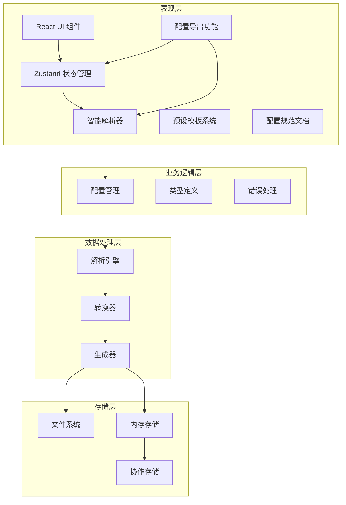
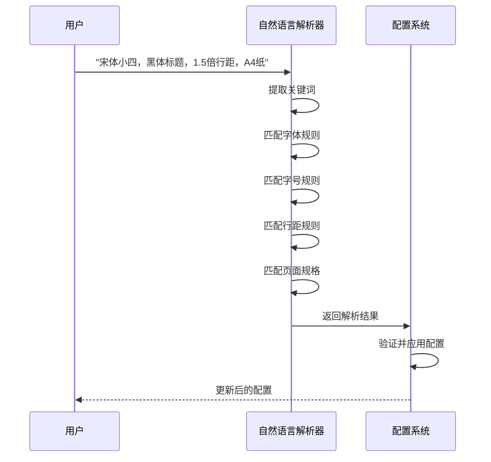
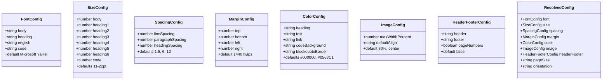
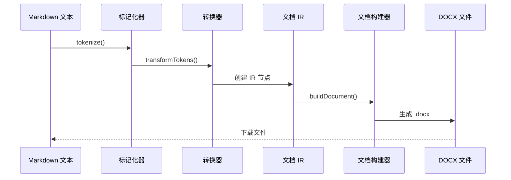
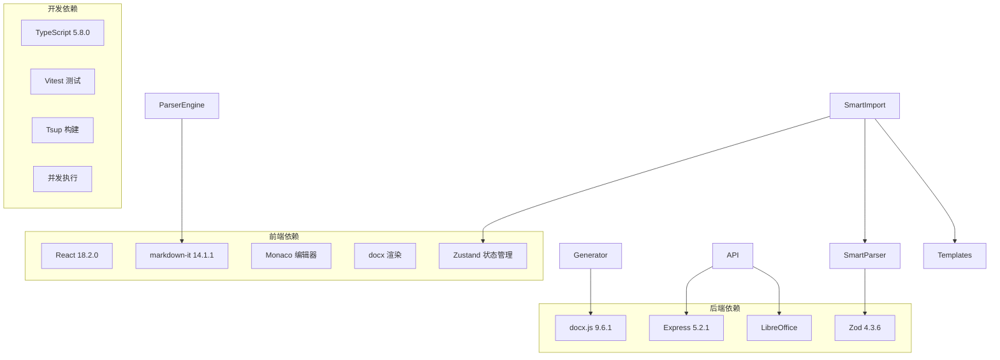
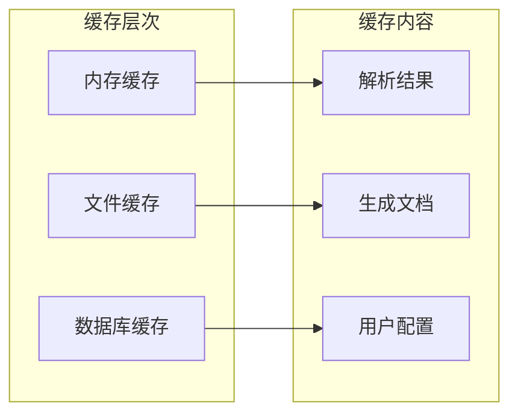

# 智能配置导入系统

<cite>
**本文档引用的文件**
- [README.md](file://README.md)
- [CONFIG_SPEC.md](file://CONFIG_SPEC.md)
- [frontend/src/components/config/SmartImport.tsx](file://frontend/src/components/config/SmartImport.tsx)
- [frontend/src/utils/smartParser.ts](file://frontend/src/utils/smartParser.ts)
- [frontend/src/utils/templates.ts](file://frontend/src/utils/templates.ts)
- [frontend/src/store/useStore.ts](file://frontend/src/store/useStore.ts)
- [frontend/public/CONFIG_SPEC.md](file://frontend/public/CONFIG_SPEC.md)
- [src/core/config.ts](file://src/core/config.ts)
- [src/core/types.ts](file://src/core/types.ts)
- [src/parser/index.ts](file://src/parser/index.ts)
- [src/parser/transformer.ts](file://src/parser/transformer.ts)
- [src/generator/index.ts](file://src/generator/index.ts)
- [src/generator/document-builder.ts](file://src/generator/document-builder.ts)
- [src/routes/api.ts](file://src/routes/api.ts)
- [package.json](file://package.json)
- [frontend/src/i18n.ts](file://frontend/src/i18n.ts)
</cite>

## 更新摘要
**变更内容**
- 新增完整的SmartImport组件实现，替代原有的纯HTML实现
- 添加智能解析器支持多种配置格式
- 实现预设模板系统，包含学术论文、商务报告、简历模板
- 集成配置规范文档，提供AI友好的配置说明
- 完善状态管理和配置验证系统
- **新增导出功能**：SmartImport组件新增导出能力，支持将当前配置导出为Key-Value格式，提供双向配置管理

## 目录
1. [简介](#简介)
2. [项目结构](#项目结构)
3. [核心组件](#核心组件)
4. [架构概览](#架构概览)
5. [详细组件分析](#详细组件分析)
6. [依赖关系分析](#依赖关系分析)
7. [性能考虑](#性能考虑)
8. [故障排除指南](#故障排除指南)
9. [结论](#结论)

## 简介

智能配置导入系统是一个功能强大的 Markdown 到 Word (.docx) 转换工具，专为满足中文用户的排版需求而设计。该系统提供了以下核心功能：

- **智能配置导入**：支持自然语言、Key-Value 文本和 JSON 格式的配置输入
- **多格式解析**：自动检测并解析不同格式的配置文本
- **预设模板**：内置学术论文、商务报告、简历等多种预设模板
- **实时预览**：支持多种预览模式（Markdown、HTML、PDF、Collabora）
- **AI 驱动**：AI 生成的配置文本可直接导入应用
- **配置规范**：提供详细的配置规范文档，便于AI理解和使用
- **双向配置管理**：支持将当前配置导出为Key-Value格式，便于备份和分享

系统采用前后端分离架构，前端使用 React + TypeScript，后端基于 Node.js 和 Express，通过 docx.js 生成标准 .docx 文件。

## 项目结构

该项目采用模块化组织方式，主要分为以下几个核心目录：



**图表来源**
- [frontend/src/components/config/SmartImport.tsx:1-221](file://frontend/src/components/config/SmartImport.tsx#L1-L221)
- [src/core/config.ts:1-91](file://src/core/config.ts#L1-L91)
- [src/parser/index.ts:1-24](file://src/parser/index.ts#L1-L24)
- [src/generator/document-builder.ts:1-193](file://src/generator/document-builder.ts#L1-L193)

**章节来源**
- [README.md:25-77](file://README.md#L25-L77)

## 核心组件

### 智能配置导入组件

智能配置导入系统的核心是 `SmartImport` 组件，它提供了三种配置输入方式和一个重要的导出功能：

1. **自然语言输入**：用户可以用中文描述格式要求
2. **Key-Value 文本**：标准的键值对格式
3. **JSON 格式**：结构化的配置对象
4. **配置导出**：将当前配置导出为Key-Value格式，支持备份和分享



**图表来源**
- [frontend/src/components/config/SmartImport.tsx:1-221](file://frontend/src/components/config/SmartImport.tsx#L1-L221)
- [frontend/src/utils/smartParser.ts:1-87](file://frontend/src/utils/smartParser.ts#L1-L87)
- [frontend/src/store/useStore.ts:1-210](file://frontend/src/store/useStore.ts#L1-L210)
- [frontend/src/utils/templates.ts:83-166](file://frontend/src/utils/templates.ts#L83-L166)

### 配置导出功能详解

**新增功能**：SmartImport组件现在支持将当前配置导出为Key-Value格式，提供完整的双向配置管理能力。

#### 导出功能特性

1. **完整配置覆盖**：导出所有配置字段，包括字体、字号、间距、边距、颜色、页面布局、页眉页脚、图片等
2. **实时状态同步**：导出当前应用中的最新配置状态
3. **标准化格式**：输出标准的Key-Value格式，便于复制和分享
4. **AI友好**：导出格式与配置规范完全兼容，可直接用于AI配置生成

#### 导出字段覆盖范围

导出功能涵盖了所有配置类别，具体包括：

- **字体配置**：body-font、heading-font、english-font、code-font
- **字号配置**：body-size、h1-size、h2-size、h3-size、h4-size、h5-size、h6-size、code-size
- **间距配置**：line-spacing、paragraph-spacing、heading-spacing
- **边距配置**：margin-top、margin-bottom、margin-left、margin-right
- **颜色配置**：heading-color、text-color、link-color、code-bg-color、quote-border-color
- **页面布局**：page-size、orientation
- **页眉页脚**：header-text、footer-text、page-numbers
- **图片配置**：image-max-width、image-align
- **文档元数据**：doc-title、doc-author

**章节来源**
- [frontend/src/components/config/SmartImport.tsx:105-144](file://frontend/src/components/config/SmartImport.tsx#L105-L144)
- [frontend/src/i18n.ts:99-103](file://frontend/src/i18n.ts#L99-L103)

### 配置管理系统

系统使用 Zod 进行配置验证和类型安全：



**图表来源**
- [src/core/config.ts:1-91](file://src/core/config.ts#L1-L91)
- [src/core/types.ts:142-204](file://src/core/types.ts#L142-L204)

**章节来源**
- [frontend/src/components/config/SmartImport.tsx:12-84](file://frontend/src/components/config/SmartImport.tsx#L12-L84)
- [src/core/config.ts:68-91](file://src/core/config.ts#L68-L91)

## 架构概览

系统采用分层架构设计，从上到下分为表现层、业务逻辑层、数据处理层和存储层：



**图表来源**
- [src/parser/index.ts:1-24](file://src/parser/index.ts#L1-L24)
- [src/generator/index.ts:1-21](file://src/generator/index.ts#L1-L21)
- [src/routes/api.ts:1-127](file://src/routes/api.ts#L1-L127)

## 详细组件分析

### 智能解析器工作流程

智能解析器支持三种输入格式，每种格式都有特定的解析策略：

```mermaid
flowchart TD
Start([开始解析]) --> CheckFormat{检查输入格式}
CheckFormat --> |以 { 开头| JSONFormat
CheckFormat --> |包含 :| KVFormat
CheckFormat --> |其他| NLFormat
JSONFormat --> ParseJSON["解析 JSON 格式"]
ParseJSON --> MapFields["映射字段到内部结构"]
KVFormat --> SplitLines["按行分割"]
SplitLines --> ProcessLine["处理每行键值对"]
ProcessLine --> CleanValue["清理值格式"]
NLFormat --> ExtractKeywords["提取关键词"]
ExtractKeywords --> MapToConfig["映射到配置结构"]
MapFields --> ValidateConfig["验证配置"]
CleanValue --> ValidateConfig
MapToConfig --> ValidateConfig
ValidateConfig --> ApplyConfig["应用到配置系统"]
ApplyConfig --> ExportConfig["导出配置"]
ExportConfig --> End([完成])
```

**图表来源**
- [frontend/src/utils/smartParser.ts:21-86](file://frontend/src/utils/smartParser.ts#L21-L86)

#### JSON 格式解析

JSON 格式解析器能够处理复杂的嵌套结构，支持完整的配置规范：

| 配置类别 | JSON 路径 | 支持的字段 |
|---------|----------|-----------|
| 字体配置 | `font.body/headings/english/code` | 中文字体、英文字体、代码字体 |
| 字号配置 | `size.body/heading1-6/code` | 各级标题和正文字号 |
| 间距配置 | `spacing.lineSpacing/paragraphSpacing/headingSpacing` | 行间距、段后间距、标题间距 |
| 边距配置 | `margin.top/bottom/left/right` | 四边页边距 |
| 颜色配置 | `color.heading/text/link/codeBackground/blockquoteBorder` | 各种文本颜色 |

#### 自然语言解析

自然语言解析器能够理解中文描述的格式要求：



**图表来源**
- [frontend/src/utils/smartParser.ts:1-19](file://frontend/src/utils/smartParser.ts#L1-L19)

**章节来源**
- [frontend/src/utils/smartParser.ts:21-86](file://frontend/src/utils/smartParser.ts#L21-L86)

### 预设模板系统

系统内置了三种专业的预设模板，每种模板都针对特定的使用场景：

#### 学术论文模板

学术论文模板专为中文高校毕业论文设计，具有严格的格式要求：

- **字体规范**：正文使用宋体小四（12pt），标题使用黑体
- **字号体系**：H1 22pt，H2 18pt，H3 16pt，正文 12pt
- **行距设置**：1.5倍行距，段后间距 0pt
- **页边距**：上下 2.54cm，左右 3.18cm
- **页码设置**：启用页码显示

#### 商务报告模板

商务报告模板适用于企业文档和商业演示：

- **字体选择**：正文使用微软雅黑，标题使用微软雅黑
- **字号比例**：H1 24pt，H2 18pt，H3 14pt，正文 11pt
- **色彩搭配**：深蓝色标题（#1a3c6e），灰色正文（#333333）
- **页边距适中**：1" 上下，1" 左右的标准商务格式

#### 简历模板

简历模板优化了视觉效果和信息密度：

- **紧凑布局**：上下边距 0.5"，左右边距 0.5"
- **强调标题**：一级标题 20pt，二级标题 14pt
- **简洁风格**：无页码，右侧图片对齐
- **专业色彩**：深蓝标题，蓝色链接

**章节来源**
- [frontend/src/utils/templates.ts:83-166](file://frontend/src/utils/templates.ts#L83-L166)

### 配置验证与类型系统

系统使用 Zod 进行严格的配置验证，确保所有输入都符合预期格式：



**图表来源**
- [src/core/types.ts:142-204](file://src/core/types.ts#L142-L204)
- [src/core/config.ts:4-64](file://src/core/config.ts#L4-L64)

**章节来源**
- [src/core/types.ts:1-204](file://src/core/types.ts#L1-L204)
- [src/core/config.ts:1-91](file://src/core/config.ts#L1-L91)

### 配置规范文档系统

系统提供完整的配置规范文档，支持AI友好格式：

- **双语支持**：同时提供英文和中文版本
- **格式说明**：详细说明支持的配置格式
- **字段参考**：完整的配置字段列表和默认值
- **示例模板**：预设模板的完整配置示例
- **AI提示**：为AI助手提供的示例提示

**章节来源**
- [frontend/public/CONFIG_SPEC.md:1-314](file://frontend/public/CONFIG_SPEC.md#L1-L314)

### Markdown 解析与转换

系统使用 markdown-it 作为解析引擎，支持 CommonMark + 表格扩展：



**图表来源**
- [src/parser/index.ts:11-21](file://src/parser/index.ts#L11-L21)
- [src/generator/document-builder.ts:18-187](file://src/generator/document-builder.ts#L18-L187)

**章节来源**
- [src/parser/index.ts:11-21](file://src/parser/index.ts#L11-L21)
- [src/parser/transformer.ts:25-39](file://src/parser/transformer.ts#L25-L39)

## 依赖关系分析

系统采用模块化设计，各组件之间的依赖关系清晰明确：



**图表来源**
- [package.json:34-55](file://package.json#L34-L55)

### 关键依赖说明

| 依赖包 | 版本 | 用途 | 重要性 |
|-------|------|------|--------|
| react | 18.2.0 | 前端框架 | 核心 |
| zustand | ^4.4.1 | 状态管理 | 核心 |
| docx | ^9.6.1 | DOCX 生成 | 核心 |
| express | ^5.2.1 | Web 服务器 | 核心 |
| markdown-it | ^14.1.1 | Markdown 解析 | 核心 |
| zod | ^4.3.6 | 类型验证 | 核心 |
| libreoffice-convert | ^1.8.1 | PDF 导出 | 重要 |
| sharp | ^0.34.5 | 图片处理 | 重要 |

**章节来源**
- [package.json:34-55](file://package.json#L34-L55)

## 性能考虑

### 内存优化策略

1. **流式处理**：文档生成采用流式处理，避免大文件占用过多内存
2. **缓存机制**：预览文件使用临时存储，支持 TTL 清理
3. **懒加载**：图片资源按需加载，支持远程 URL 和本地文件
4. **状态管理优化**：使用Zustand进行高效的状态管理

### 并发处理

系统支持多用户并发操作：
- **API 并发**：Express 服务器支持高并发请求
- **文件并发**：WOPIServer 支持多个协作会话
- **解析并发**：Markdown 解析器可同时处理多个文档

### 缓存策略



## 故障排除指南

### 常见问题及解决方案

#### 配置解析失败

**问题症状**：智能配置导入面板显示解析错误

**可能原因**：
1. 配置格式不正确
2. 字段名称拼写错误
3. 数值范围超出限制

**解决步骤**：
1. 检查配置格式是否符合规范
2. 验证字段名称是否正确
3. 确认数值在允许范围内

#### 文档生成错误

**问题症状**：转换过程中出现错误

**可能原因**：
1. Markdown 语法错误
2. 图片路径无效
3. 配置参数冲突

**解决步骤**：
1. 检查 Markdown 语法
2. 验证图片链接
3. 简化配置参数

#### PDF 导出失败

**问题症状**：PDF 导出时报错

**可能原因**：
1. LibreOffice 未安装
2. soffice 二进制文件找不到
3. 内存不足

**解决步骤**：
1. 安装 LibreOffice
2. 确认 soffice 路径
3. 增加系统内存

#### 预设模板加载失败

**问题症状**：预设模板无法加载

**可能原因**：
1. 模板文件损坏
2. 网络连接问题
3. 浏览器缓存问题

**解决步骤**：
1. 刷新页面清除缓存
2. 检查网络连接
3. 重新加载模板文件

#### 配置导出失败

**问题症状**：点击导出按钮无响应或报错

**可能原因**：
1. 状态管理异常
2. 配置数据格式错误
3. 浏览器剪贴板权限问题

**解决步骤**：
1. 检查浏览器控制台错误信息
2. 验证当前配置状态
3. 确认浏览器剪贴板权限设置

**章节来源**
- [src/routes/api.ts:15-34](file://src/routes/api.ts#L15-L34)
- [src/generator/index.ts:7-18](file://src/generator/index.ts#L7-L18)

## 结论

智能配置导入系统是一个功能完整、架构清晰的 Markdown 到 Word 转换工具。其核心优势包括：

1. **智能化配置导入**：支持多种输入格式，降低用户学习成本
2. **专业的预设模板**：内置多种行业标准模板
3. **严格的数据验证**：使用 Zod 确保配置的正确性
4. **现代化的前端体验**：React + TypeScript 提供优秀的用户体验
5. **完善的错误处理**：全面的错误捕获和用户反馈机制
6. **AI友好设计**：提供详细的配置规范文档，便于AI理解和使用
7. **双向配置管理**：新增的导出功能支持配置备份、分享和版本管理

系统适合需要高质量文档生成的专业用户，特别是中文用户群体。通过 AI 驱动的配置导入功能和双向配置管理能力，用户可以快速获得符合要求的文档格式，大大提高了工作效率。

未来可以考虑的功能增强包括：
- 更多的预设模板
- 配置导入的 AI 辅助功能
- 更丰富的样式自定义选项
- 批量处理能力
- 更好的移动端支持
- 配置导入的历史记录功能
- 配置模板的分享和导入功能
- 配置版本管理和比较功能
- 导入导出的批量操作功能