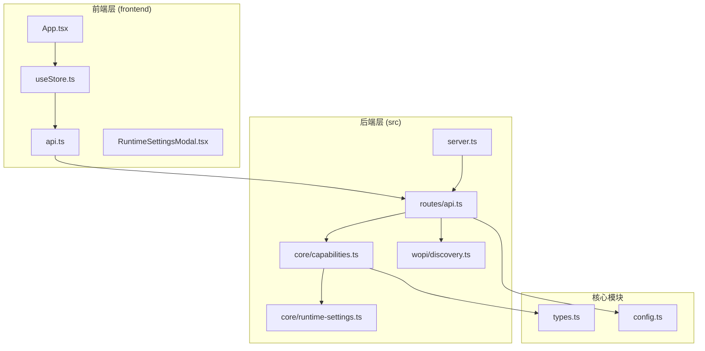
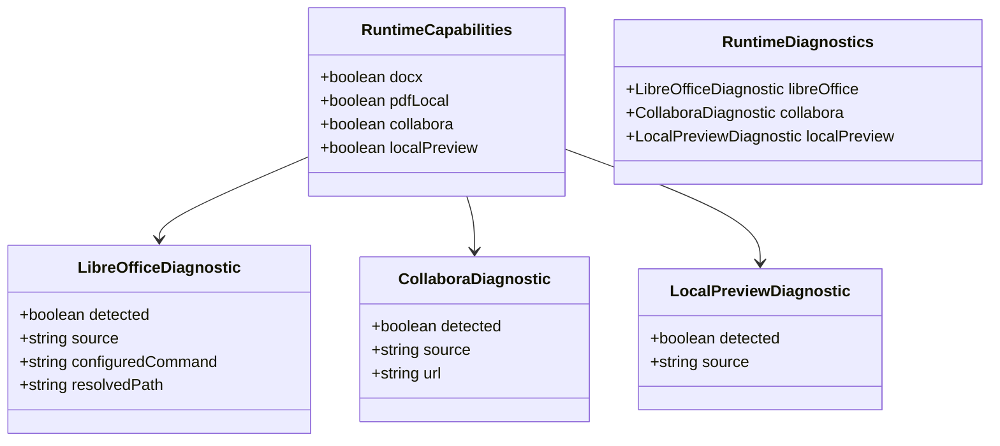
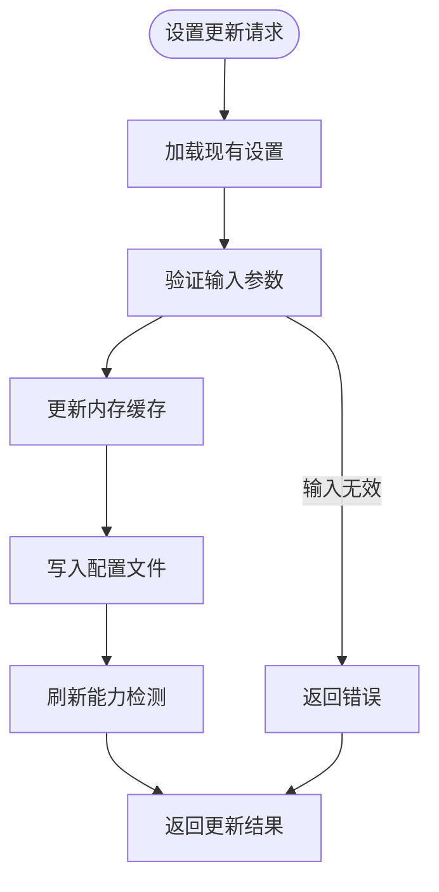
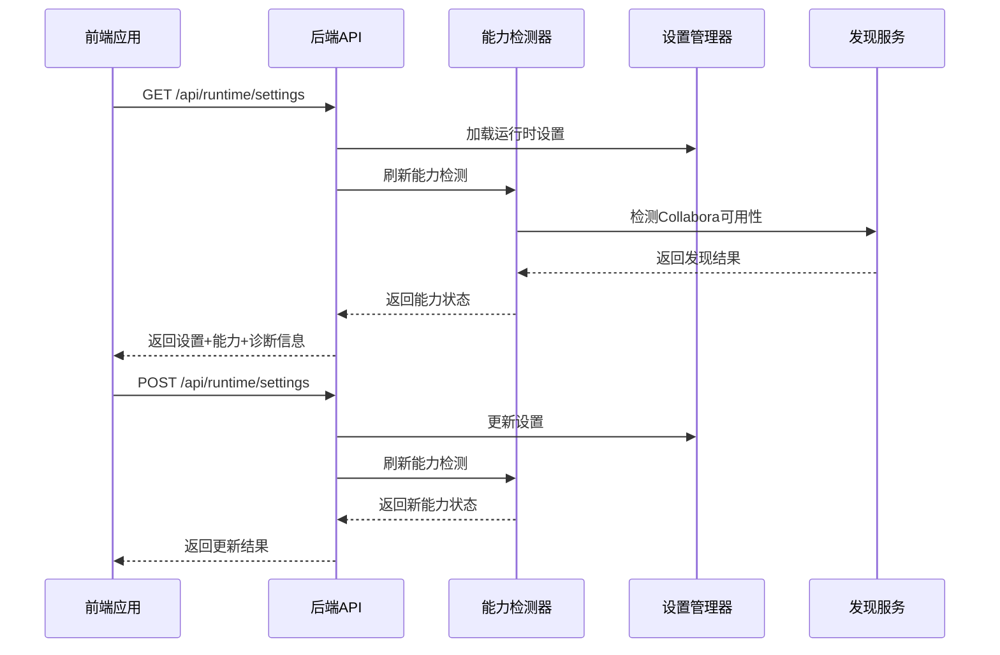
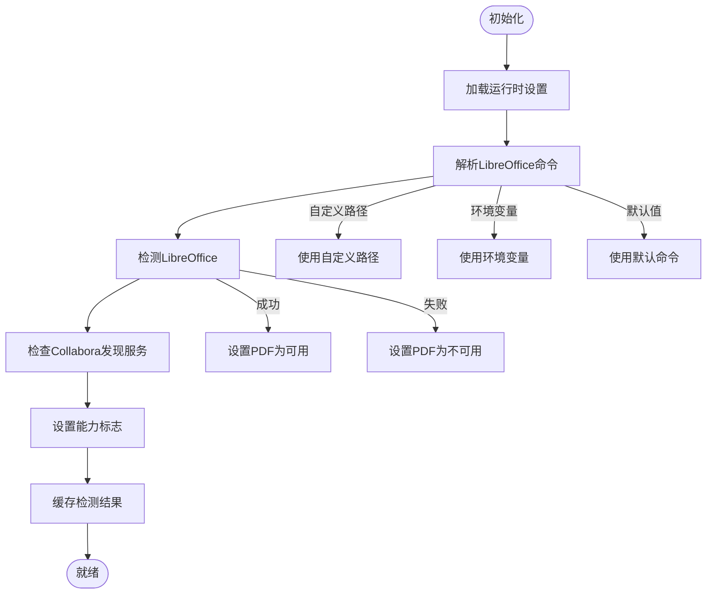
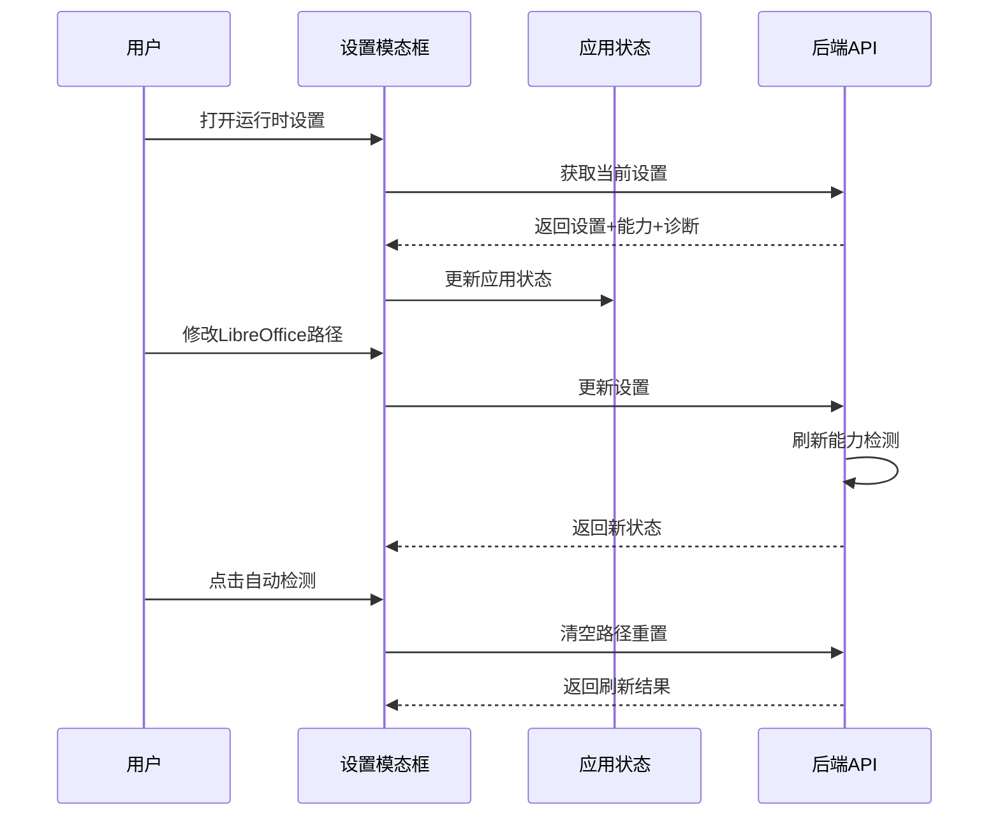
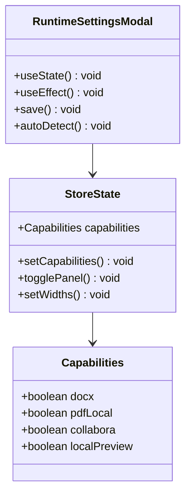
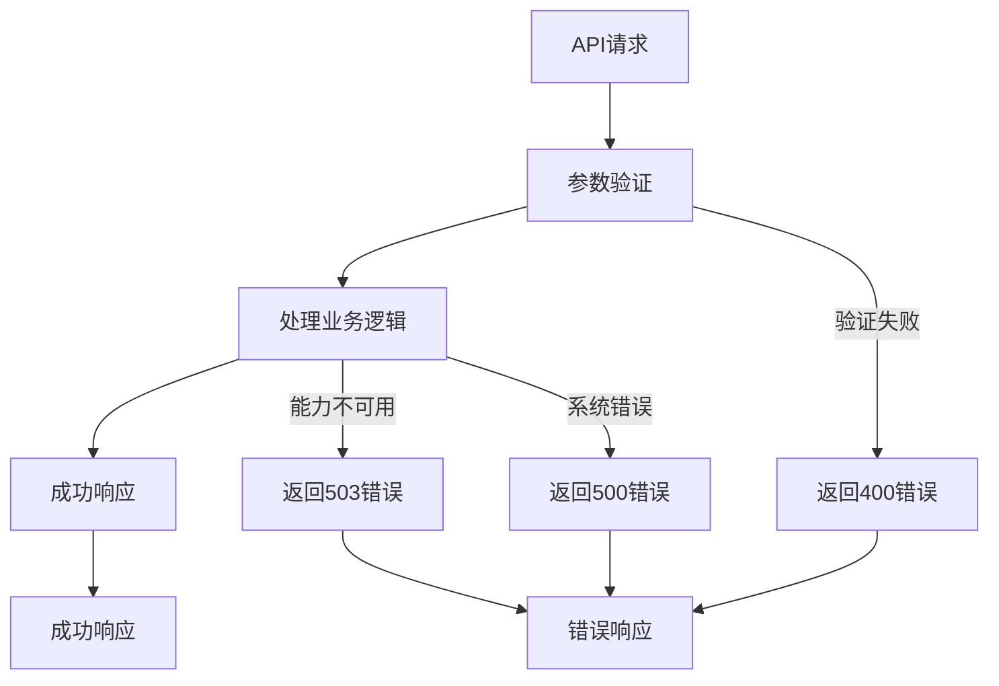
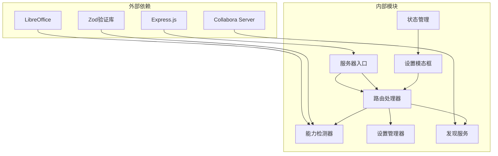

# 运行时能力检测系统

<cite>
**本文档引用的文件**
- [capabilities.ts](file://src/core/capabilities.ts)
- [runtime-settings.ts](file://src/core/runtime-settings.ts)
- [types.ts](file://src/core/types.ts)
- [config.ts](file://src/core/config.ts)
- [RuntimeSettingsModal.tsx](file://frontend/src/components/config/RuntimeSettingsModal.tsx)
- [api.ts](file://frontend/src/services/api.ts)
- [api.ts](file://src/routes/api.ts)
- [discovery.ts](file://src/wopi/discovery.ts)
- [server.ts](file://src/server.ts)
- [useStore.ts](file://frontend/src/store/useStore.ts)
- [App.tsx](file://frontend/src/App.tsx)
- [package.json](file://package.json)
</cite>

## 目录
1. [简介](#简介)
2. [项目结构](#项目结构)
3. [核心组件](#核心组件)
4. [架构概览](#架构概览)
5. [详细组件分析](#详细组件分析)
6. [依赖关系分析](#依赖关系分析)
7. [性能考虑](#性能考虑)
8. [故障排除指南](#故障排除指南)
9. [结论](#结论)

## 简介

运行时能力检测系统是 Markdown to Word 转换器中的核心功能模块，负责动态检测和报告系统在运行时可用的功能特性。该系统能够自动检测本地 PDF 导出能力、Collabora 在线编辑能力以及本地 Word 预览能力，并提供详细的诊断信息和用户可配置的设置界面。

该系统采用分层架构设计，通过前后端分离的方式实现能力检测，前端负责用户界面交互和状态管理，后端负责实际的能力检测逻辑和配置持久化。

## 项目结构

该项目采用现代化的全栈架构，主要分为以下几个核心部分：

**图表来源**
- [server.ts:1-53](file://src/server.ts#L1-L53)
- [api.ts:1-196](file://src/routes/api.ts#L1-L196)
- [capabilities.ts:1-111](file://src/core/capabilities.ts#L1-L111)

**章节来源**
- [package.json:1-59](file://package.json#L1-L59)
- [server.ts:1-53](file://src/server.ts#L1-L53)

## 核心组件

运行时能力检测系统由多个相互协作的核心组件构成，每个组件都有明确的职责分工：

### 能力检测接口定义

系统定义了标准化的运行时能力接口，用于统一描述各种功能特性的可用状态：

**图表来源**
- [capabilities.ts:5-28](file://src/core/capabilities.ts#L5-L28)

### 运行时设置管理

系统提供了灵活的运行时设置管理系统，支持多种配置来源和持久化机制：

**图表来源**
- [runtime-settings.ts:32-41](file://src/core/runtime-settings.ts#L32-L41)

**章节来源**
- [capabilities.ts:1-111](file://src/core/capabilities.ts#L1-L111)
- [runtime-settings.ts:1-42](file://src/core/runtime-settings.ts#L1-L42)

## 架构概览

运行时能力检测系统采用分层架构设计，实现了前后端分离的能力检测机制：

**图表来源**
- [api.ts:17-43](file://src/routes/api.ts#L17-L43)
- [capabilities.ts:77-90](file://src/core/capabilities.ts#L77-L90)

系统的核心工作流程包括：

1. **初始化阶段**：服务器启动时同时初始化运行时能力和 Collabora 发现服务
2. **检测阶段**：通过命令行调用检测外部依赖（如 LibreOffice）
3. **缓存阶段**：将检测结果缓存到内存中以提高性能
4. **暴露阶段**：通过 API 接口向客户端提供能力信息

**章节来源**
- [server.ts:36-52](file://src/server.ts#L36-L52)
- [discovery.ts:39-64](file://src/wopi/discovery.ts#L39-L64)

## 详细组件分析

### 后端能力检测器

后端能力检测器是整个系统的核心组件，负责实际的能力检测逻辑：

#### 能力检测算法

**图表来源**
- [capabilities.ts:68-90](file://src/core/capabilities.ts#L68-L90)
- [capabilities.ts:41-66](file://src/core/capabilities.ts#L41-L66)

#### 关键实现细节

1. **多源命令解析**：支持三种命令解析来源
   - 自定义配置路径（最高优先级）
   - 环境变量设置
   - 默认系统命令

2. **平台兼容性**：针对不同操作系统使用相应的查找工具
   - Windows 使用 `where` 命令
   - Unix/Linux 使用 `which` 命令

3. **进程调用优化**：使用同步进程调用确保检测准确性

**章节来源**
- [capabilities.ts:36-75](file://src/core/capabilities.ts#L36-L75)

### 前端设置管理器

前端设置管理器提供了用户友好的界面来查看和配置运行时能力：

#### 设置界面交互流程

**图表来源**
- [RuntimeSettingsModal.tsx:17-57](file://frontend/src/components/config/RuntimeSettingsModal.tsx#L17-L57)

#### 状态管理集成

前端使用 Zustand 状态管理库来维护运行时能力状态：

**图表来源**
- [useStore.ts:59-64](file://frontend/src/store/useStore.ts#L59-L64)
- [RuntimeSettingsModal.tsx:11-28](file://frontend/src/components/config/RuntimeSettingsModal.tsx#L11-L28)

**章节来源**
- [RuntimeSettingsModal.tsx:1-180](file://frontend/src/components/config/RuntimeSettingsModal.tsx#L1-L180)
- [useStore.ts:208-291](file://frontend/src/store/useStore.ts#L208-L291)

### API 接口设计

系统提供了标准化的 API 接口来暴露运行时能力信息：

#### API 端点设计

| 端点 | 方法 | 功能 | 请求体 | 响应体 |
|------|------|------|--------|--------|
| `/api/runtime/settings` | GET | 获取运行时设置 | 无 | `{settings, capabilities, diagnostics}` |
| `/api/runtime/settings` | POST | 更新运行时设置 | `{libreOfficePath: string}` | `{settings, capabilities, diagnostics}` |
| `/capabilities` | GET | 获取能力状态 | 无 | `{docx, pdfLocal, collabora, localPreview}` |

#### 错误处理机制

系统实现了完善的错误处理机制：

**图表来源**
- [api.ts:25-43](file://src/routes/api.ts#L25-L43)
- [api.ts:133-162](file://src/routes/api.ts#L133-L162)

**章节来源**
- [api.ts:17-43](file://src/routes/api.ts#L17-L43)
- [api.ts:133-193](file://src/routes/api.ts#L133-L193)

## 依赖关系分析

运行时能力检测系统涉及多个层面的依赖关系，形成了清晰的层次化架构：

**图表来源**
- [package.json:36-46](file://package.json#L36-L46)
- [server.ts:1-53](file://src/server.ts#L1-L53)

### 关键依赖关系

1. **LibreOffice 依赖**：用于 PDF 导出功能
2. **Collabora 依赖**：用于在线预览功能
3. **Zod 依赖**：用于配置验证
4. **Express 依赖**：用于 Web 服务

### 循环依赖避免

系统通过模块化设计避免了循环依赖：
- 前端不直接依赖后端实现
- 后端通过接口抽象与前端解耦
- 设置管理器独立于能力检测器

**章节来源**
- [package.json:1-59](file://package.json#L1-L59)
- [capabilities.ts:1-111](file://src/core/capabilities.ts#L1-L111)

## 性能考虑

运行时能力检测系统在设计时充分考虑了性能优化：

### 缓存策略

1. **内存缓存**：检测结果缓存在内存中，避免重复检测
2. **文件缓存**：设置信息持久化到文件系统
3. **状态缓存**：前端状态管理器缓存用户界面状态

### 异步处理

1. **非阻塞检测**：使用异步方式处理能力检测
2. **超时控制**：为外部服务调用设置合理的超时时间
3. **重试机制**：为 Collabora 发现服务提供指数退避重试

### 资源优化

1. **最小权限原则**：只在需要时进行能力检测
2. **延迟初始化**：服务器启动时延迟初始化某些功能
3. **连接池管理**：合理管理外部服务连接

## 故障排除指南

### 常见问题及解决方案

#### LibreOffice 检测失败

**症状**：PDF 导出功能不可用，诊断显示 LibreOffice 未检测到

**可能原因**：
1. LibreOffice 未正确安装
2. 系统 PATH 中缺少 LibreOffice 路径
3. 权限不足导致无法执行 soffice 命令

**解决步骤**：
1. 在终端执行 `soffice --version` 验证安装
2. 检查环境变量 `LIBREOFFICE_PATH`
3. 在设置界面手动指定 LibreOffice 路径

#### Collabora 连接失败

**症状**：在线预览功能不可用，诊断显示 Collabora 未找到

**可能原因**：
1. Collabora 服务器未启动
2. 网络连接问题
3. 端口被占用

**解决步骤**：
1. 检查 Collabora 服务状态
2. 验证网络连接
3. 检查端口配置

#### 设置持久化失败

**症状**：重启后设置丢失

**可能原因**：
1. 文件权限问题
2. 磁盘空间不足
3. 路径不存在

**解决步骤**：
1. 检查 tmp 目录权限
2. 确保磁盘空间充足
3. 创建必要的目录结构

**章节来源**
- [RuntimeSettingsModal.tsx:139-166](file://frontend/src/components/config/RuntimeSettingsModal.tsx#L139-L166)
- [capabilities.ts:92-110](file://src/core/capabilities.ts#L92-L110)

## 结论

运行时能力检测系统是一个设计精良、功能完整的模块化系统。它通过清晰的分层架构、标准化的接口设计和完善的错误处理机制，为用户提供了一个可靠且易用的能力检测和配置管理解决方案。

### 主要优势

1. **模块化设计**：各组件职责明确，便于维护和扩展
2. **用户友好**：提供直观的图形界面和详细的诊断信息
3. **平台兼容**：支持多种操作系统和配置场景
4. **性能优化**：通过缓存和异步处理提升用户体验
5. **错误处理**：完善的错误捕获和用户反馈机制

### 技术亮点

1. **多源配置解析**：支持自定义路径、环境变量和默认配置
2. **智能检测算法**：结合命令行检测和网络服务发现
3. **状态管理集成**：前后端状态同步，提供一致的用户体验
4. **配置验证**：使用 Zod 进行严格的配置验证

该系统为 Markdown to Word 转换器提供了强大的运行时能力支撑，是整个应用稳定运行的重要保障。