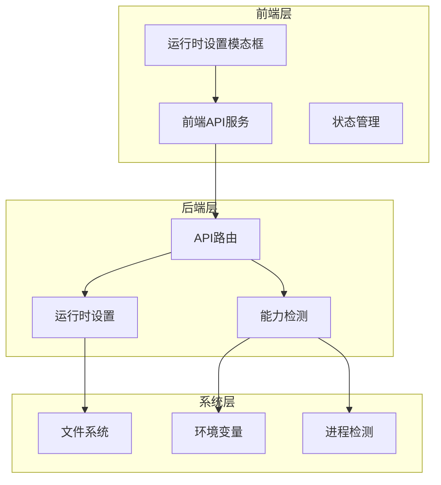
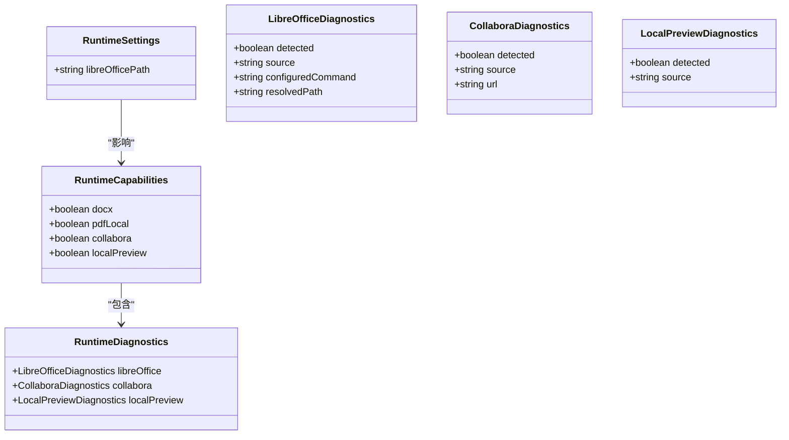
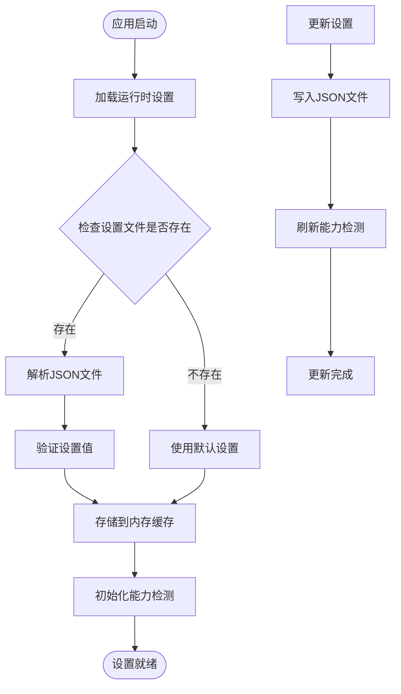
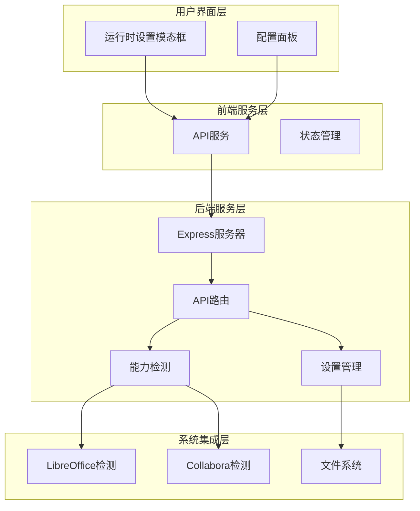
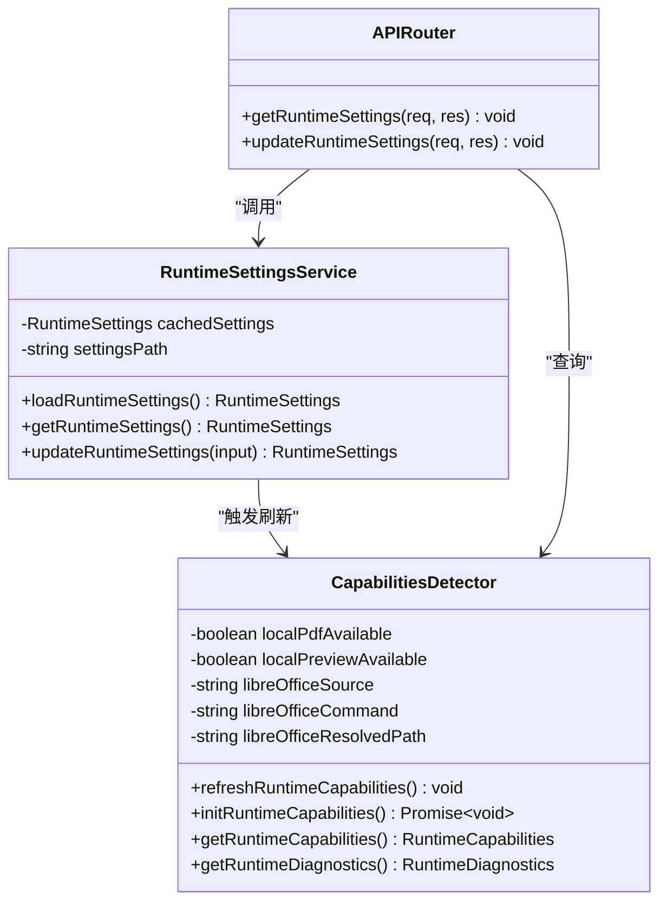
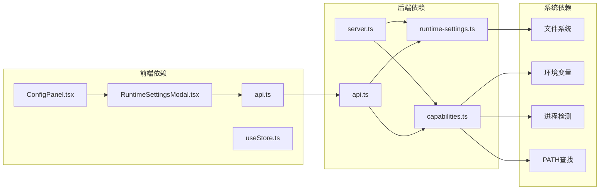

# 运行时设置管理

<cite>
**本文档引用的文件**
- [runtime-settings.ts](file://src/core/runtime-settings.ts)
- [capabilities.ts](file://src/core/capabilities.ts)
- [api.ts](file://src/routes/api.ts)
- [server.ts](file://src/server.ts)
- [RuntimeSettingsModal.tsx](file://frontend/src/components/config/RuntimeSettingsModal.tsx)
- [ConfigPanel.tsx](file://frontend/src/components/config/ConfigPanel.tsx)
- [api.ts](file://frontend/src/services/api.ts)
- [useStore.ts](file://frontend/src/store/useStore.ts)
- [CONFIG_SPEC.md](file://CONFIG_SPEC.md)
</cite>

## 目录
1. [简介](#简介)
2. [项目结构](#项目结构)
3. [核心组件](#核心组件)
4. [架构概览](#架构概览)
5. [详细组件分析](#详细组件分析)
6. [依赖关系分析](#依赖关系分析)
7. [性能考虑](#性能考虑)
8. [故障排除指南](#故障排除指南)
9. [结论](#结论)

## 简介

运行时设置管理是该 Markdown 转 Word 应用程序中的一个关键功能模块，负责管理系统运行时的关键配置参数，特别是 LibreOffice 可执行文件路径的检测和配置。该系统通过前后端分离的方式实现，前端提供用户界面进行设置管理，后端负责实际的配置检测和持久化存储。

## 项目结构

该项目采用前后端分离的架构设计，运行时设置管理功能分布在多个层次中：

**图表来源**
- [RuntimeSettingsModal.tsx:1-180](file://frontend/src/components/config/RuntimeSettingsModal.tsx#L1-L180)
- [api.ts:1-196](file://src/routes/api.ts#L1-L196)
- [runtime-settings.ts:1-42](file://src/core/runtime-settings.ts#L1-L42)

**章节来源**
- [RuntimeSettingsModal.tsx:1-180](file://frontend/src/components/config/RuntimeSettingsModal.tsx#L1-L180)
- [api.ts:1-196](file://src/routes/api.ts#L1-L196)
- [runtime-settings.ts:1-42](file://src/core/runtime-settings.ts#L1-L42)

## 核心组件

### 运行时设置接口定义

运行时设置管理的核心数据结构定义如下：

**图表来源**
- [runtime-settings.ts:4-6](file://src/core/runtime-settings.ts#L4-L6)
- [capabilities.ts:5-28](file://src/core/capabilities.ts#L5-L28)

### 设置存储机制

系统采用文件系统存储运行时设置，使用 JSON 格式进行序列化：

**图表来源**
- [runtime-settings.ts:14-26](file://src/core/runtime-settings.ts#L14-L26)
- [capabilities.ts:68-80](file://src/core/capabilities.ts#L68-L80)

**章节来源**
- [runtime-settings.ts:1-42](file://src/core/runtime-settings.ts#L1-L42)
- [capabilities.ts:1-111](file://src/core/capabilities.ts#L1-L111)

## 架构概览

运行时设置管理采用分层架构设计，确保前后端职责清晰分离：

**图表来源**
- [RuntimeSettingsModal.tsx:11-178](file://frontend/src/components/config/RuntimeSettingsModal.tsx#L11-L178)
- [api.ts:17-43](file://src/routes/api.ts#L17-L43)
- [server.ts:36-52](file://src/server.ts#L36-L52)

## 详细组件分析

### 前端运行时设置模态框

运行时设置模态框提供了用户友好的界面来管理 LibreOffice 路径设置：

**图表来源**
- [RuntimeSettingsModal.tsx:17-42](file://frontend/src/components/config/RuntimeSettingsModal.tsx#L17-L42)
- [api.ts:53-70](file://frontend/src/services/api.ts#L53-L70)
- [api.ts:17-43](file://src/routes/api.ts#L17-L43)

### 后端设置管理服务

后端提供了完整的运行时设置管理功能：

**图表来源**
- [runtime-settings.ts:14-41](file://src/core/runtime-settings.ts#L14-L41)
- [capabilities.ts:68-110](file://src/core/capabilities.ts#L68-L110)
- [api.ts:17-43](file://src/routes/api.ts#L17-L43)

### 能力检测机制

系统实现了多层次的能力检测机制：

**图表来源**
- [capabilities.ts:41-75](file://src/core/capabilities.ts#L41-L75)
- [capabilities.ts:82-110](file://src/core/capabilities.ts#L82-L110)

**章节来源**
- [RuntimeSettingsModal.tsx:1-180](file://frontend/src/components/config/RuntimeSettingsModal.tsx#L1-L180)
- [api.ts:1-196](file://src/routes/api.ts#L1-L196)
- [capabilities.ts:1-111](file://src/core/capabilities.ts#L1-L111)

## 依赖关系分析

运行时设置管理涉及多个组件之间的复杂依赖关系：

**图表来源**
- [server.ts:36-52](file://src/server.ts#L36-L52)
- [api.ts:11-12](file://src/core/runtime-settings.ts#L11-L12)
- [capabilities.ts:41-66](file://src/core/capabilities.ts#L41-L66)

**章节来源**
- [server.ts:1-53](file://src/server.ts#L1-L53)
- [useStore.ts:1-291](file://frontend/src/store/useStore.ts#L1-L291)

## 性能考虑

运行时设置管理在性能方面考虑了多个优化点：

### 缓存策略
- 内存缓存：运行时设置在内存中缓存，避免频繁的文件读取操作
- 状态同步：前端和后端的状态保持同步，减少不必要的网络请求

### 异步处理
- 异步文件操作：设置更新采用异步方式，不影响用户体验
- 并发检测：能力检测可以并行执行多个检测任务

### 错误处理
- 容错设计：文件损坏或缺失时使用默认值，确保系统稳定性
- 渐进式降级：部分功能失败时，其他功能仍可正常工作

## 故障排除指南

### 常见问题及解决方案

#### LibreOffice 路径检测失败

**症状**：PDF 本地转换功能不可用，诊断结果显示 LibreOffice 未检测到

**可能原因**：
1. LibreOffice 未正确安装
2. LibreOffice 路径不在系统 PATH 中
3. 权限问题导致无法执行 soffice

**解决步骤**：
1. 验证 LibreOffice 是否正确安装
2. 在命令行中运行 `soffice --version` 测试
3. 如果命令不可用，手动指定完整路径
4. 检查文件权限

#### 设置文件损坏

**症状**：应用启动时报错或设置重置为默认值

**解决方法**：
1. 删除损坏的设置文件
2. 文件路径：`tmp/runtime-settings.json`
3. 重新配置运行时设置

#### 跨平台兼容性问题

**Windows 特定问题**：
- 使用双反斜杠 `\\` 或正斜杠 `/` 分隔路径
- 确保路径包含完整的可执行文件名

**Linux/macOS 特定问题**：
- 确保 soffice 在 PATH 中
- 检查可执行权限：`chmod +x /path/to/soffice`

**章节来源**
- [RuntimeSettingsModal.tsx:139-166](file://frontend/src/components/config/RuntimeSettingsModal.tsx#L139-L166)
- [capabilities.ts:36-66](file://src/core/capabilities.ts#L36-L66)

## 结论

运行时设置管理模块通过精心设计的架构实现了灵活且可靠的配置管理功能。该系统的主要优势包括：

1. **用户友好**：提供直观的图形界面进行设置管理
2. **自动化程度高**：自动检测 LibreOffice 和 Collabora 支持
3. **跨平台兼容**：支持 Windows、Linux 和 macOS 系统
4. **容错性强**：具备完善的错误处理和恢复机制
5. **性能优化**：采用缓存和异步处理提升用户体验

该模块为整个 Markdown 转 Word 应用提供了坚实的基础，确保用户能够在不同环境下获得一致的使用体验。通过持续的监控和维护，该系统能够适应不断变化的技术环境和用户需求。