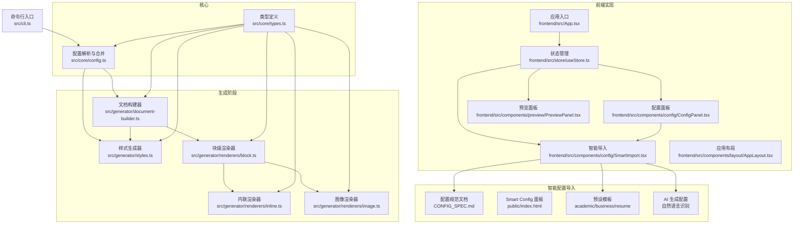
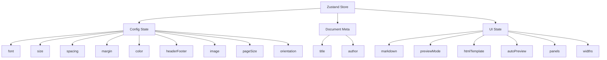
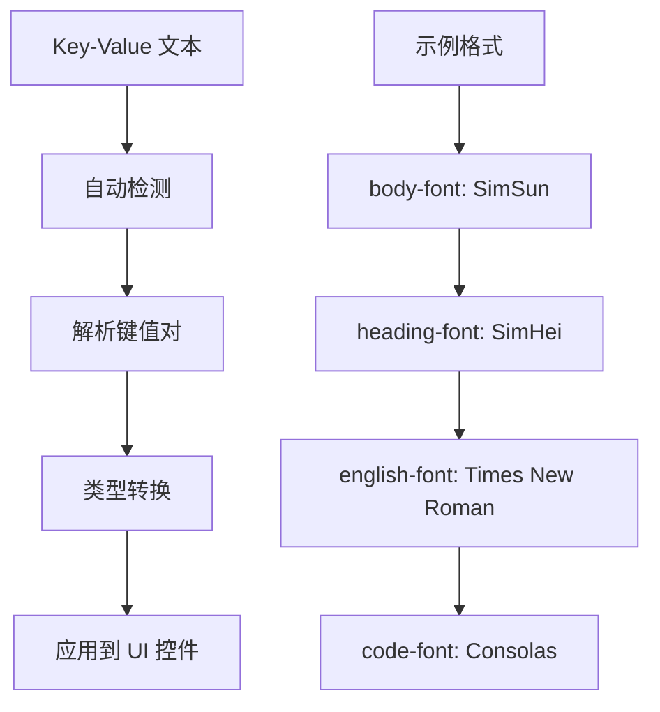
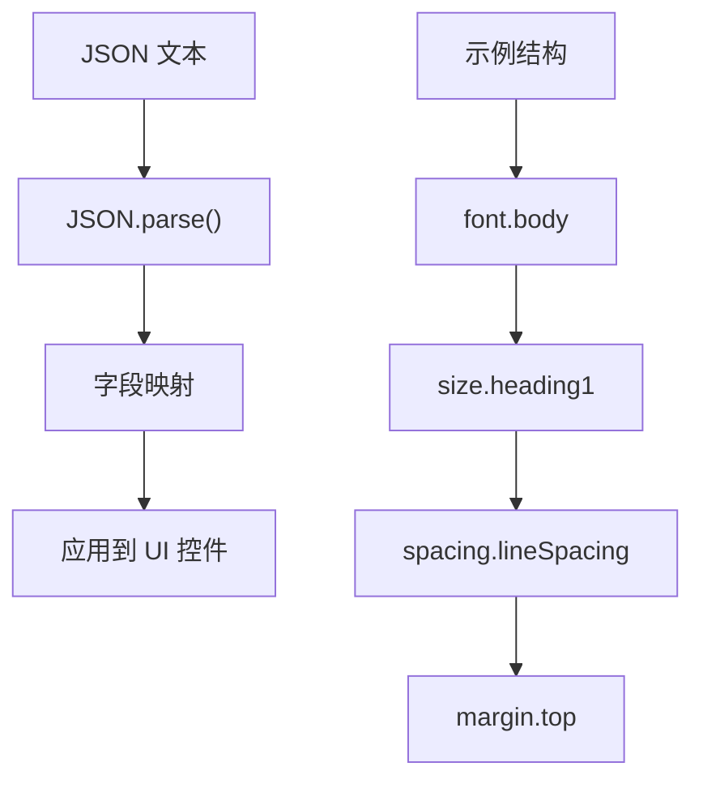
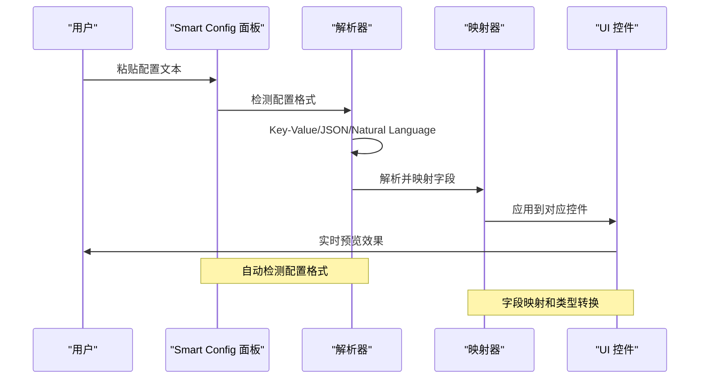
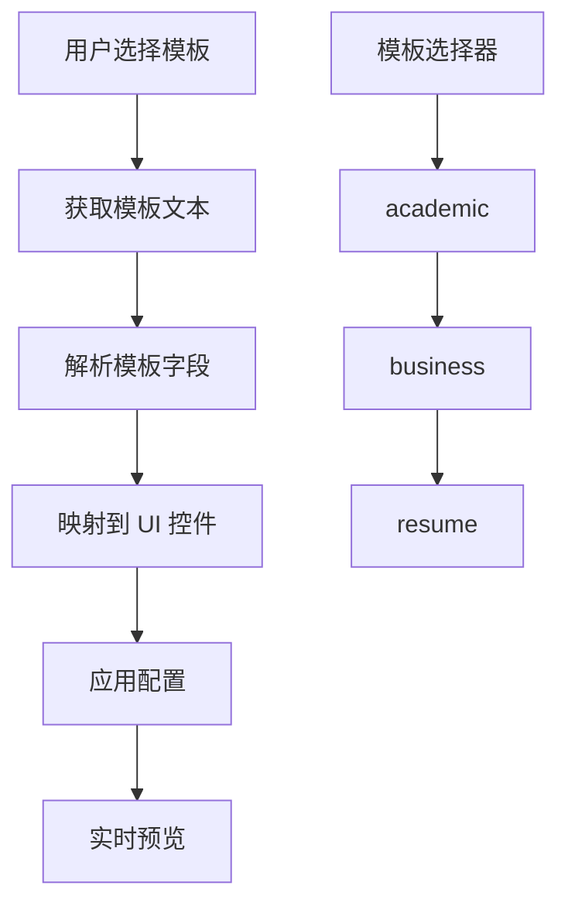
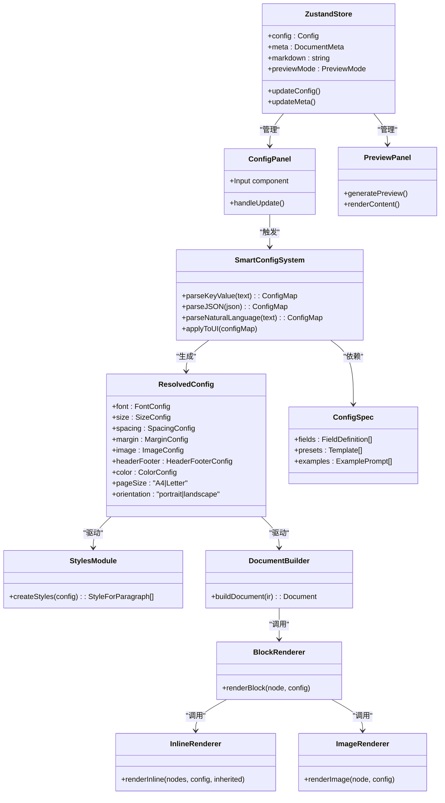

# 配置系统

<cite>
**本文引用的文件**
- [src/core/config.ts](file://src/core/config.ts)
- [src/core/types.ts](file://src/core/types.ts)
- [src/generator/styles.ts](file://src/generator/styles.ts)
- [src/generator/document-builder.ts](file://src/generator/document-builder.ts)
- [src/generator/renderers/block.ts](file://src/generator/renderers/block.ts)
- [src/generator/renderers/inline.ts](file://src/generator/renderers/inline.ts)
- [src/generator/renderers/image.ts](file://src/generator/renderers/image.ts)
- [src/utils/units.ts](file://src/utils/units.ts)
- [src/utils/image.ts](file://src/utils/image.ts)
- [src/cli.ts](file://src/cli.ts)
- [tests/unit/core/config.test.ts](file://tests/unit/core/config.test.ts)
- [CONFIG_SPEC.md](file://CONFIG_SPEC.md)
- [public/CONFIG_SPEC.md](file://public/CONFIG_SPEC.md)
- [public/index.html](file://public/index.html)
- [frontend/src/store/useStore.ts](file://frontend/src/store/useStore.ts)
- [frontend/src/components/config/ConfigPanel.tsx](file://frontend/src/components/config/ConfigPanel.tsx)
- [frontend/src/components/config/SmartImport.tsx](file://frontend/src/components/config/SmartImport.tsx)
- [frontend/src/utils/smartParser.ts](file://frontend/src/utils/smartParser.ts)
- [frontend/src/utils/templates.ts](file://frontend/src/utils/templates.ts)
- [frontend/src/components/preview/PreviewPanel.tsx](file://frontend/src/components/preview/PreviewPanel.tsx)
- [frontend/src/components/layout/AppLayout.tsx](file://frontend/src/components/layout/AppLayout.tsx)
- [frontend/src/App.tsx](file://frontend/src/App.tsx)
- [frontend/src/index.css](file://frontend/src/index.css)
- [GEMINI.md](file://GEMINI.md)
</cite>

## 更新摘要
**所做更改**
- 新增完整的前端实现章节，详细介绍配置面板、智能导入、实时预览等功能
- 更新配置系统架构图，反映前端集成架构
- 补充前端组件间的交互关系和数据流
- 增加前端状态管理和响应式设计说明
- 更新配置导入机制，支持多种前端交互方式
- 补充前端错误处理和用户反馈机制

## 目录
1. [简介](#简介)
2. [项目结构](#项目结构)
3. [核心组件](#核心组件)
4. [架构总览](#架构总览)
5. [详细组件分析](#详细组件分析)
6. [前端实现](#前端实现)
7. [Smart Config Import 智能配置导入](#smart-config-import-智能配置导入)
8. [配置规范文档](#配置规范文档)
9. [预设模板系统](#预设模板系统)
10. [依赖关系分析](#依赖关系分析)
11. [性能考量](#性能考量)
12. [故障排查指南](#故障排查指南)
13. [结论](#结论)
14. [附录](#附录)

## 简介
本指南面向 Markdown to Word 转换器的配置系统，帮助用户与开发者理解配置对象的结构、默认值、校验规则、合并策略与优先级，并提供可直接套用的配置模板与最佳实践。配置系统以类型安全的模式构建，通过 Zod Schema 定义严格的输入校验，确保生成的 Word 文档在样式、页面布局、图像处理与页眉页脚等方面符合预期。

**更新** 配置系统现已包含完整的前端实现，提供可视化配置面板、智能导入、实时预览等现代化功能，大幅提升了用户体验和配置效率。

## 项目结构
配置系统主要由以下模块组成：
- 类型定义：集中于核心类型文件，定义配置接口与运行时解析后的配置类型。
- 配置解析与合并：提供创建默认配置、合并配置与导出默认配置的能力。
- 渲染与应用：样式生成器、文档构建器与各渲染器读取配置，将其映射到最终的 Word 文档结构。
- 前端实现：完整的 React 前端界面，包含配置面板、智能导入、实时预览等功能。
- 智能配置导入：前端提供 Smart Config 面板，支持 AI 生成配置、自然语言识别、预设模板加载等功能。



**图表来源**
- [src/core/config.ts:1-91](file://src/core/config.ts#L1-L91)
- [src/core/types.ts:136-198](file://src/core/types.ts#L136-L198)
- [src/generator/styles.ts:1-122](file://src/generator/styles.ts#L1-L122)
- [src/generator/document-builder.ts:17-106](file://src/generator/document-builder.ts#L17-L106)
- [src/generator/renderers/block.ts:28-58](file://src/generator/renderers/block.ts#L28-L58)
- [src/generator/renderers/inline.ts:12-109](file://src/generator/renderers/inline.ts#L12-L109)
- [src/generator/renderers/image.ts:6-61](file://src/generator/renderers/image.ts#L6-L61)
- [src/cli.ts:69-113](file://src/cli.ts#L69-L113)
- [CONFIG_SPEC.md:1-314](file://CONFIG_SPEC.md#L1-L314)
- [public/index.html:530-820](file://public/index.html#L530-L820)
- [frontend/src/App.tsx:1-68](file://frontend/src/App.tsx#L1-L68)
- [frontend/src/store/useStore.ts:1-210](file://frontend/src/store/useStore.ts#L1-L210)
- [frontend/src/components/config/ConfigPanel.tsx:1-167](file://frontend/src/components/config/ConfigPanel.tsx#L1-L167)
- [frontend/src/components/config/SmartImport.tsx:1-243](file://frontend/src/components/config/SmartImport.tsx#L1-L243)
- [frontend/src/components/preview/PreviewPanel.tsx:1-237](file://frontend/src/components/preview/PreviewPanel.tsx#L1-L237)

## 核心组件
- 配置 Schema 与默认值
  - 字体配置：正文、标题、英文、代码字体族名称。
  - 尺寸配置：正文、各级标题、代码字号。
  - 间距配置：行距、段前段后间距、标题间距。
  - 边距配置：上、下、左、右边距（Twip）。
  - 图像配置：最大宽度百分比、默认对齐方式。
  - 页眉页脚配置：页眉文本、页脚文本、是否显示页码。
  - 颜色配置：标题、正文、链接、代码背景、引用边框颜色。
  - 页面设置：纸张大小（A4、Letter）、方向（纵向、横向）。
- 配置解析与合并
  - createConfig：基于 Schema 解析输入，自动填充默认值。
  - mergeConfig：浅合并两个配置对象，后者覆盖前者同名字段。
  - defaultConfig：完整的默认配置实例，便于作为基线进行覆盖。
- 前端实现
  - ConfigPanel：可视化配置面板，提供直观的配置界面。
  - SmartImport：智能配置导入组件，支持多种配置格式。
  - PreviewPanel：实时预览组件，支持多种预览模式。
  - Zustand Store：全局状态管理，维护配置状态和应用状态。
- 智能配置导入
  - 支持 Key-Value 文本格式、JSON 格式、自然语言描述三种输入方式。
  - 自动检测配置格式并进行解析。
  - 提供预设模板一键加载功能。
  - 支持 AI 生成配置文本的自动填充。

**章节来源**
- [src/core/config.ts:4-64](file://src/core/config.ts#L4-L64)
- [src/core/config.ts:68-91](file://src/core/config.ts#L68-L91)
- [src/core/types.ts:136-198](file://src/core/types.ts#L136-L198)
- [frontend/src/store/useStore.ts:3-104](file://frontend/src/store/useStore.ts#L3-L104)
- [frontend/src/components/config/ConfigPanel.tsx:21-167](file://frontend/src/components/config/ConfigPanel.tsx#L21-L167)
- [frontend/src/components/config/SmartImport.tsx:9-243](file://frontend/src/components/config/SmartImport.tsx#L9-L243)
- [frontend/src/components/preview/PreviewPanel.tsx:11-237](file://frontend/src/components/preview/PreviewPanel.tsx#L11-L237)

## 架构总览
配置从输入到渲染的流转如下：

```mermaid
sequenceDiagram
participant U as "用户/调用方"
participant FE as "前端界面<br/>React Components"
participant STORE as "状态管理<br/>Zustand Store"
participant SMART as "Smart Config 面板<br/>frontend/src/components/config/SmartImport.tsx"
SPEC as "配置规范<br/>CONFIG_SPEC.md"
participant CLI as "命令行入口<br/>src/cli.ts"
participant CFG as "配置解析<br/>src/core/config.ts"
participant IR as "中间表示(DocumentIR)"
participant DB as "文档构建器<br/>src/generator/document-builder.ts"
participant STY as "样式生成器<br/>src/generator/styles.ts"
participant BLK as "块级渲染器<br/>src/generator/renderers/block.ts"
participant INL as "内联渲染器<br/>src/generator/renderers/inline.ts"
participant IMG as "图像渲染器<br/>src/generator/renderers/image.ts"
U->>FE : 交互配置界面
FE->>STORE : 更新配置状态
STORE->>SMART : 触发配置解析
SMART->>SPEC : 加载配置规范文档
SMART->>SMART : 解析配置格式Key-Value/JSON/自然语言
SMART->>STORE : 应用配置到状态
STORE->>FE : 更新UI控件
FE->>CLI : 提供输入文件与可选配置路径
CLI->>CFG : createConfig(可选JSON配置)
CFG-->>CLI : ResolvedConfig
CLI->>IR : 传入配置与元数据
CLI->>DB : 传入 IR
DB->>STY : 基于 ResolvedConfig 生成样式
DB->>BLK : 渲染块节点
BLK->>INL : 渲染内联节点
BLK->>IMG : 渲染图片按配置缩放与对齐
DB-->>U : 输出 Word 文档
```

**图表来源**
- [frontend/src/App.tsx:11-68](file://frontend/src/App.tsx#L11-L68)
- [frontend/src/store/useStore.ts:172-210](file://frontend/src/store/useStore.ts#L172-L210)
- [frontend/src/components/config/SmartImport.tsx:33-105](file://frontend/src/components/config/SmartImport.tsx#L33-L105)
- [CONFIG_SPEC.md:1-314](file://CONFIG_SPEC.md#L1-L314)
- [src/cli.ts:69-113](file://src/cli.ts#L69-L113)
- [src/core/config.ts:68-91](file://src/core/config.ts#L68-L91)
- [src/generator/document-builder.ts:17-106](file://src/generator/document-builder.ts#L17-L106)
- [src/generator/styles.ts:5-109](file://src/generator/styles.ts#L5-L109)
- [src/generator/renderers/block.ts:28-58](file://src/generator/renderers/block.ts#L28-L58)
- [src/generator/renderers/inline.ts:12-109](file://src/generator/renderers/inline.ts#L12-L109)
- [src/generator/renderers/image.ts:6-61](file://src/generator/renderers/image.ts#L6-L61)

## 详细组件分析

### 配置对象结构与字段说明
- 字体配置（font）
  - body：正文字体族名称。
  - heading：标题字体族名称。
  - english：英文内容字体族名称。
  - code：代码字体族名称。
- 尺寸配置（size）
  - body：正文字号。
  - heading1..heading6：各级标题字号。
  - code：代码块字号。
- 间距配置（spacing）
  - lineSpacing：行距（倍数）。
  - paragraphSpacing：段前段后间距（pt）。
  - headingSpacing：标题间距（pt）。
- 边距配置（margin）
  - top/bottom/left/right：页面四边边距（Twip）。
- 图像配置（image）
  - maxWidthPercent：图像最大宽度占页面可用宽度的百分比（1–100）。
  - defaultAlign：图像默认对齐方式（left/center/right）。
- 页眉页脚（headerFooter）
  - header：页眉文本（可选）。
  - footer：页脚文本（可选）。
  - pageNumbers：是否在页脚显示页码。
- 颜色配置（color）
  - heading：标题颜色（十六进制字符串）。
  - text：正文颜色。
  - link：链接颜色。
  - codeBackground：代码背景色。
  - blockquoteBorder：引用块左侧边框颜色。
- 页面设置（pageSize、orientation）
  - pageSize：纸张大小（A4/Letter）。
  - orientation：页面方向（portrait/landscape）。

**章节来源**
- [src/core/config.ts:4-64](file://src/core/config.ts#L4-L64)
- [src/core/types.ts:136-198](file://src/core/types.ts#L136-L198)

### 默认值与校验规则
- 默认值
  - 字体：中文（正文/标题）、英文字体、代码字体均有默认值。
  - 尺寸：正文与各级标题、代码字号有默认值。
  - 间距：行距、段间距、标题间距有默认值。
  - 边距：上下左右默认 Twip 值。
  - 图像：最大宽度百分比默认 80，对齐默认居中。
  - 页眉页脚：页码默认关闭；页眉/页脚文本可选。
  - 颜色：标题、正文、链接、代码背景、引用边框颜色有默认值。
  - 页面设置：默认 A4 与纵向。
- 校验规则
  - 字体、尺寸、颜色、边距、图像、页眉页脚、颜色等均通过 Schema 校验。
  - pageSize 仅允许 A4 或 Letter。
  - orientation 仅允许 portrait 或 landscape。
  - image.maxWidthPercent 必须在 1–100 的范围内。
  - headerFooter 中的 header/ footer 为可选字符串，pageNumbers 为布尔值。

**章节来源**
- [src/core/config.ts:4-64](file://src/core/config.ts#L4-L64)
- [tests/unit/core/config.test.ts:14-31](file://tests/unit/core/config.test.ts#L14-L31)

### 配置继承与合并策略
- 继承机制
  - defaultConfig 提供完整默认集，作为"基线"。
- 合并策略
  - mergeConfig 对 base 与 override 进行浅合并，后者覆盖前者同名字段。
  - createConfig 在内部先以空对象填充默认值，再将输入覆盖其上，实现"输入优先"的效果。
- 优先级
  - 输入配置 > 默认配置；mergeConfig 中 override > base。
- 注意事项
  - 部分字段（如颜色、边距）为数值或字符串，直接覆盖；嵌套对象（如 font、size、spacing、margin、image、headerFooter、color）采用浅合并，不会递归合并子属性。

**章节来源**
- [src/core/config.ts:68-91](file://src/core/config.ts#L68-L91)
- [tests/unit/core/config.test.ts:14-31](file://tests/unit/core/config.test.ts#L14-L31)

### 配置在渲染中的应用
- 样式生成（样式表）
  - 标题样式：基于 heading1..6 的字号、字体、颜色与段落间距生成。
  - 正文样式：基于 body 字号、字体、颜色与行距/段间距生成。
  - 代码块样式：基于 code 字号、字体与背景色生成。
  - 引用样式：斜体、浅灰文本与左侧边框。
- 段落与块级元素
  - 标题段落：根据层级映射 HeadingLevel，并应用对应字号与段前段后间距。
  - 列表与引用：应用统一的行距与段间距，并在引用块添加左侧边框。
  - 表格：单元格内段落复用正文样式。
- 内联元素
  - 文本、加粗、斜体、下划线、行内代码、链接、换行分别映射到对应的 TextRun 属性。
- 图像
  - 最大宽度按页面宽度与边距计算，受 maxWidthPercent 控制。
  - 默认对齐方式来自 image.defaultAlign，节点可覆盖。
- 页眉页脚与页面属性
  - 页眉/页脚文本与页码显示由 headerFooter 控制。
  - 页面方向与边距由 orientation 与 margin 控制。

**章节来源**
- [src/generator/styles.ts:5-109](file://src/generator/styles.ts#L5-L109)
- [src/generator/renderers/block.ts:60-197](file://src/generator/renderers/block.ts#L60-L197)
- [src/generator/renderers/inline.ts:12-109](file://src/generator/renderers/inline.ts#L12-L109)
- [src/generator/renderers/image.ts:6-61](file://src/generator/renderers/image.ts#L6-L61)
- [src/generator/document-builder.ts:17-106](file://src/generator/document-builder.ts#L17-L106)

### 配置 JSON 格式与示例
- JSON 结构要点
  - 顶层字段与类型需与 ResolvedConfig 对应，支持部分字段覆盖。
  - 可选字段（如 headerFooter.header/ footer）可省略。
  - 数值字段（如字号、边距）需为数字；枚举字段（如 pageSize、orientation）需为允许值。
- 示例模板
  - 基础模板：仅覆盖必要的字段，其余使用默认值。
  - 中文排版模板：调整字体与字号，适配中文阅读习惯。
  - 报告模板：增大标题间距与段间距，设置页眉页脚与页码。
  - 瘦身模板：减小边距与行距，提高信息密度。
  - 大图展示模板：提升图像最大宽度百分比与字号，突出图文。
- 使用方式
  - 命令行：通过 -c/--config 指定 JSON 文件路径。
  - 编程：导入 createConfig 并传入对象字面量。

**章节来源**
- [src/cli.ts:69-113](file://src/cli.ts#L69-L113)
- [src/core/config.ts:68-91](file://src/core/config.ts#L68-L91)

### 配置错误诊断与常见问题
- 常见错误类型
  - 枚举值非法：如 pageSize 非 A4/Letter，orientation 非 portrait/landscape。
  - 数值范围越界：如 maxWidthPercent 不在 1–100。
  - 类型不匹配：如字号为字符串而非数字。
- 诊断步骤
  - 捕获异常并输出错误消息；检查报错字段与期望值。
  - 使用默认配置作为对比，逐步缩小问题范围。
  - 单独校验 JSON 文件格式与字段命名。
- 解决方案
  - 修正枚举值或数值范围。
  - 确保所有数值字段为合法数字。
  - 使用 mergeConfig 与 defaultConfig 对比差异，确认覆盖顺序。

**章节来源**
- [tests/unit/core/config.test.ts:22-24](file://tests/unit/core/config.test.ts#L22-L24)
- [src/cli.ts:106-109](file://src/cli.ts#L106-L109)

## 前端实现

**新增** 配置系统现已包含完整的前端实现，提供现代化的用户界面和交互体验。

### 状态管理系统

前端使用 Zustand 作为状态管理库，提供全局状态管理能力：



**图表来源**
- [frontend/src/store/useStore.ts:3-104](file://frontend/src/store/useStore.ts#L3-L104)
- [frontend/src/store/useStore.ts:146-210](file://frontend/src/store/useStore.ts#L146-L210)

### 配置面板组件

ConfigPanel 提供了可视化的配置界面，支持所有配置字段的实时编辑：

- **文档信息**：标题和作者设置
- **字体配置**：正文、标题、英文、代码字体选择
- **尺寸配置**：正文字号和各级标题字号设置
- **颜色配置**：标题、正文、链接、代码背景、引用边框颜色选择
- **页面布局**：纸张大小、页面方向、页边距设置
- **页眉页脚**：页眉页脚文本和页码显示设置
- **图像配置**：图像最大宽度和默认对齐方式设置

**章节来源**
- [frontend/src/components/config/ConfigPanel.tsx:21-167](file://frontend/src/components/config/ConfigPanel.tsx#L21-L167)

### 智能导入组件

SmartImport 提供了强大的配置导入功能：

- **多格式支持**：Key-Value 文本、JSON、自然语言描述
- **实时预览**：配置应用后立即更新预览
- **预设模板**：学术论文、商务报告、简历三种模板
- **AI 辅助**：支持 AI 生成配置文本
- **错误处理**：详细的错误消息和状态反馈

**章节来源**
- [frontend/src/components/config/SmartImport.tsx:9-243](file://frontend/src/components/config/SmartImport.tsx#L9-L243)

### 预览面板组件

PreviewPanel 提供了多种预览模式：

- **Markdown 预览**：即时预览 Markdown 渲染结果
- **HTML 创意预览**：支持多种主题的 HTML 预览
- **本地 Docx 预览**：使用 docx-preview 实时预览 Word 文档
- **PDF 预览**：高质量 PDF 预览
- **Collabora 编辑**：在线协作编辑功能

**章节来源**
- [frontend/src/components/preview/PreviewPanel.tsx:11-237](file://frontend/src/components/preview/PreviewPanel.tsx#L11-L237)

### 响应式布局

应用采用响应式设计，支持不同屏幕尺寸：

- **自动隐藏**：小屏幕设备自动隐藏面板
- **拖拽调整**：支持拖拽调整面板宽度
- **本地存储**：保存用户的面板宽度偏好
- **动态布局**：根据窗口大小动态调整布局

**章节来源**
- [frontend/src/App.tsx:14-41](file://frontend/src/App.tsx#L14-L41)
- [frontend/src/components/layout/AppLayout.tsx:10-22](file://frontend/src/components/layout/AppLayout.tsx#L10-L22)

## Smart Config Import 智能配置导入

**新增** 配置系统现已集成强大的 Smart Config Import 功能，支持 AI 辅助配置生成、自然语言描述识别和预设模板加载。

### 支持的配置格式

#### 格式 1：Key-Value 文本（推荐）
人类可读的键值对格式，每行一个设置。格式：`key: value`



**图表来源**
- [frontend/src/components/config/SmartImport.tsx:62-76](file://frontend/src/components/config/SmartImport.tsx#L62-L76)

#### 格式 2：JSON 格式
标准 JSON 结构，与 ResolvedConfig 接口完全对应。



**图表来源**
- [frontend/src/utils/smartParser.ts:25-62](file://frontend/src/utils/smartParser.ts#L25-L62)

#### 格式 3：自然语言描述
支持中文自然语言描述，系统自动识别关键信息。

**章节来源**
- [frontend/src/utils/smartParser.ts:1-19](file://frontend/src/utils/smartParser.ts#L1-L19)
- [frontend/src/components/config/SmartImport.tsx:74-76](file://frontend/src/components/config/SmartImport.tsx#L74-L76)

### 智能配置导入流程



**图表来源**
- [frontend/src/components/config/SmartImport.tsx:33-105](file://frontend/src/components/config/SmartImport.tsx#L33-L105)

### 配置导入功能特性

#### 自动格式检测
- 检测输入文本的格式类型
- Key-Value 格式：以冒号分隔的键值对
- JSON 格式：以花括号包围的对象
- 自然语言：中文描述文本

#### 字段映射与转换
- 支持多种字段命名方式
- 自动类型转换（字符串转布尔值、数字）
- 支持注释移除（如 "SimSun (宋体)"）

#### 错误处理与反馈
- 详细的错误消息提示
- 成功应用的字段数量统计
- 实时状态反馈

**章节来源**
- [frontend/src/components/config/SmartImport.tsx:33-105](file://frontend/src/components/config/SmartImport.tsx#L33-L105)

### 配置导出功能

系统还提供配置导出功能，可将当前 UI 中的配置导出为 Key-Value 文本格式：


**图表来源**
- [frontend/src/components/config/SmartImport.tsx:114-153](file://frontend/src/components/config/SmartImport.tsx#L114-L153)

**章节来源**
- [frontend/src/components/config/SmartImport.tsx:114-153](file://frontend/src/components/config/SmartImport.tsx#L114-L153)

## 配置规范文档

**新增** 完整的配置规范文档（CONFIG_SPEC.md）提供了详细的配置字段说明、示例和最佳实践。

### 支持的配置字段

#### 字体配置（Fonts）
| Key (KV format) | JSON path | Type | Default | Description |
|---|---|---|---|---|
| `body-font` | `font.body` | string | `Microsoft YaHei` | Body text font / 正文字体 |
| `heading-font` | `font.heading` | string | `SimHei` | Heading font / 标题字体 |
| `english-font` | `font.english` | string | `Times New Roman` | English text font / 英文字体 |
| `code-font` | `font.code` | string | `Consolas` | Code block font / 代码字体 |

#### 尺寸配置（Sizes）
| Key | JSON path | Type | Default | Description |
|---|---|---|---|---|
| `body-size` | `size.body` | number (pt) | `11` | Body font size / 正文字号 |
| `h1-size` | `size.heading1` | number (pt) | `22` | H1 size / 一级标题字号 |
| `h2-size` | `size.heading2` | number (pt) | `18` | H2 size / 二级标题字号 |
| `h3-size` | `size.heading3` | number (pt) | `16` | H3 size / 三级标题字号 |
| `h4-size` | `size.heading4` | number (pt) | `14` | H4 size / 四级标题字号 |
| `h5-size` | `size.heading5` | number (pt) | `12` | H5 size / 五级标题字号 |
| `h6-size` | `size.heading6` | number (pt) | `11` | H6 size / 六级标题字号 |
| `code-size` | `size.code` | number (pt) | `10` | Code font size / 代码字号 |

#### 间距配置（Spacing）
| Key | JSON path | Type | Default | Description |
|---|---|---|---|---|
| `line-spacing` | `spacing.lineSpacing` | number | `1.5` | Line spacing multiplier / 行间距倍数 |
| `paragraph-spacing` | `spacing.paragraphSpacing` | number (pt) | `6` | Space after paragraph / 段后间距 |
| `heading-spacing` | `spacing.headingSpacing` | number (pt) | `12` | Space after heading / 标题后间距 |

#### 边距配置（Margins）
单位：**twips**（1 inch = 1440 twips, 1 cm ≈ 567 twips）

| Key | JSON path | Type | Default | Description |
|---|---|---|---|---|
| `margin-top` | `margin.top` | number (twips) | `1440` | Top margin / 上边距 |
| `margin-bottom` | `margin.bottom` | number (twips) | `1440` | Bottom margin / 下边距 |
| `margin-left` | `margin.left` | number (twips) | `1440` | Left margin / 左边距 |
| `margin-right` | `margin.right` | number (twips) | `1440` | Right margin / 右边距 |

#### 颜色配置（Colors）
使用十六进制格式：`#RRGGBB`（Key-Value）或 `RRGGBB`（JSON，无 #）。

| Key | JSON path | Default | Description |
|---|---|---|---|
| `heading-color` | `color.heading` | `#000000` | Heading text color / 标题颜色 |
| `text-color` | `color.text` | `#000000` | Body text color / 正文颜色 |
| `link-color` | `color.link` | `#0563C1` | Link color / 链接颜色 |
| `code-bg-color` | `color.codeBackground` | `#F5F5F5` | Code background / 代码背景色 |
| `quote-border-color` | `color.blockquoteBorder` | `#CCCCCC` | Blockquote border / 引用边框色 |

#### 页面布局（Page Layout）
| Key | JSON path | Values | Default | Description |
|---|---|---|---|---|
| `page-size` | `pageSize` | `A4`, `Letter` | `A4` | Page size / 纸张大小 |
| `orientation` | `orientation` | `portrait`, `landscape` | `portrait` | Orientation / 页面方向 |

#### 页眉页脚（Header & Footer）
| Key | JSON path | Type | Default | Description |
|---|---|---|---|---|
| `header-text` | `headerFooter.header` | string | (empty) | Header text / 页眉文本 |
| `footer-text` | `headerFooter.footer` | string | (empty) | Footer text / 页脚文本 |
| `page-numbers` | `headerFooter.pageNumbers` | boolean | `false` | Show page numbers / 显示页码 |

#### 图片配置（Images）
| Key | JSON path | Type | Default | Description |
|---|---|---|---|---|
| `image-max-width` | `image.maxWidthPercent` | number (1-100) | `80` | Max image width % / 最大图片宽度% |
| `image-align` | `image.defaultAlign` | `left`, `center`, `right` | `center` | Default alignment / 默认对齐 |

#### 文档元数据（Document Metadata）
| Key | JSON path | Type | Default | Description |
|---|---|---|---|---|
| `doc-title` | `meta.title` | string | `My Document` | Document title / 文档标题 |
| `doc-author` | `meta.author` | string | (empty) | Author name / 作者 |

**章节来源**
- [CONFIG_SPEC.md:111-210](file://CONFIG_SPEC.md#L111-L210)
- [public/CONFIG_SPEC.md:111-210](file://public/CONFIG_SPEC.md#L111-L210)

### 配置规范使用指南

#### AI 辅助配置生成
将 CONFIG_SPEC.md 文档连同格式要求一起提供给 AI，AI 会输出配置文本，可以直接粘贴到 Smart Config 面板中自动填充所有设置。

#### 配置字段映射
系统提供完整的字段映射关系，支持 Key-Value 和 JSON 两种格式的双向转换。

#### 预设模板支持
提供三种常用文档类型的预设模板，可直接加载使用或作为自定义配置的基础。

**章节来源**
- [CONFIG_SPEC.md:1-314](file://CONFIG_SPEC.md#L1-L314)
- [public/CONFIG_SPEC.md:1-314](file://public/CONFIG_SPEC.md#L1-L314)

## 预设模板系统

**新增** 配置系统包含三个预设模板，针对不同文档类型提供即用型配置。

### 学术论文模板（Academic Paper）
专为中文学术论文设计，强调正式性和规范性：

- 正文字体：宋体（SimSun）小四（12pt）
- 标题字体：黑体（SimHei）
- 英文字体：Times New Roman
- 代码字体：Courier New
- 行距：1.5倍
- 段间距：段后0pt，标题后12pt
- 页边距：上下1英寸，左右1.25英寸
- 页码：启用
- 图片：居中对齐，最大宽度80%

### 商务报告模板（Business Report）
适用于商务文档，强调专业性和现代感：

- 正文字体：微软雅黑（Microsoft YaHei）11pt
- 标题字体：微软雅黑（Microsoft YaHei）
- 英文字体：Calibri
- 代码字体：Consolas
- 行距：1.5倍
- 段间距：段后6pt，标题后12pt
- 页边距：上下1英寸，左右1英寸
- 颜色：深蓝色标题（#1a3c6e），深灰正文（#333333）
- 页码：启用
- 图片：居中对齐，最大宽度90%

### 简历模板（Resume）
专为简历设计，强调简洁和可读性：

- 正文字体：微软雅黑（Microsoft YaHei）11pt
- 标题字体：黑体（SimHei）
- 英文字体：Arial
- 代码字体：Consolas
- 行距：1.15倍
- 段间距：段后3pt，标题后6pt
- 页边距：上下0.5英寸，左右0.5英寸
- 颜色：深蓝标题（#2c3e50），深灰正文（#333333）
- 页码：禁用
- 图片：右对齐，最大宽度30%

### 预设模板加载流程



**图表来源**
- [frontend/src/utils/templates.ts:83-166](file://frontend/src/utils/templates.ts#L83-L166)
- [frontend/src/components/config/SmartImport.tsx:107-112](file://frontend/src/components/config/SmartImport.tsx#L107-L112)

**章节来源**
- [frontend/src/utils/templates.ts:83-166](file://frontend/src/utils/templates.ts#L83-L166)
- [frontend/src/components/config/SmartImport.tsx:107-112](file://frontend/src/components/config/SmartImport.tsx#L107-L112)

## 依赖关系分析
- 类型耦合
  - ResolvedConfig 与各渲染器共享，确保样式与布局一致性。
- 解析与渲染的耦合
  - createConfig 与 mergeConfig 为纯函数，不引入副作用，便于测试与复用。
- 外部依赖
  - 样式生成依赖 docx 库的样式与段落 API。
  - 图像渲染依赖图像读取与单位转换工具。
  - 前端依赖 React、Zustand、TailwindCSS 等现代前端技术栈。
- 智能配置导入依赖
  - CONFIG_SPEC.md 提供配置规范和字段映射。
  - 前端 JavaScript 提供配置解析和 UI 应用逻辑。
  - MarkdownIt 用于 Markdown 解析和渲染。



**图表来源**
- [src/core/types.ts:187-198](file://src/core/types.ts#L187-L198)
- [frontend/src/store/useStore.ts:146-210](file://frontend/src/store/useStore.ts#L146-L210)
- [frontend/src/components/config/ConfigPanel.tsx:21-167](file://frontend/src/components/config/ConfigPanel.tsx#L21-L167)
- [frontend/src/components/config/SmartImport.tsx:9-243](file://frontend/src/components/config/SmartImport.tsx#L9-L243)
- [frontend/src/components/preview/PreviewPanel.tsx:11-237](file://frontend/src/components/preview/PreviewPanel.tsx#L11-L237)
- [src/generator/styles.ts:5-109](file://src/generator/styles.ts#L5-L109)
- [src/generator/document-builder.ts:17-106](file://src/generator/document-builder.ts#L17-L106)
- [src/generator/renderers/block.ts:28-58](file://src/generator/renderers/block.ts#L28-L58)
- [src/generator/renderers/inline.ts:12-109](file://src/generator/renderers/inline.ts#L12-L109)
- [src/generator/renderers/image.ts:6-61](file://src/generator/renderers/image.ts#L6-L61)
- [CONFIG_SPEC.md:1-314](file://CONFIG_SPEC.md#L1-L314)

## 性能考量
- 样式生成
  - createStyles 会为每个标题级别生成独立样式，避免重复计算；保持配置稳定可减少样式数量。
- 渲染流程
  - renderBlock/renderInline 为纯函数，避免全局状态；合理拆分段落与表格可降低内存峰值。
- 图像处理
  - 图像最大宽度按页面宽度与边距动态计算，避免过大图像导致内存压力；必要时在上游压缩图像。
- 合并策略
  - mergeConfig 为浅合并，避免深度遍历带来的开销；尽量只覆盖必要字段。
- 智能配置导入
  - 配置解析采用防抖机制，避免频繁的 UI 更新。
  - 自动格式检测使用正则表达式，性能开销较小。
  - 预设模板直接加载，无需复杂解析。
- 前端性能优化
  - Zustand 状态管理提供高性能的状态更新。
  - React.memo 优化组件渲染。
  - 懒加载预览内容，避免不必要的计算。
  - 本地存储面板宽度，减少重新计算。

## 故障排查指南
- 配置校验失败
  - 现象：抛出校验异常，提示字段非法或类型不符。
  - 排查：对照默认值与枚举列表，修正字段值。
- 样式不符合预期
  - 现象：标题字号、颜色或段间距异常。
  - 排查：确认 size、color、spacing 是否被正确覆盖；检查 mergeConfig 的覆盖顺序。
- 图像显示异常
  - 现象：图像过大、对齐不生效或空白。
  - 排查：检查 image.maxWidthPercent 与 margin；确认节点对齐是否覆盖；查看回退逻辑。
- 页眉页脚与页面布局
  - 现象：页码未显示或边距不正确。
  - 排查：确认 headerFooter.pageNumbers 与 margin 设置；检查 orientation 与 pageSize。
- 智能配置导入问题
  - 现象：配置无法正确应用到 UI。
  - 排查：检查配置格式是否正确；确认字段映射关系；查看错误状态提示。
- 预设模板加载失败
  - 现象：模板选择后无变化。
  - 排查：检查模板文本格式；确认字段名称正确；验证 UI 控件存在。
- 前端状态同步问题
  - 现象：配置更改后 UI 不更新。
  - 排查：检查 Zustand 状态更新；确认组件订阅状态；验证状态更新函数。
- 预览加载失败
  - 现象：预览内容无法加载或显示空白。
  - 排查：检查网络连接；确认 API 调用成功；验证 Blob 对象有效。

**章节来源**
- [src/generator/renderers/image.ts:47-60](file://src/generator/renderers/image.ts#L47-L60)
- [src/generator/document-builder.ts:30-69](file://src/generator/document-builder.ts#L30-L69)
- [frontend/src/components/config/SmartImport.tsx:102-104](file://frontend/src/components/config/SmartImport.tsx#L102-L104)
- [frontend/src/components/preview/PreviewPanel.tsx:45-48](file://frontend/src/components/preview/PreviewPanel.tsx#L45-L48)

## 结论
该配置系统以类型安全与 Schema 校验为核心，结合默认配置与浅合并策略，提供了灵活且可控的排版能力。通过将配置贯穿至样式生成与渲染阶段，实现了从输入到输出的一致性与可预测性。

**更新** 新增的完整前端实现大幅提升了用户体验，提供可视化配置面板、智能导入、实时预览等现代化功能。智能配置导入功能支持 AI 辅助配置生成、自然语言描述识别、预设模板加载等多种方式，使配置过程更加智能化和便捷化。完整的配置规范文档（CONFIG_SPEC.md）提供了详细的字段说明和示例，配合预设模板系统，用户可以在不同场景下快速获得高质量的 Word 文档输出。

## 附录
- 命令行使用
  - 支持通过 -c/--config 指定 JSON 配置文件；支持通过 --title 与 --author 注入文档元数据。
- 测试参考
  - 单元测试覆盖了默认配置、字段覆盖与非法值校验，可作为编写自定义配置的参考。
- 配置最佳实践
  - 建议为不同文档类型创建专门的配置模板
  - 保持字体和颜色配置的一致性，建立品牌色彩规范
  - 合理设置行距和段间距，确保文档可读性
  - 使用适当的边距和页面设置，适应不同的打印需求
  - 利用智能配置导入功能，通过 AI 辅助生成符合要求的配置
  - 定期备份配置，便于团队协作和版本管理
  - 利用前端状态管理，保持配置状态的一致性和持久化

**章节来源**
- [src/cli.ts:69-113](file://src/cli.ts#L69-L113)
- [tests/unit/core/config.test.ts:4-31](file://tests/unit/core/config.test.ts#L4-L31)
- [GEMINI.md:84-85](file://GEMINI.md#L84-L85)
- [GEMINI.md:148-149](file://GEMINI.md#L148-L149)