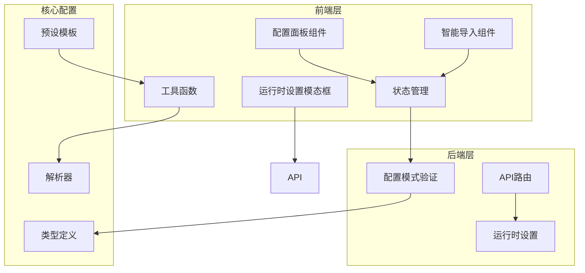
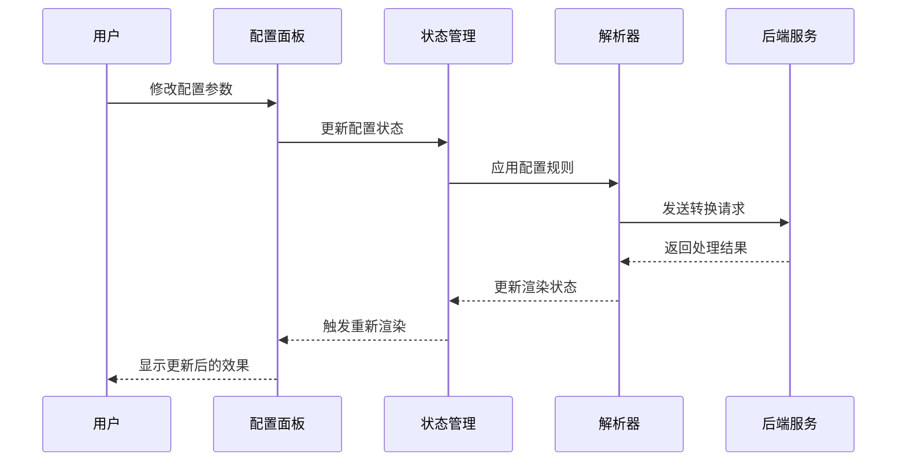
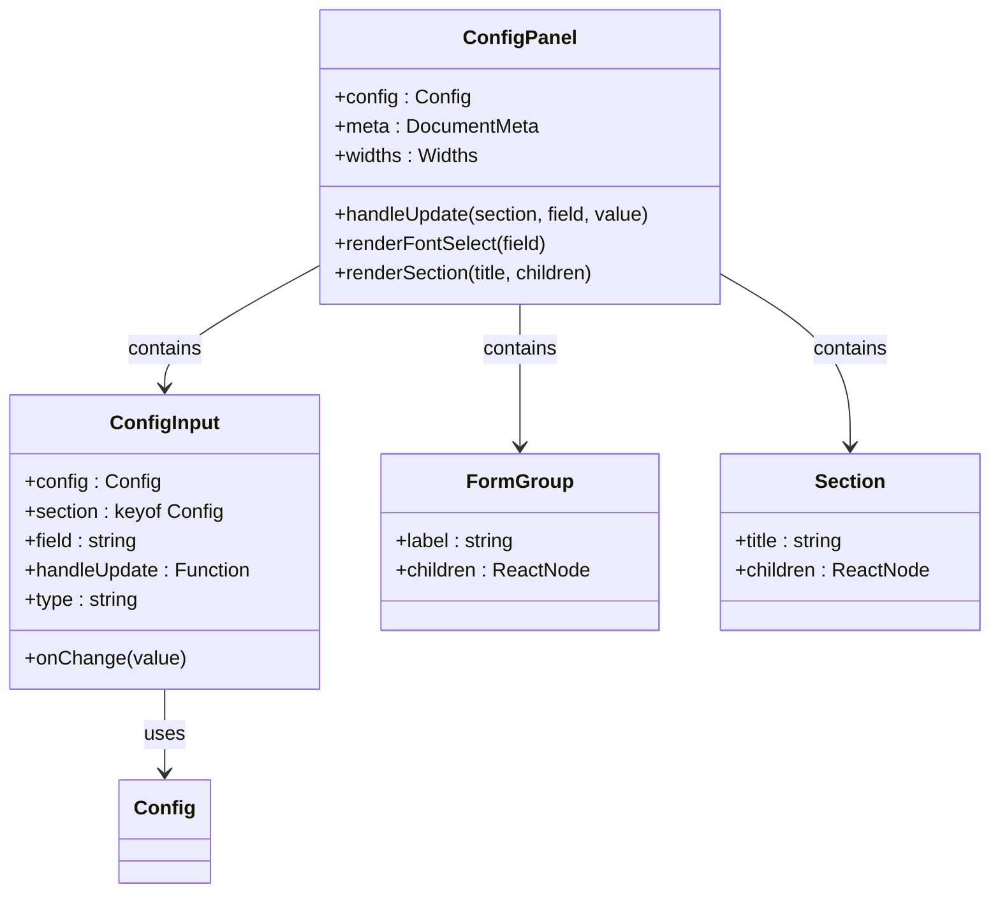
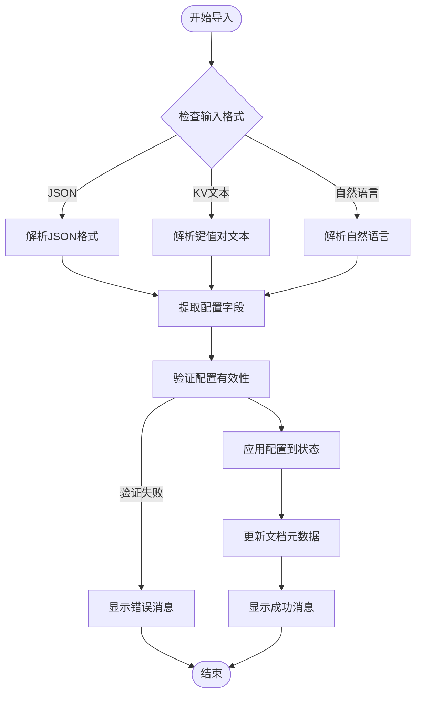
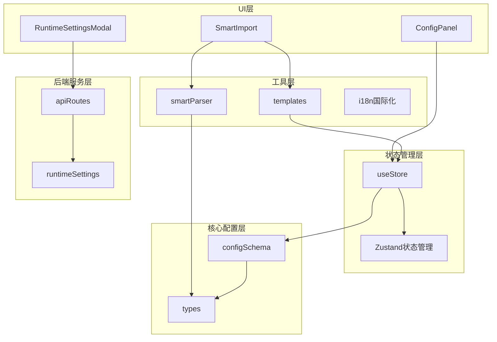

# 配置面板增强

<cite>
**本文档引用的文件**
- [ConfigPanel.tsx](file://frontend/src/components/config/ConfigPanel.tsx)
- [RuntimeSettingsModal.tsx](file://frontend/src/components/config/RuntimeSettingsModal.tsx)
- [SmartImport.tsx](file://frontend/src/components/config/SmartImport.tsx)
- [config.ts](file://src/core/config.ts)
- [runtime-settings.ts](file://src/core/runtime-settings.ts)
- [useStore.ts](file://frontend/src/store/useStore.ts)
- [smartParser.ts](file://frontend/src/utils/smartParser.ts)
- [templates.ts](file://frontend/src/utils/templates.ts)
- [types.ts](file://src/core/types.ts)
- [api.ts](file://frontend/src/services/api.ts)
- [api.ts](file://src/routes/api.ts)
- [i18n.ts](file://frontend/src/i18n.ts)
- [CONFIG_SPEC.md](file://CONFIG_SPEC.md)
- [App.tsx](file://frontend/src/App.tsx)
</cite>

## 目录
1. [简介](#简介)
2. [项目结构](#项目结构)
3. [核心组件](#核心组件)
4. [架构概览](#架构概览)
5. [详细组件分析](#详细组件分析)
6. [依赖关系分析](#依赖关系分析)
7. [性能考虑](#性能考虑)
8. [故障排除指南](#故障排除指南)
9. [结论](#结论)

## 简介

配置面板增强是该 Markdown 转 Word 应用中的一个关键功能模块，它提供了强大的文档格式化和样式定制能力。该系统通过三个主要组件实现了完整的配置管理：基础配置面板、智能配置导入功能和运行时设置管理。

系统支持多种配置格式，包括键值对文本、JSON 格式和自然语言描述，为用户提供了灵活的配置方式。同时集成了运行时环境检测和自动配置功能，确保 LibreOffice 等外部依赖的正确配置。

## 项目结构

该项目采用前后端分离的架构设计，配置面板相关的代码主要分布在前端组件和核心配置模块中：

**图表来源**
- [ConfigPanel.tsx:1-201](file://frontend/src/components/config/ConfigPanel.tsx#L1-L201)
- [SmartImport.tsx:1-221](file://frontend/src/components/config/SmartImport.tsx#L1-L221)
- [RuntimeSettingsModal.tsx:1-180](file://frontend/src/components/config/RuntimeSettingsModal.tsx#L1-L180)

**章节来源**
- [ConfigPanel.tsx:1-201](file://frontend/src/components/config/ConfigPanel.tsx#L1-L201)
- [SmartImport.tsx:1-221](file://frontend/src/components/config/SmartImport.tsx#L1-L221)
- [RuntimeSettingsModal.tsx:1-180](file://frontend/src/components/config/RuntimeSettingsModal.tsx#L1-L180)

## 核心组件

配置面板系统由三个核心组件构成，每个组件都有其特定的功能和职责：

### 1. 基础配置面板 (ConfigPanel)
提供传统的表单式配置界面，支持字体、字号、间距、颜色、页面布局等全方位的文档样式定制。

### 2. 智能配置导入 (SmartImport)
支持多种配置格式的智能解析和应用，包括键值对文本、JSON 格式和自然语言描述。

### 3. 运行时设置管理 (RuntimeSettingsModal)
处理 LibreOffice 等外部依赖的自动检测和手动配置，提供详细的环境诊断信息。

**章节来源**
- [ConfigPanel.tsx:66-201](file://frontend/src/components/config/ConfigPanel.tsx#L66-L201)
- [SmartImport.tsx:10-221](file://frontend/src/components/config/SmartImport.tsx#L10-L221)
- [RuntimeSettingsModal.tsx:11-180](file://frontend/src/components/config/RuntimeSettingsModal.tsx#L11-L180)

## 架构概览

配置面板系统采用分层架构设计，确保了良好的可维护性和扩展性：

**图表来源**
- [ConfigPanel.tsx:71-79](file://frontend/src/components/config/ConfigPanel.tsx#L71-L79)
- [useStore.ts:236-239](file://frontend/src/store/useStore.ts#L236-L239)
- [api.ts:78-89](file://frontend/src/services/api.ts#L78-L89)

系统的核心数据流遵循以下模式：
1. 用户通过界面修改配置
2. 状态管理器更新全局配置状态
3. 解析器应用新的配置规则
4. 后端服务处理文档转换
5. 结果通过状态管理器反馈给界面

**章节来源**
- [useStore.ts:208-291](file://frontend/src/store/useStore.ts#L208-L291)
- [api.ts:52-129](file://frontend/src/services/api.ts#L52-L129)

## 详细组件分析

### 配置面板组件分析

配置面板组件是整个系统的核心界面组件，提供了完整的文档样式定制功能：

**图表来源**
- [ConfigPanel.tsx:37-64](file://frontend/src/components/config/ConfigPanel.tsx#L37-L64)
- [ConfigPanel.tsx:8-20](file://frontend/src/components/config/ConfigPanel.tsx#L8-L20)

#### 配置字段分类

配置面板支持以下主要配置类别：

| 配置类别 | 字段数量 | 主要功能 | 默认值范围 |
|---------|----------|----------|------------|
| 字体配置 | 4个 | 正文字体、标题字体、英文字体、代码字体 | 中英文字体选择 |
| 字号配置 | 7个 | 正文字号、各级标题字号、代码字号 | 8-72pt范围 |
| 间距配置 | 3个 | 行距、段后间距、标题间距 | 0.1-10倍行距 |
| 边距配置 | 4个 | 上下左右页边距 | 0-50000twips |
| 颜色配置 | 5个 | 标题色、正文色、链接色、代码背景、引用边框 | #RRGGBB格式 |
| 图片配置 | 2个 | 最大宽度百分比、默认对齐方式 | 10-100%，左右中对齐 |

**章节来源**
- [ConfigPanel.tsx:22-35](file://frontend/src/components/config/ConfigPanel.tsx#L22-L35)
- [ConfigPanel.tsx:112-198](file://frontend/src/components/config/ConfigPanel.tsx#L112-L198)

### 智能配置导入组件分析

智能配置导入组件提供了三种配置格式的支持：

**图表来源**
- [SmartImport.tsx:34-98](file://frontend/src/components/config/SmartImport.tsx#L34-L98)
- [smartParser.ts:21-86](file://frontend/src/utils/smartParser.ts#L21-L86)

#### 支持的配置格式

| 格式类型 | 语法特点 | 示例用途 | 自动检测 |
|---------|----------|----------|----------|
| 键值对文本 | `key: value` 每行一个 | 人类可读，推荐格式 | ✅ 自动识别 |
| JSON格式 | 标准JSON对象 | 机器友好，结构清晰 | ✅ 自动识别 |
| 自然语言 | 中文自然语言描述 | AI助手友好 | ✅ 自动识别 |

**章节来源**
- [SmartImport.tsx:19-32](file://frontend/src/components/config/SmartImport.tsx#L19-L32)
- [smartParser.ts:1-87](file://frontend/src/utils/smartParser.ts#L1-L87)

### 运行时设置管理组件分析

运行时设置管理组件负责处理外部依赖的配置和检测：

**图表来源**
- [RuntimeSettingsModal.tsx:17-28](file://frontend/src/components/config/RuntimeSettingsModal.tsx#L17-L28)
- [api.ts:53-70](file://frontend/src/services/api.ts#L53-L70)
- [runtime-settings.ts:14-41](file://src/core/runtime-settings.ts#L14-L41)

#### 环境检测功能

运行时设置管理提供了全面的环境检测能力：

| 检测项目 | 检测方法 | 状态指示 |
|---------|----------|----------|
| LibreOffice | 命令行检测 `soffice --version` | ✅/❌ 状态徽章 |
| Collabora | URL可达性检测 | ✅/❌ 状态徽章 |
| 本地预览 | 前端渲染能力检测 | ✅/❌ 状态徽章 |

**章节来源**
- [RuntimeSettingsModal.tsx:61-65](file://frontend/src/components/config/RuntimeSettingsModal.tsx#L61-L65)
- [runtime-settings.ts:14-41](file://src/core/runtime-settings.ts#L14-L41)

## 依赖关系分析

配置面板系统的依赖关系展现了清晰的分层架构：

**图表来源**
- [useStore.ts:1-291](file://frontend/src/store/useStore.ts#L1-L291)
- [smartParser.ts:1-87](file://frontend/src/utils/smartParser.ts#L1-L87)
- [templates.ts:1-181](file://frontend/src/utils/templates.ts#L1-L181)
- [config.ts:1-91](file://src/core/config.ts#L1-L91)

### 关键依赖关系

1. **状态管理依赖**: 所有配置组件都依赖于统一的状态管理器
2. **解析器依赖**: 智能导入功能依赖于专门的解析器模块
3. **API服务依赖**: 运行时设置功能依赖于后端API服务
4. **类型系统依赖**: 核心配置模块提供严格的类型定义

**章节来源**
- [useStore.ts:208-291](file://frontend/src/store/useStore.ts#L208-L291)
- [config.ts:68-91](file://src/core/config.ts#L68-L91)

## 性能考虑

配置面板系统在设计时充分考虑了性能优化：

### 1. 渲染性能优化
- 使用 React.memo 优化组件重渲染
- 分离配置面板为独立组件，避免不必要的重渲染
- 使用虚拟滚动处理大量配置选项

### 2. 状态管理优化
- 采用分层状态管理，避免全局状态污染
- 使用选择器模式减少状态订阅
- 实现状态持久化，避免重复计算

### 3. 网络请求优化
- 运行时设置采用缓存机制
- 批量处理配置更新请求
- 实现请求去重和防抖

### 4. 内存使用优化
- 智能导入功能使用流式处理
- 配置解析采用增量更新
- 及时清理临时状态和缓存

## 故障排除指南

### 常见问题及解决方案

#### 1. 配置导入失败
**症状**: 智能导入功能无法识别配置格式
**原因分析**:
- 输入格式不符合规范
- JSON语法错误
- 自然语言描述不完整

**解决步骤**:
1. 检查配置格式是否符合规范
2. 验证JSON语法正确性
3. 确认自然语言描述的完整性

#### 2. 运行时设置配置错误
**症状**: LibreOffice路径配置无效
**原因分析**:
- 路径不存在或权限不足
- LibreOffice版本不兼容
- 环境变量配置错误

**解决步骤**:
1. 验证LibreOffice安装路径
2. 检查文件权限设置
3. 确认环境变量配置

#### 3. 配置应用不生效
**症状**: 修改配置后预览效果未更新
**原因分析**:
- 状态管理器更新失败
- 缓存数据未刷新
- 渲染管道阻塞

**解决步骤**:
1. 检查状态更新日志
2. 清除浏览器缓存
3. 重启应用实例

**章节来源**
- [SmartImport.tsx:95-98](file://frontend/src/components/config/SmartImport.tsx#L95-L98)
- [RuntimeSettingsModal.tsx:30-42](file://frontend/src/components/config/RuntimeSettingsModal.tsx#L30-L42)

## 结论

配置面板增强系统通过精心设计的架构和丰富的功能特性，为用户提供了强大而灵活的文档格式化能力。系统的主要优势包括：

### 核心优势
1. **多格式支持**: 支持键值对文本、JSON和自然语言三种配置格式
2. **智能解析**: 自动识别和解析不同格式的配置内容
3. **实时预览**: 配置变更立即反映在预览界面中
4. **环境检测**: 自动检测和配置外部依赖环境
5. **国际化支持**: 完整的中英文界面支持

### 技术特色
1. **类型安全**: 使用Zod进行严格的配置模式验证
2. **状态管理**: 基于Zustand的高效状态管理
3. **响应式设计**: 支持多种屏幕尺寸和设备
4. **错误处理**: 完善的错误捕获和用户反馈机制

### 扩展潜力
系统的设计为未来的功能扩展预留了充足的空间，包括：
- 更多配置模板和预设
- 高级样式定制功能
- 配置版本管理和同步
- 协作编辑和共享功能

该配置面板增强系统为Markdown转Word应用提供了坚实的技术基础，满足了用户对专业文档格式化的各种需求。