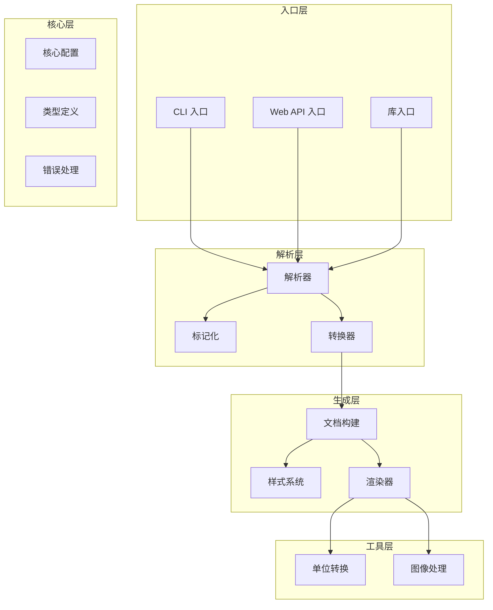
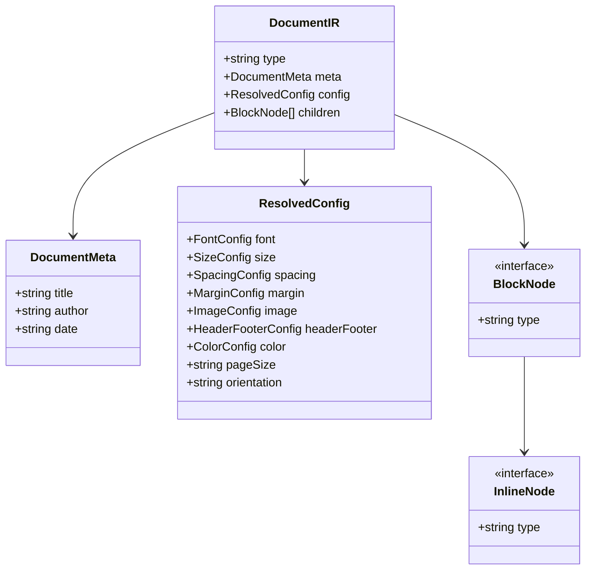
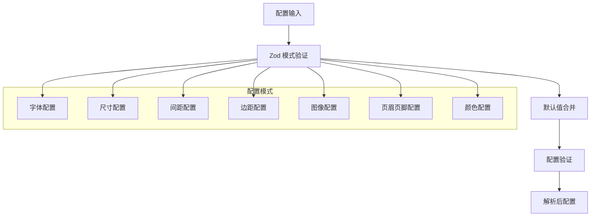
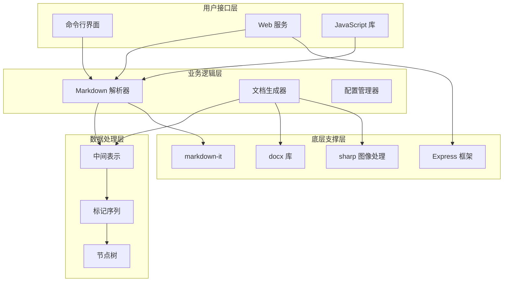
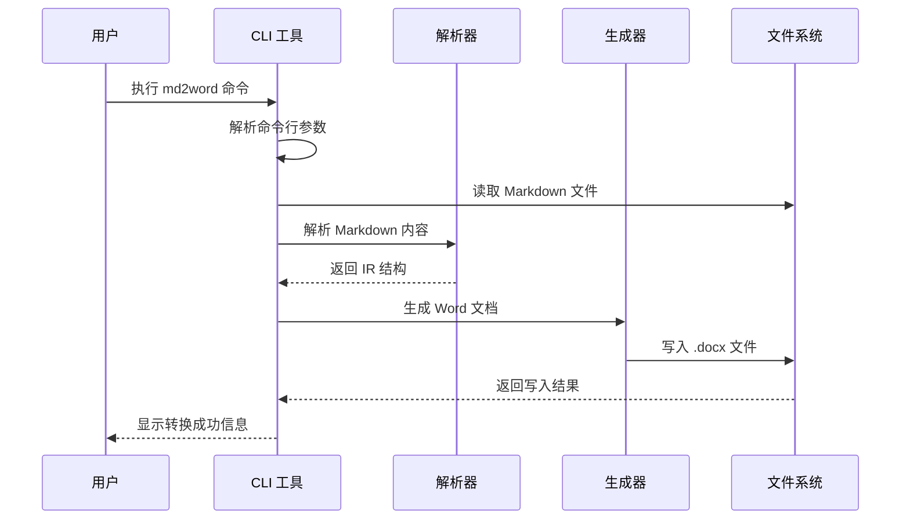
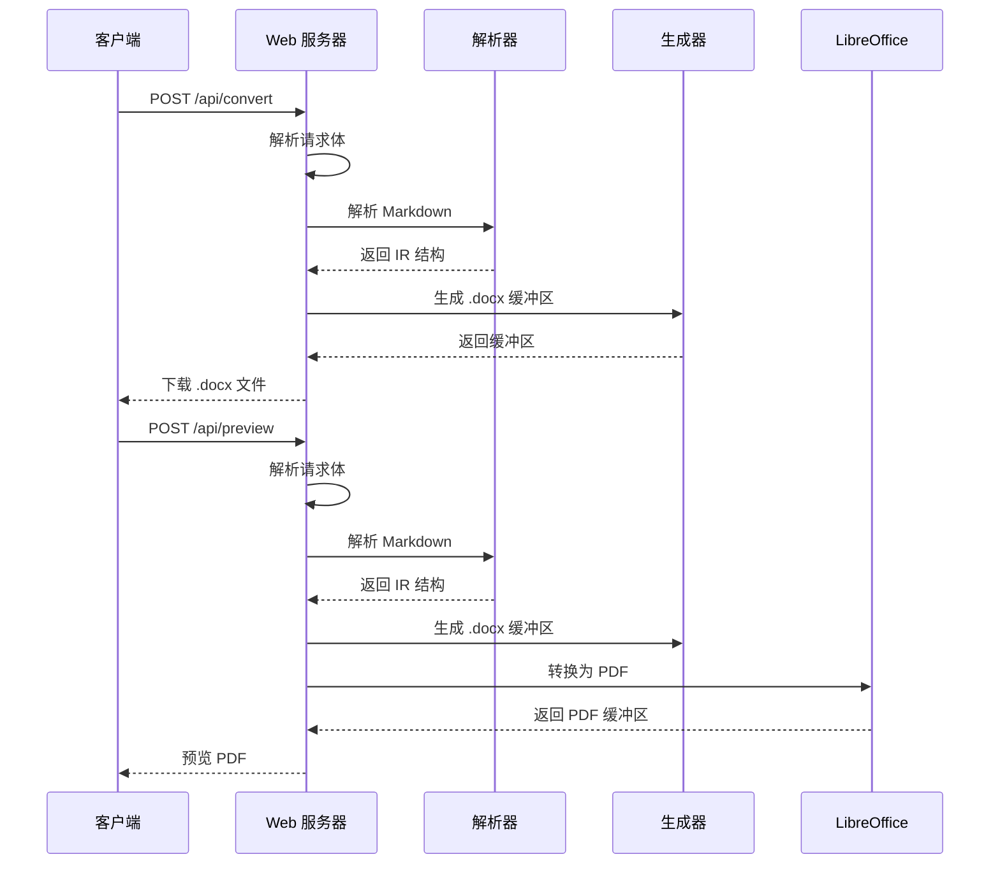
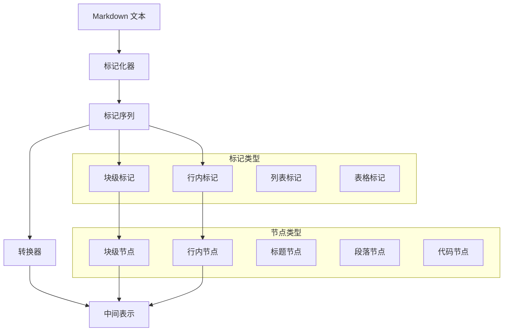
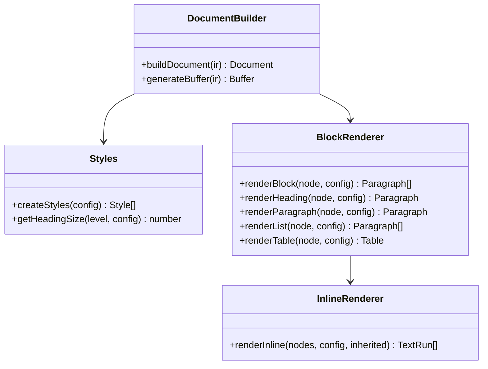
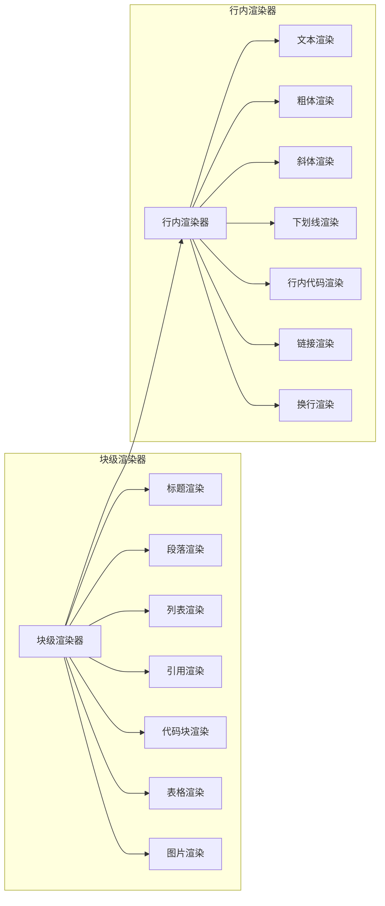
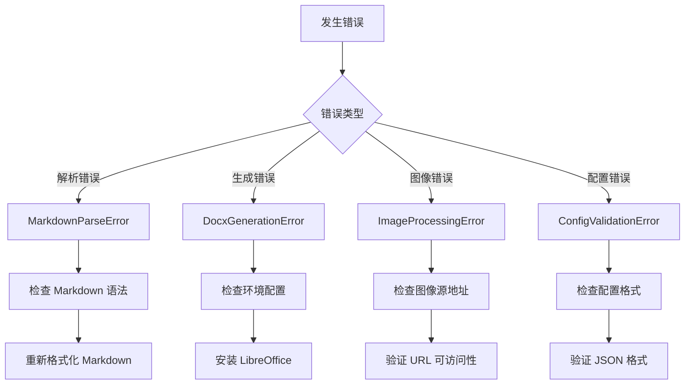

# 项目概述

<cite>
**本文档引用的文件**
- [package.json](file://package.json)
- [src/index.ts](file://src/index.ts)
- [src/cli.ts](file://src/cli.ts)
- [src/server.ts](file://src/server.ts)
- [src/core/types.ts](file://src/core/types.ts)
- [src/core/config.ts](file://src/core/config.ts)
- [src/core/errors.ts](file://src/core/errors.ts)
- [src/parser/index.ts](file://src/parser/index.ts)
- [src/parser/tokenize.ts](file://src/parser/tokenize.ts)
- [src/parser/transformer.ts](file://src/parser/transformer.ts)
- [src/generator/index.ts](file://src/generator/index.ts)
- [src/generator/document-builder.ts](file://src/generator/document-builder.ts)
- [src/generator/styles.ts](file://src/generator/styles.ts)
- [src/generator/renderers/block.ts](file://src/generator/renderers/block.ts)
- [src/generator/renderers/inline.ts](file://src/generator/renderers/inline.ts)
- [src/utils/units.ts](file://src/utils/units.ts)
- [src/utils/image.ts](file://src/utils/image.ts)
</cite>

## 目录
1. [引言](#引言)
2. [项目结构](#项目结构)
3. [核心组件](#核心组件)
4. [架构总览](#架构总览)
5. [详细组件分析](#详细组件分析)
6. [依赖分析](#依赖分析)
7. [性能考虑](#性能考虑)
8. [故障排除指南](#故障排除指南)
9. [结论](#结论)

## 引言

Markdown to Word 转换器是一个现代化的文档转换工具，旨在将 Markdown 文档无缝转换为 Microsoft Word 的 .docx 格式。该项目不仅提供了命令行界面（CLI），还支持作为 Web 服务运行，并可作为 JavaScript 库在其他应用中集成使用。

### 核心目标
- 提供高质量的 Markdown 到 Word 的转换体验
- 支持多种使用场景：本地 CLI 使用、Web 服务部署、JavaScript 库集成
- 保持配置的灵活性和样式定制能力
- 确保转换结果的准确性和一致性

### 主要特性
- **多形态支持**：CLI 工具、Web 服务、JavaScript 库三合一架构
- **可定制样式**：丰富的字体、字号、颜色、间距等配置选项
- **完整语法支持**：标题、段落、列表、表格、代码块、引用、图片等
- **响应式设计**：支持 A4 和 Letter 页面尺寸，支持横向和纵向布局
- **错误处理**：完善的错误类型定义和处理机制

## 项目结构

该项目采用模块化架构设计，按照功能层次组织代码结构：



**图表来源**
- [src/index.ts:1-25](file://src/index.ts#L1-L25)
- [src/cli.ts:1-113](file://src/cli.ts#L1-L113)
- [src/server.ts:1-94](file://src/server.ts#L1-L94)

**章节来源**
- [package.json:1-47](file://package.json#L1-L47)
- [src/index.ts:1-25](file://src/index.ts#L1-L25)

## 核心组件

### 数据模型与类型系统

项目建立了完整的文档中间表示（IR）体系，用于描述 Markdown 到 Word 的转换过程中的数据结构。



**图表来源**
- [src/core/types.ts:1-198](file://src/core/types.ts#L1-L198)

### 配置系统

配置系统基于 Zod 验证库，提供了强类型的配置管理能力：



**图表来源**
- [src/core/config.ts:1-91](file://src/core/config.ts#L1-L91)

**章节来源**
- [src/core/types.ts:1-198](file://src/core/types.ts#L1-L198)
- [src/core/config.ts:1-91](file://src/core/config.ts#L1-L91)

## 架构总览

项目采用分层架构设计，从上到下分为入口层、核心层、解析层、生成层和工具层：



**图表来源**
- [src/cli.ts:1-113](file://src/cli.ts#L1-L113)
- [src/server.ts:1-94](file://src/server.ts#L1-L94)
- [src/index.ts:1-25](file://src/index.ts#L1-L25)

## 详细组件分析

### CLI 命令行工具

CLI 工具提供了最直接的使用方式，支持多种参数配置：



**图表来源**
- [src/cli.ts:69-113](file://src/cli.ts#L69-L113)

CLI 工具的主要功能包括：
- 参数解析和验证
- 配置文件加载
- Markdown 文件读取
- 错误处理和日志输出

**章节来源**
- [src/cli.ts:1-113](file://src/cli.ts#L1-L113)

### Web 服务架构

Web 服务提供了 RESTful API 接口，支持在线转换和预览功能：



**图表来源**
- [src/server.ts:23-85](file://src/server.ts#L23-L85)

Web 服务的关键特性：
- CORS 支持跨域访问
- JSON 请求体解析
- PDF 预览功能（需要 LibreOffice）
- 健康检查端点

**章节来源**
- [src/server.ts:1-94](file://src/server.ts#L1-L94)

### 解析器系统

解析器负责将 Markdown 文本转换为内部中间表示（IR）：



**图表来源**
- [src/parser/tokenize.ts:1-16](file://src/parser/tokenize.ts#L1-L16)
- [src/parser/transformer.ts:25-39](file://src/parser/transformer.ts#L25-L39)

解析器的处理流程：
1. 使用 markdown-it 进行基础解析
2. 将标记序列转换为节点树
3. 支持复杂语法结构如表格、列表、代码块等
4. 处理 HTML 块中的图片提取

**章节来源**
- [src/parser/index.ts:1-24](file://src/parser/index.ts#L1-L24)
- [src/parser/tokenize.ts:1-16](file://src/parser/tokenize.ts#L1-L16)
- [src/parser/transformer.ts:1-360](file://src/parser/transformer.ts#L1-L360)

### 生成器系统

生成器将中间表示转换为实际的 Word 文档：



**图表来源**
- [src/generator/document-builder.ts:17-106](file://src/generator/document-builder.ts#L17-L106)
- [src/generator/styles.ts:5-109](file://src/generator/styles.ts#L5-L109)
- [src/generator/renderers/block.ts:28-58](file://src/generator/renderers/block.ts#L28-L58)

生成器的核心功能：
- 样式系统的创建和应用
- 块级元素的渲染
- 行内元素的处理
- 文档结构的构建
- 缓冲区的生成

**章节来源**
- [src/generator/index.ts:1-21](file://src/generator/index.ts#L1-L21)
- [src/generator/document-builder.ts:1-112](file://src/generator/document-builder.ts#L1-L112)
- [src/generator/styles.ts:1-122](file://src/generator/styles.ts#L1-L122)

### 渲染器系统

渲染器负责将不同类型的节点转换为 Word 文档的具体元素：



**图表来源**
- [src/generator/renderers/block.ts:28-266](file://src/generator/renderers/block.ts#L28-L266)
- [src/generator/renderers/inline.ts:12-109](file://src/generator/renderers/inline.ts#L12-L109)

渲染器的处理策略：
- 块级元素使用段落容器
- 行内元素使用文本运行
- 支持嵌套样式的继承
- 统一的间距和对齐控制

**章节来源**
- [src/generator/renderers/block.ts:1-266](file://src/generator/renderers/block.ts#L1-L266)
- [src/generator/renderers/inline.ts:1-110](file://src/generator/renderers/inline.ts#L1-L110)

## 依赖分析

项目的技术栈和依赖关系如下：

```mermaid
graph TB
subgraph "核心依赖"
DOCX[docx@^9.6.1]
MARKDOWN[markdown-it@^14.1.1]
ZOD[zod@^4.3.6]
end
subgraph "Web 依赖"
EXPRESS[express@^5.2.1]
CORS[cors@^2.8.6]
LO[libreoffice-convert@^1.8.1]
end
subgraph "工具依赖"
SHARP[sharp@^0.34.5]
LIBRE[libreoffice@^0.4.5]
end
subgraph "开发依赖"
TSUP[tsup@^8.5.1]
TYPESCRIPT[typescript@^6.0.3]
VITEST[vitest@^4.1.5]
EX_TYPES[express 类型]
MD_TYPES[markdown-it 类型]
end
subgraph "项目入口"
INDEX[src/index.ts]
CLI[src/cli.ts]
SERVER[src/server.ts]
end
INDEX --> DOCX
INDEX --> MARKDOWN
INDEX --> ZOD
CLI --> INDEX
SERVER --> INDEX
SERVER --> EXPRESS
SERVER --> CORS
SERVER --> LO
INDEX --> SHARP
LO --> LIBRE
```

**图表来源**
- [package.json:27-45](file://package.json#L27-L45)

**章节来源**
- [package.json:1-47](file://package.json#L1-L47)

## 性能考虑

### 转换性能优化

1. **流式处理**：使用缓冲区进行内存友好的处理
2. **异步操作**：充分利用 Promise 和 async/await 减少阻塞
3. **缓存策略**：合理使用配置缓存避免重复计算
4. **资源管理**：及时释放文件句柄和内存资源

### 内存使用优化

- 图像处理使用流式读取，避免大文件占用过多内存
- 文档生成采用增量构建，减少中间对象的创建
- 合理设置 Express 的请求大小限制（10MB）

### 并发处理

- CLI 工具支持单次转换
- Web 服务支持并发请求处理
- 图像处理使用独立的处理流程

## 故障排除指南

### 常见问题及解决方案



**图表来源**
- [src/core/errors.ts:1-28](file://src/core/errors.ts#L1-L28)

### 错误处理策略

1. **类型安全**：每种错误都有对应的错误类
2. **上下文信息**：错误对象包含源信息和原因
3. **用户友好**：提供清晰的错误消息
4. **恢复机制**：部分错误可以自动恢复或降级处理

**章节来源**
- [src/core/errors.ts:1-28](file://src/core/errors.ts#L1-L28)

## 结论

Markdown to Word 转换器项目展现了现代 JavaScript 生态系统中工具类应用的最佳实践。通过模块化设计、清晰的分层架构和完善的错误处理机制，该项目成功地实现了从 Markdown 到 Word 的高质量转换。

### 项目优势

1. **多形态支持**：满足不同使用场景的需求
2. **配置灵活**：丰富的样式定制选项
3. **架构清晰**：良好的模块分离和职责划分
4. **错误处理完善**：健壮的异常处理机制
5. **性能优化**：合理的内存和处理策略

### 技术创新点

1. **中间表示设计**：统一的数据结构便于扩展
2. **样式系统抽象**：可配置的样式引擎
3. **Web 服务集成**：RESTful API 设计
4. **图像处理集成**：支持在线和本地图像源

该项目为开发者提供了一个可靠的 Markdown 转换解决方案，既适合个人使用，也适合集成到更大的应用生态系统中。